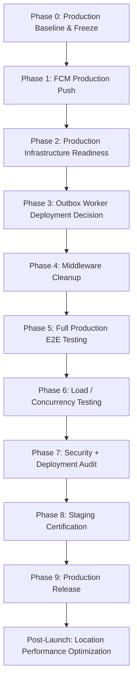

# Remediation Roadmap: Production Readiness Remediation

## Active Milestone: Production Readiness Remediation

---

## Phases & Deliverables

### Phase 0: Production Baseline & Freeze

- [x] Complete READ-ONLY audit & verification baseline across 49 domain categories
- [x] Establish baseline `.planning/` project state without source code mutation

### Phase 1: FCM Production Push (P0 Blocker)

- [x] Implement `FcmPushProvider` with `firebase-admin` SDK (`PushProvider` interface)
- [x] Map FCM v1 HTTP API Android/iOS APNs payloads
- [x] Implement invalid token cleanup in `DeviceRepository`
- [x] Verify PushProvider contract and singleton-safe initialization (10/10 PASS)
- [ ] Staging real-device certification (smoke matrix: Android/iOS fg/bg, dispatch/ride events, dead token cleanup, transient failure retention)

### Phase 2: Production Infrastructure Readiness

- [ ] Airtel DLT + SMS Production Verification (Principal Entity registration, sender/header, approved templates & IDs, template variables, production API credentials & endpoint, delivery callbacks, failure/retry handling, rate limits, non-sensitive logging)
- [ ] Verify cloud database 35-day PITR automated backup retention & validate `db-restore.sh`
- [ ] Confirm Pino structured logging & Prometheus metrics endpoint scraping

### Phase 3: Outbox Worker Deployment Decision

- [ ] Add `ENABLE_OUTBOX_RELAY` toggle to isolate OutboxRelay execution to dedicated worker pods (`node dist/worker.js`)

### Phase 4: Middleware Cleanup (AUDIT-003)

- [ ] Re-export or remove orphaned root stub files (`src/middleware/auth.ts`, `role.ts`, `idempotency.ts`)

### Phase 5: Full Production E2E Testing

- [ ] Implement full E2E ride lifecycle test suite (`tests/e2e/`)
- [ ] Implement payment webhook reconciliation tests (Razorpay & Stripe)

### Phase 6: Load / Concurrency Testing

- [ ] Simulate 1,000 active concurrent drivers emitting GPS updates every 3s
- [ ] Validate H3 spatial lookup query latency (< 20ms) and DB IOPS

### Phase 7: Security + Deployment Audit

- [ ] Run dependency vulnerability scans (`npm audit`)
- [ ] Verify non-root execution (`USER node`) in multi-stage Dockerfile

### Phase 8: Staging Certification

- [ ] Deploy container to staging cluster
- [ ] End-to-end staging validation with Razorpay sandbox, Airtel SMS, and FCM push notifications

### Phase 9: Production Release

- [ ] Run `npx prisma migrate deploy`
- [ ] Launch live API & worker cluster

### Post-Launch Deferred

- [ ] AUDIT-006 Redis stream buffering for `ride_location_points` when active rides exceed 2,000+
