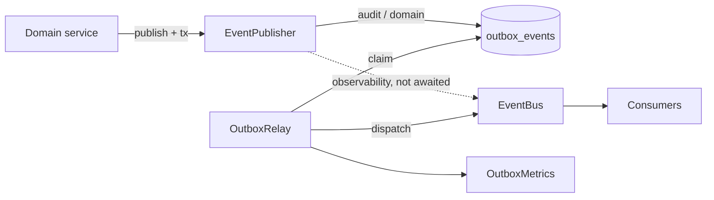
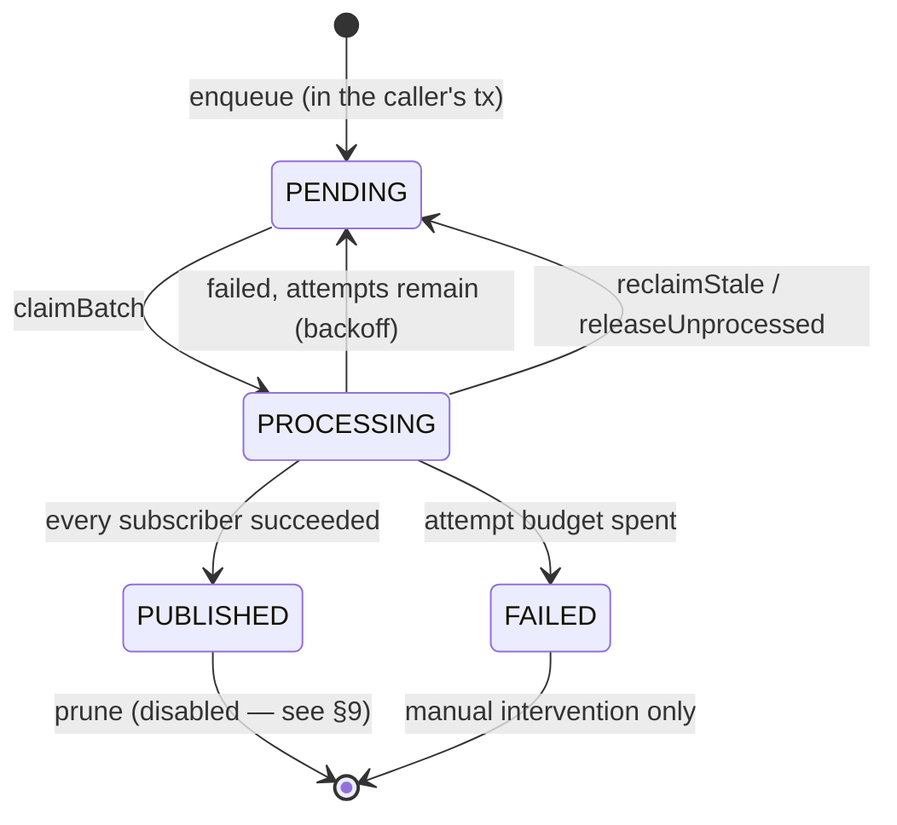

# Event Infrastructure

How domain events are produced, stored, delivered, retried, and recovered in this
service. Read this before publishing an event, before writing a consumer, and
before touching `src/core/events`.

**Status:** the producing half is in production use — every audit and domain event
is written to the outbox inside its state change's transaction. The consuming half
does not exist yet: nothing subscribes to the bus. Sections 13–15 are what a first
consumer has to satisfy, and §11.7 explains what "delivered" currently means.

---

## 1. Architecture overview

Four pieces, all in [`src/core/events`](src/core/events), registered as singletons
in the Awilix container by [`EventsModule.ts`](src/core/events/EventsModule.ts).

| Registration       | Class              | Role                                                            |
| ------------------ | ------------------ | --------------------------------------------------------------- |
| `eventPublisher`   | `EventPublisher`   | Builds the envelope; routes durable → outbox, best-effort → bus |
| `outboxRepository` | `OutboxRepository` | All access to `outbox_events`, including the claim protocol     |
| `outboxRelay`      | `OutboxRelay`      | Polls, claims, dispatches, retries, dead-letters, reaps, prunes |
| `eventBus`         | `EventBus`         | In-process pub/sub; the delivery target                         |
| `outboxMetrics`    | `OutboxMetrics`    | Log-based counters and gauges                                   |



**Two delivery classes, chosen per event type in the module catalogs:**

- **Durable** (`audit`, `domain`) — written to `outbox_events` in the caller's
  transaction. If the business write rolls back, so does the event. Survives a
  crash. Delivered at-least-once.
- **Best-effort** (`observability`) — emitted straight to the bus, never stored,
  never retried, and **not awaited** by the caller. Lost on a crash by design.

The classification is not a per-call decision. It comes from the catalog entry for
the event type, so the same event is always delivered the same way (§12).

**The bus is in-process.** An event dispatched by pod A reaches only pod A's
subscribers. This is the v1 substitute for a broker; when one arrives, it becomes
another subscriber to this bus rather than a rewrite of everything upstream.

---

## 2. Outbox lifecycle

Table `outbox_events` ([`admin.prisma`](prisma/schema/modules/admin/admin.prisma)).

| Column                            | Purpose                                                                                                    |
| --------------------------------- | ---------------------------------------------------------------------------------------------------------- |
| `id`                              | `uuid(7)` — time-ordered, so it doubles as a stable ordering tiebreak                                      |
| `event_id`                        | The envelope's own id, `UNIQUE`. The consumer dedupe key, and the database's rejection of a double-enqueue |
| `aggregate_type` / `aggregate_id` | What the event is about. `aggregate_id` is required and validated                                          |
| `event_type`                      | Dotted type, e.g. `auth.login.succeeded`                                                                   |
| `payload`                         | The full envelope as JSONB (§12)                                                                           |
| `status`                          | `PENDING` → `PROCESSING` → `PUBLISHED`, or → `FAILED`                                                      |
| `retries`                         | Failed attempts so far                                                                                     |
| `last_error`                      | Truncated failure text from the most recent attempt (≤500 chars)                                           |
| `next_attempt_at`                 | Earliest instant the row may be claimed; backoff pushes it out                                             |
| `claimed_at`                      | When the current claim was taken — the reaper's input                                                      |
| `claim_token`                     | _Which_ claim is current (§4)                                                                              |
| `published_at`                    | When it was retired                                                                                        |



`PENDING` is the only claimable state, and only when `next_attempt_at <= now()`.
`FAILED` is the dead-letter state: terminal, nothing reclaims it, alert on it.

**Atomicity.** `enqueue` takes an optional `TransactionClient`. Every durable
publish passes the transaction of the state change it records:

```ts
await this.transactionManager.execute(async (tx) => {
  const updated = await this.userProfileRepository.update(userId, changes, tx);
  await this.eventPublisher.publish(userEvent('user.profile.updated', { ... }), tx);
  return updated;
});
```

The row and the state change commit together or not at all. **A durable publish
without a `tx` is a bug** — it breaks the only guarantee the outbox pattern exists
to provide.

---

## 3. Relay lifecycle

[`OutboxRelay`](src/core/events/OutboxRelay.ts). Started by
[`bootstrapEvents()`](src/bootstrap/events.bootstrap.ts) inside the **API**
process. The worker process deliberately does not run one — see
[`worker.bootstrap.ts`](src/bootstrap/worker.bootstrap.ts). Jobs still publish;
the API's relays pick their rows up.

One tick:

1. `claimBatch(100)` — atomically claim up to 100 due rows (§4).
2. For each claimed row, in order, one at a time: `eventBus.emit(payload)` and
   await it.
3. Success → collect the id. Failure → `releaseForRetry` or `markDead` (§5, §6).
4. `markPublished(collectedIds, claimToken)` once for the batch.
5. Every 60th tick, run maintenance: reap stale claims, sample the backlog gauges,
   prune (currently disabled).

The loop is **self-scheduling** (`setTimeout` chained off the end of each tick),
not `setInterval`. An interval fires on a fixed clock whether or not the previous
tick finished, and two overlapping ticks are two claims being dispatched at once.
The configured interval is therefore a _gap between_ ticks, not a period.

`start()` is idempotent. The timer is `unref()`ed, so the relay never keeps the
process alive on its own.

**Consumers must be registered before `bootstrapEvents()`.** Startup order in
[`startup.bootstrap.ts`](src/bootstrap/startup.bootstrap.ts) is database → redis →
**events** → storage → `createApp()`. The relay is already dispatching before the
Fastify app exists, so a subscription registered during route setup will miss
whatever was delivered in that window.

### Ordering: none is offered

**Consumers must not assume any order between two events, including two events on
the same aggregate.** Rows are _claimed_ oldest-first by `(created_at, id)`, which
is a fairness property — nothing starves — not a delivery guarantee. Two things
break order routinely and neither is a defect:

- Replicas claim disjoint sets concurrently. Production runs 3–20 API pods, each
  with its own relay, so two events enqueued a millisecond apart can be dispatched
  by different pods in either order. Fixing this needs claims partitioned by
  aggregate, which needs stable replica identity that a Deployment behind an HPA
  does not provide.
- A failed event backs off and is redelivered _after_ events enqueued later that
  succeeded.

Within a single batch, events are dispatched one at a time. That is **backpressure**
— a hundred concurrent handler invocations is a stampede at the consumer — not an
ordering guarantee. A consumer needing order must reconstruct it from `occurredAt`
and its own state, never from arrival.

---

## 4. Claim protocol

The relay runs on **every API replica**. Correctness comes from the claim being a
single statement, not from a deployment assumption.

```sql
UPDATE outbox_events
SET status = 'PROCESSING', claimed_at = $now, claim_token = $token::uuid
WHERE id IN (
  SELECT id FROM outbox_events
  WHERE status = 'PENDING' AND next_attempt_at <= $now
  ORDER BY created_at, id
  LIMIT $limit
  FOR UPDATE SKIP LOCKED
)
RETURNING id, event_type AS "eventType", retries, payload, claim_token AS "claimToken"
```

- **`FOR UPDATE SKIP LOCKED`** — concurrent claimers step over each other's locked
  rows instead of blocking or returning the same batch. Verified: three concurrent
  claimers over 20 events return 20 rows, 20 distinct.
- **`ORDER BY created_at, id`** — `created_at` is `timestamp(3)` and one
  transaction routinely enqueues several events inside a millisecond, so it is not
  a total order on its own. `id` is `uuid(7)`, time-ordered, making the pair total.
- **`claim_token`** — a fresh UUID per batch, returned on every row.

### Why the token exists

A batch can outlive its claim: the reaper releases it, another relay picks the rows
up, and the original relay finishes dispatching afterwards. Every retire path —
`markPublished`, `releaseForRetry`, `markDead`, `releaseUnprocessed` — is an
`updateMany` scoped to `{ id, claimToken }` and **returns the affected count**. A
relay that no longer owns a row writes nothing and logs `outbox.claims.lost`.

Matching on `status = 'PROCESSING'` instead would not work: the stale owner and the
current owner both see that state. Without the token, this sequence silently
destroyed an event:

```
relay A claims → reaper releases it → relay B claims → B's delivery FAILS,
B schedules a retry → slow relay A finishes and marks it PUBLISHED
```

The row ends `PUBLISHED` with its only delivery attempt failed. Nothing claims it
again. `reclaimStale` nulls the token precisely so a resurrected owner can never
match again.

**Invariant to preserve:** `batch size × per-event dispatch time` must stay well
under `CLAIM_TIMEOUT_MS`. At the defaults that is 100 × 3s = 5 min — exactly the
timeout. A consumer slower than ~1s/event needs a smaller batch, a longer timeout,
or heartbeated `claimed_at`. `outbox.claims.lost` is the signal that you crossed it.

---

## 5. Retry and backoff

A dispatch "fails" when `EventBus.emit` reports any subscriber failure, or when the
dispatch machinery itself throws. **Partial success counts as failure**: if three
subscribers succeed and one fails, the row is not retired and every subscriber sees
the event again on redelivery. This is why §14 is not optional.

`releaseForRetry(id, claimToken, error, nextAttemptAt)` puts the row back to
`PENDING` with `retries + 1`, the truncated error, and a future `next_attempt_at`.

Backoff is exponential with **full jitter** — `random(0, ceiling)`, matching
`RetryService`'s convention — so retries from 20 replicas do not synchronise into a
thundering herd:

| Attempt | Ceiling      | Cumulative worst case |
| ------- | ------------ | --------------------- |
| 1       | 1s           | 1s                    |
| 2       | 2s           | 3s                    |
| 3       | 4s           | 7s                    |
| 4       | 8s           | 15s                   |
| 5       | 16s          | 31s                   |
| 6       | 30s (capped) | 61s                   |
| 7       | 30s (capped) | 91s                   |
| 8       | —            | dead-lettered         |

Seven retries span at most ~91s and ~45s on average. Long enough to ride out a
consumer restart; short enough that a poisonous event reaches the alert while
somebody is still looking at the deploy that caused it.

Returning the row to `PENDING` is the entire point. An earlier version marked it
`FAILED`, which the poll query filtered out — a transient error became a silently
dropped audit event.

---

## 6. Dead-letter flow

On the 8th failed attempt (`retries + 1 >= MAX_ATTEMPTS`), `markDead` sets
`status = 'FAILED'` with the final error in `last_error`.

`FAILED` is **terminal**. Nothing reclaims it, no timer revisits it, and the relay's
poll query cannot see it. Recovery is manual.

The relay logs `[outbox] dead-lettered after exhausting attempts` at `error` and
emits `outbox.dead_lettered`. **Alert on any occurrence.** These are durable audit
and domain events — `user.account.erased` is documented as the only surviving proof
a deletion obligation was discharged, and a dead-lettered one means that proof
reached nobody.

To recover a dead-lettered event once the cause is fixed:

```sql
-- Inspect first. Never bulk-revive without reading last_error.
SELECT id, event_type, retries, last_error, created_at
FROM outbox_events WHERE status = 'FAILED' ORDER BY created_at;

-- Revive a specific event for another run of the attempt budget.
UPDATE outbox_events
SET status = 'PENDING', retries = 0, next_attempt_at = now(),
    claimed_at = NULL, claim_token = NULL
WHERE id = '<id>';
```

---

## 7. Shutdown sequence

[`shutdown.bootstrap.ts`](src/bootstrap/shutdown.bootstrap.ts), on `SIGTERM` or
`SIGINT`, guarded against a double signal:

```mermaid
sequenceDiagram
    participant K as kubelet
    participant A as API process
    participant R as OutboxRelay
    participant DB as Postgres
    K->>A: SIGTERM (after preStop sleep 10s)
    A->>A: app.close() — drain HTTP
    A->>R: await relay.stop()
    R->>R: stopping = true; cancel the pending timer
    R->>R: finish the event in flight, skip the rest of the batch
    R->>DB: releaseUnprocessed(tail, claimToken)
    R-->>A: resolved (or 15s deadline passed)
    A->>DB: provider.disconnect()
    A->>A: redis.quit(); exit(0)
```

Three properties matter:

1. **`stop()` is awaited.** The database connection closes next; a batch cut off
   mid-write fails whatever statement it was issuing.
2. **The loop stops between events and hands back the tail.** The undispatched
   remainder of the batch is released to `PENDING`, due immediately, with `retries`
   untouched — the next pod claims it on its first tick instead of waiting out the
   reaper's five minutes.
3. **The wait is bounded** at `STOP_TIMEOUT_MS` (15s). Production allows a 60s
   grace period with a 10s pre-stop sleep, leaving ~50s for everything. A batch
   that has not yielded by then is stuck on a subscriber that is not coming back;
   its rows stay claimed and the reaper recovers them. Blocking forever would earn
   a `SIGKILL` and strand the rows anyway, without the log line.

Maintenance is skipped once `stopping` is set — three whole-table statements with
nothing waiting on them are pure delay against the grace period.

---

## 8. Metrics

[`OutboxMetrics`](src/core/events/OutboxMetrics.ts) emits one structured log line
per event: `{ metric: "outbox.<name>", ...fields }`. Log-based, matching
`FileMetrics`/`UserMetrics` — a drop-in seam for Prometheus or OpenTelemetry later.
Labels are event _types_ and counts only: **never an aggregate id, user id, or
payload field.**

| Metric                         | Fields                                                         | Meaning                                               | Alert                  |
| ------------------------------ | -------------------------------------------------------------- | ----------------------------------------------------- | ---------------------- |
| `outbox.batch.processed`       | `claimed`, `published`, `retried`, `deadLettered`, `abandoned` | One tick's work                                       | No — dashboard         |
| `outbox.dispatch.failed`       | `eventType`, `attempt`                                         | A dispatch failed, row requeued                       | Sustained rise         |
| `outbox.dead_lettered`         | `eventType`, `attempts`                                        | Event abandoned permanently                           | **Any occurrence**     |
| `outbox.claims.reclaimed`      | `count`                                                        | Claims recovered from a dead relay                    | Sustained rise         |
| `outbox.claims.lost`           | `count`                                                        | A relay outlived its claim; likely duplicate delivery | **Any sustained rate** |
| `outbox.observability.dropped` | `eventType`                                                    | Best-effort subscriber failed; not retried            | Sustained rise         |
| `outbox.pruned`                | `count`                                                        | Retired rows deleted                                  | No                     |
| `outbox.backlog`               | `pending`, `dead`, `oldestPendingAgeMs`                        | Backlog gauges, every ~60 ticks                       | See below              |

**`oldestPendingAgeMs` is the one that matters.** `pending` alone cannot detect a
stalled relay — a queue of 5 looks identical whether it drained a second ago or an
hour ago. Age rises the moment dispatch stops, regardless of volume.

Suggested thresholds: warn at `oldestPendingAgeMs > 60_000`, page at `> 300_000`;
page on `dead > 0`.

Not yet instrumented: per-dispatch latency, and a per-replica label to tell which
pod a metric came from.

---

## 9. Configuration

All of these are **module constants** in
[`OutboxRelay.ts`](src/core/events/OutboxRelay.ts), not environment variables.
Changing one requires a deploy. If an incident ever demands tuning them live, move
them to a config module alongside `fileConfig`/`userConfig` — that is the known gap,
not an oversight to rediscover.

| Constant                  | Value            | Meaning                                      |
| ------------------------- | ---------------- | -------------------------------------------- |
| `DEFAULT_BATCH_SIZE`      | 100              | Rows claimed per tick                        |
| `DEFAULT_INTERVAL_MS`     | 1 000            | Gap between ticks                            |
| `MAX_ATTEMPTS`            | 8                | Attempts before dead-lettering               |
| `BASE_BACKOFF_MS`         | 1 000            | First retry ceiling; doubles per attempt     |
| `MAX_BACKOFF_MS`          | 30 000           | Backoff ceiling cap                          |
| `CLAIM_TIMEOUT_MS`        | 300 000          | Claim age after which the reaper releases it |
| `MAINTENANCE_EVERY_TICKS` | 60               | Ticks between reap/gauge/prune passes        |
| `STOP_TIMEOUT_MS`         | 15 000           | Shutdown wait for the in-flight tick         |
| `RETENTION_MS`            | **0 (disabled)** | Age after which retired rows may be deleted  |
| `PRUNE_LIMIT`             | 1 000            | Max rows deleted per prune pass              |

Envelope versions live in [`EventPublisher.ts`](src/core/events/EventPublisher.ts):
`ENVELOPE_VERSION = 1`, `DEFAULT_EVENT_VERSION = 1`.

### Why pruning is off

`RETENTION_MS = 0` disables deletion entirely. **This is deliberate.** Nothing
subscribes to the bus, so no consumer has archived anything by the time a row
reaches `PUBLISHED` — the outbox is currently the _only_ copy of every audit event.
Deleting on a timer would destroy the audit trail rather than trim a buffer.

The consequence is that `outbox_events` grows without bound. The poll query does
not care — it is served by a composite index on
`(status, next_attempt_at, created_at, id)` and only walks the pending set
(measured: index scan, 3 buffer hits, 0.18 ms against 50,020 rows). But `stats()`
runs two `COUNT(*)`s per replica per minute over a growing table.

Enable pruning only once an archival consumer exists and its retention satisfies
the audit requirements.

---

## 10. Operational runbook

### Backlog is growing / `oldestPendingAgeMs` rising

```sql
SELECT status, count(*), min(created_at) AS oldest
FROM outbox_events GROUP BY status;
```

- **All `PENDING`, none `PROCESSING`** → no relay is claiming. Is any API pod
  running? Check for `Outbox relay started` in pod logs. A relay only starts in the
  API process, never in the worker.
- **Many `PROCESSING`, `claimed_at` old** → relays died mid-batch. The reaper
  recovers them within `CLAIM_TIMEOUT_MS` + up to 60 ticks. If it does not, check
  for `outbox.claims.reclaimed` lines.
- **`PENDING` with `next_attempt_at` in the future** → they are backing off, not
  stuck. Read `last_error`.

### `outbox.dead_lettered` fired

1. `SELECT event_type, last_error, count(*) FROM outbox_events WHERE status='FAILED' GROUP BY 1,2;`
2. Fix the consumer, then revive with the `UPDATE` in §6.
3. If the payload itself is poison, decide explicitly whether the event should be
   dropped. Record that decision somewhere durable — `FAILED` rows look identical
   whether they were triaged or ignored.

### `outbox.claims.lost` is nonzero

Batches are outliving `CLAIM_TIMEOUT_MS`, so some events were probably delivered
twice. Consumers should absorb that (§14), but fix the cause: lower
`DEFAULT_BATCH_SIZE`, raise `CLAIM_TIMEOUT_MS`, or make the slow subscriber faster.

### Deploy leaves events stuck

Expected window is one tick. If rows sit `PROCESSING` for minutes after a rollout,
`stop()` hit its 15s deadline — look for `shutdown deadline passed with a batch
still in flight`. That means a subscriber hangs; it is a consumer bug, not a relay
bug.

### Emergency: stop delivery without stopping the API

There is no feature flag. Options, in order of preference: fix forward; unsubscribe
the offending consumer and redeploy; as a last resort park the events with
`UPDATE outbox_events SET next_attempt_at = now() + interval '1 hour' WHERE status='PENDING' AND event_type = '<type>'`
(they stay durable and resume on their own).

---

## 11. Failure scenarios

| #     | Scenario                                        | What happens                                                           | Outcome                                                                                                                      |
| ----- | ----------------------------------------------- | ---------------------------------------------------------------------- | ---------------------------------------------------------------------------------------------------------------------------- |
| 11.1  | Business transaction rolls back after publish   | The outbox row rolls back with it                                      | No event. Correct                                                                                                            |
| 11.2  | Process dies between `enqueue` commit and claim | Row stays `PENDING`                                                    | Delivered after restart                                                                                                      |
| 11.3  | Process dies mid-dispatch                       | Row stays `PROCESSING`; reaper releases it after `CLAIM_TIMEOUT_MS`    | Redelivered — **possible duplicate**                                                                                         |
| 11.4  | `SIGTERM` mid-batch                             | In-flight event finishes; tail released immediately                    | No duplicate, no delay                                                                                                       |
| 11.5  | `SIGKILL` mid-batch                             | Like 11.3                                                              | Redelivered after the reaper                                                                                                 |
| 11.6  | One subscriber of several fails                 | Row is **not** retired; all subscribers see it again                   | Duplicates for the ones that succeeded                                                                                       |
| 11.7  | **No subscribers at all** (today)               | `emit` reports `delivered: 0, failures: []` → success → `PUBLISHED`    | Event retired having reached nobody. Not a defect _yet_, but "PUBLISHED" currently means "the bus had nothing to give it to" |
| 11.8  | Consumer permanently broken                     | 8 attempts over ~91s, then `FAILED`                                    | Alert; manual revival                                                                                                        |
| 11.9  | Database unavailable during dispatch            | `claimBatch` throws; tick logs and retries next tick                   | Self-healing                                                                                                                 |
| 11.10 | Relay outlives its claim                        | Its writes are rejected by the token filter; the current owner decides | No corruption; duplicate delivery likely                                                                                     |
| 11.11 | Duplicate `enqueue` of one envelope             | `event_id` unique constraint rejects it                                | The caller's transaction fails loudly                                                                                        |
| 11.12 | Clock skew between replicas                     | `next_attempt_at` comparisons use each pod's clock                     | Skew shifts retry timing only; claims stay exclusive because Postgres arbitrates                                             |

---

## 12. How to add a new event

**1. Add it to the owning module's catalog.** One of
[`auth`](src/modules/auth/events/catalog.ts),
[`users`](src/modules/users/events/catalog.ts),
[`files`](src/modules/files/events/catalog.ts).

```ts
'user.profile.archived': { classification: 'domain', aggregateType: 'user' },
```

`classification` decides durability (§1). `aggregateType` names the kind of thing
the event is about. Add `version: 2` only when you make a breaking change to an
existing event's `data` — it is per event type, not global.

The catalog is a `satisfies Record<string, CatalogEntry>` object, so its keys form
a closed union (`AuthEventType`, `UserEventType`, `FileEventType`). A typo in a call
site is a compile error, not a runtime throw.

**2. Publish through the module's helper**, never by hand-building a `PublishInput`:

```ts
await this.eventPublisher.publish(
  userEvent('user.profile.archived', {
    subjectUserId: userId,
    requestId,
    data: { userId, reason },
  }),
  tx, // required for audit/domain
);
```

The helper fills `classification`, `aggregateType`, `producer`, and `version`.

**3. Obey the publisher's guards.** Both throw rather than paper over the mistake:

- A durable event needs an `aggregateId` (or a `subjectUserId` to fall back to).
  An outbox row whose aggregate points at nothing cannot be ordered, partitioned,
  or replayed per aggregate.
- An observability event must **not** be given a `tx`. That branch emits
  immediately, so a transaction would mean announcing a change that has not
  committed and may roll back.

**4. Keep the payload non-secret.** Identifiers, field _names_, counts, coarse
enums, masked values. Never a token, signed URL, storage key, filename, or personal
value. The envelope ends up in a JSONB column and in consumer logs.

### Envelope shape

```jsonc
{
  "eventId": "uuid", // unique; the consumer dedupe key
  "type": "user.profile.updated",
  "version": 1, // payload version for THIS event type
  "envelopeVersion": 1, // version of the fields around `data`
  "occurredAt": "2026-08-06T09:00:00.000Z",
  "producer": "users", // required; no default
  "subject": { "userId": "uuid | null" },
  "correlation": { "requestId": "…|null", "sessionId": "…|null" },
  "data": {}, // event-specific, non-secret
}
```

### Naming

`<module>.<aggregate>.<past-tense-verb>` — `auth.session.revoked`,
`user.saved_place.added`, `file.uploaded`. **Known inconsistency:** the AUTH catalog
also emits `account.*` (`account.suspended`, `account.role.granted`) while USER
emits `user.account.*`. Two prefixes for one aggregate. Consumers of account
lifecycle must subscribe to both. Changing it means changing the documented event
contract in auth doc 06 / user doc 05 — do not rename unilaterally.

---

## 13. How to add a new consumer

There are none yet. You will be the first, so read §14 before writing code.

**Register before `bootstrapEvents()`** in
[`startup.bootstrap.ts`](src/bootstrap/startup.bootstrap.ts) — the relay begins
dispatching there, and anything subscribed later misses that window.

```ts
const bus = container.resolve<EventBus>('eventBus');

const off = bus.on('user.account.erased', async (envelope) => {
  await consumer.handle(envelope);
});

bus.onAny(async (envelope) => {
  /* every event */
});
```

Both return an unsubscribe function. Keep it if the consumer's lifetime is shorter
than the process's.

**Rules that are not negotiable:**

1. **Throwing means redelivery.** `emit` awaits every handler and reports failures;
   any rejection prevents the row from being retired and the event is retried up to
   8 times, then dead-lettered. Throw only for failures that a retry could fix.
   Swallow permanent ones (bad payload, deleted entity) after logging, or you will
   dead-letter an event that was never going to succeed.
2. **Be fast.** Handlers are awaited and dispatched one at a time. 100 events ×
   your latency is the batch duration, and that must stay well under
   `CLAIM_TIMEOUT_MS` (§4). Anything slow belongs on a BullMQ queue — the handler
   enqueues a job and returns.
3. **Never assume ordering** (§3).
4. **Expect duplicates** (§14).
5. **Do not subscribe to the same event twice** in one process — a handler
   registered on both its type and `onAny` is invoked twice per event.

---

## 14. Consumer idempotency requirements

Delivery is **at-least-once**. Duplicates are normal operation, not an incident:
11.3, 11.5, 11.6, and 11.10 all produce them. A consumer that is not idempotent
will corrupt data on a routine pod restart.

**The dedupe key is `envelope.eventId`**, unique in the database and stable across
redeliveries of the same event. Do not dedupe on `(type, aggregateId)` — two
legitimate events can share both.

The expected mechanism — **not yet built**, create it with the first consumer:

```sql
CREATE TABLE processed_events (
  event_id   UUID        NOT NULL,
  consumer   TEXT        NOT NULL,
  processed_at TIMESTAMP(3) NOT NULL DEFAULT now(),
  PRIMARY KEY (event_id, consumer)
);
```

Keyed per consumer, because each one must see every event exactly once _for itself_.

Handler shape:

```ts
await tx.processedEvent.create({ data: { eventId, consumer: 'billing' } });
// unique violation => already handled => return, do not throw
await doTheWork(tx);
```

Write the marker **and** the side effect in one transaction. A marker committed
separately from the work turns a crash between them into a permanently skipped
event — the same class of bug the outbox exists to prevent on the producing side.

Where the side effect is external (an HTTP call, an email), you cannot have
transactional exactly-once. Choose deliberately: marker-first risks a lost effect,
effect-first risks a duplicate. For anything user-visible, prefer the duplicate and
make the external call idempotent with `eventId` as its idempotency key.

Other requirements:

- **Tolerate reordering** — handle `updated` arriving before `created`.
- **Ignore unknown fields** and unknown `version` values you cannot interpret;
  log and skip rather than throw, so a producer's additive change does not
  dead-letter your consumer.

---

## 15. Replay prerequisites

There is **no replay support today**. `PUBLISHED` rows are never re-emitted, there
is no consumer cursor, and no admin surface. Recovering a consumer that lost state
currently means hand-written SQL against `payload`.

Before building it, all four must be true:

1. **Consumer idempotency exists** (§14). Replay without dedupe is just a
   deliberate duplicate-side-effect generator.
2. **The events still exist.** Replay depth is bounded by retention. Since pruning
   is disabled (§9) everything is currently replayable — turning pruning on caps
   the replay window, so decide the two together.
3. **Selection is precise.** Replay must target `(time range, event types,
aggregateId)`. A whole-table replay is an outage.
4. **Isolation.** A replay must be able to target one consumer without re-invoking
   every other subscriber. Today's bus fans out to all of them, so this needs a bus
   change, not just a query.

Design note for whoever builds it: **preserve the original `eventId`**. Minting a
new one makes every consumer's dedupe table useless and turns replay into
guaranteed double-processing. Mark the redelivery on the envelope (a `replayedAt`
field, not a new id) if consumers need to distinguish it.

---

## Known gaps

Tracked honestly so nobody rediscovers them under pressure:

| Gap                             | Impact                                                 | Section |
| ------------------------------- | ------------------------------------------------------ | ------- |
| No consumers exist              | At-least-once delivery is unproven in production       | §11.7   |
| No replay path                  | A consumer that loses state cannot recover without SQL | §15     |
| No `processed_events` table     | The first consumer must build it                       | §14     |
| Pruning disabled                | `outbox_events` grows without bound                    | §9      |
| Constants not in config         | Tuning requires a deploy                               | §9      |
| `claimed_at` not heartbeated    | Slow batches can outlive their claim                   | §4      |
| `account.*` vs `user.account.*` | Two prefixes for one aggregate                         | §12     |
| No per-replica metric label     | Cannot attribute a metric to a pod                     | §8      |

## Where things live

| Path                                                                                   | What                                 |
| -------------------------------------------------------------------------------------- | ------------------------------------ |
| [`src/core/events/`](src/core/events)                                                  | All infrastructure                   |
| [`src/bootstrap/events.bootstrap.ts`](src/bootstrap/events.bootstrap.ts)               | Relay startup                        |
| [`src/bootstrap/shutdown.bootstrap.ts`](src/bootstrap/shutdown.bootstrap.ts)           | Shutdown sequence                    |
| [`src/modules/*/events/catalog.ts`](src/modules/users/events/catalog.ts)               | Per-module event catalogs            |
| [`prisma/schema/modules/admin/admin.prisma`](prisma/schema/modules/admin/admin.prisma) | `OutboxEvent` model                  |
| `prisma/migrations/20260805180000_outbox_claim_and_retry`                              | Claim, retry, index, `event_id`      |
| `prisma/migrations/20260806090000_outbox_claim_token`                                  | Claim ownership                      |
| [`tests/unit/events/`](tests/unit/events)                                              | Relay, bus, publisher unit tests     |
| [`tests/integration/outbox-relay.test.ts`](tests/integration/outbox-relay.test.ts)     | Claim protocol against live Postgres |
