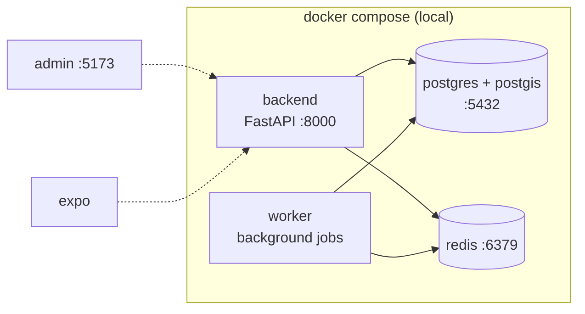

# Docker Setup

**Owner:** Engineering · **Last reviewed:** 2026-07-06

Docker gives every engineer and every CI run an **identical** environment. "Works on my
machine" is not a defense — the machine is a container defined in git. This page covers the
**local** Docker setup; production Kubernetes lives in Volume 11.

---

## What runs where

The local stack is defined in `infra/docker/docker-compose.yml`:



`admin` and `mobile` usually run on the host for hot-reload speed, but can also run in
Compose. `postgres`, `redis`, `backend`, and `worker` always run in Compose locally.

---

## `docker-compose.yml` (annotated)

```yaml
services:
  postgres:
    image: postgis/postgis:16-3.4 # Postgres 16 WITH PostGIS preinstalled
    environment:
      POSTGRES_USER: zaroorat
      POSTGRES_PASSWORD: zaroorat
      POSTGRES_DB: zaroorat
    ports: ['5432:5432']
    volumes:
      - pgdata:/var/lib/postgresql/data
      - ./init:/docker-entrypoint-initdb.d # enables extensions on first boot
    healthcheck:
      test: ['CMD-SHELL', 'pg_isready -U zaroorat']
      interval: 5s
      retries: 10

  redis:
    image: redis:7-alpine
    ports: ['6379:6379']
    healthcheck:
      test: ['CMD', 'redis-cli', 'ping']
      interval: 5s
      retries: 10

  backend:
    build:
      context: ../../apps/backend
      target: dev # multi-stage: dev target has reload tooling
    env_file: ../../.env
    ports: ['8000:8000']
    volumes:
      - ../../apps/backend:/app # bind-mount for hot reload
    depends_on:
      postgres: { condition: service_healthy }
      redis: { condition: service_healthy }
    command: uvicorn zaroorat.main:app --host 0.0.0.0 --port 8000 --reload

  worker:
    build:
      context: ../../apps/backend
      target: dev
    env_file: ../../.env
    depends_on:
      postgres: { condition: service_healthy }
      redis: { condition: service_healthy }
    command: python -m zaroorat.worker # consumes queues / scheduled jobs

volumes:
  pgdata:
```

Key points:

- **`postgis/postgis:16-3.4`** — we use the PostGIS image so geo functions exist out of the box.
- **Healthchecks + `depends_on: service_healthy`** — the backend waits until Postgres and Redis
  are actually ready, not just started. No race conditions on boot.
- **Bind mounts in dev** — your local code is live inside the container; `--reload` picks up
  changes instantly. Production images copy code in and do **not** mount.
- **`env_file`** — the container reads the same `.env` you edit locally.

---

## The backend Dockerfile (multi-stage)

We use a multi-stage build so the **dev** image has reload/debug tooling while the **production**
image is small and locked-down.

```dockerfile
# ---- base: shared runtime ----
FROM python:3.12-slim AS base
ENV PYTHONUNBUFFERED=1 PYTHONDONTWRITEBYTECODE=1
WORKDIR /app
RUN pip install --no-cache-dir uv

# ---- deps: install dependencies (cached layer) ----
FROM base AS deps
COPY pyproject.toml uv.lock ./
RUN uv sync --frozen --no-dev        # prod deps only

# ---- dev: adds dev deps + tooling, used by compose ----
FROM deps AS dev
RUN uv sync --frozen                  # include dev deps (pytest, ruff, mypy)
COPY . .
EXPOSE 8000

# ---- production: minimal, non-root, no source-editing ----
FROM base AS production
COPY --from=deps /app/.venv /app/.venv
ENV PATH="/app/.venv/bin:$PATH"
COPY src ./src
RUN adduser --disabled-password --gecos "" appuser && chown -R appuser /app
USER appuser                          # never run as root in prod
EXPOSE 8000
CMD ["uvicorn", "zaroorat.main:app", "--host", "0.0.0.0", "--port", "8000"]
```

Principles reflected here:

- **Layer caching**: dependencies are installed before source is copied, so code changes don't
  reinstall packages.
- **Non-root in production**: the container runs as `appuser`, not `root`.
- **Small production image**: `slim` base, prod deps only, no test tooling.
- **Reproducible**: `uv sync --frozen` installs exactly the locked versions.

---

## Common commands

```bash
make up                 # docker compose up -d (start stack)
make down               # stop stack
make logs               # tail all service logs
docker compose exec backend bash        # shell into the backend container
docker compose exec postgres psql -U zaroorat   # psql into the DB
make db-reset           # drop volume + recreate + migrate + seed
```

---

## `.dockerignore`

Keep build context small and never leak secrets into an image:

```
.git
.env
**/__pycache__
**/.venv
**/node_modules
**/.pytest_cache
**/*.md
```

---

## Rules

- **One process per container.** Backend, worker, DB, Redis are separate services.
- **No secrets baked into images.** Config comes in at runtime via env.
- **Pin base image tags** (`python:3.12-slim`, `redis:7-alpine`) — never `latest` in a Dockerfile.
- **Prod images run as non-root** and contain no dev/test tooling.
- **The dev and prod images share a base** so parity is high but the prod image stays minimal.
