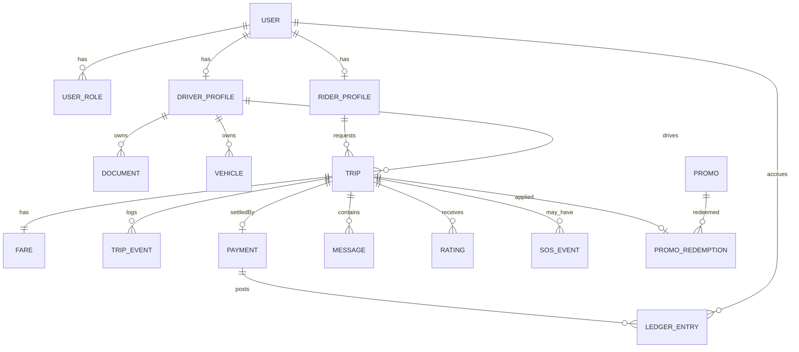
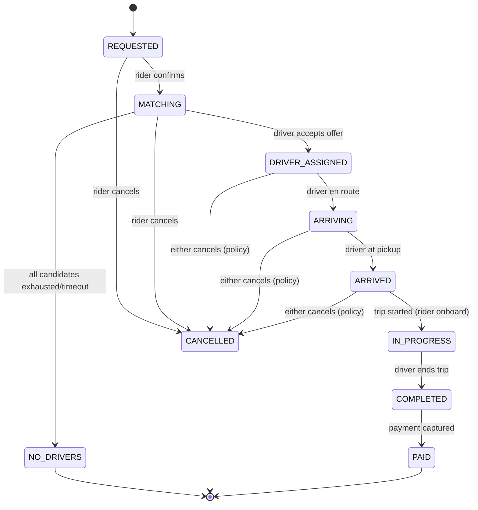

# ER Diagram & Data Model

> **Status:** 🟡 Draft · **Owner:** Engineering · **Last updated:** 2026-07-20
> **Answers:** _What are the entities, relationships, and the trip state model?_
> **Canonical schema:** [`prisma/schema.prisma`](../../prisma/schema.prisma) · **See also:** [Database Guide](./DATABASE_GUIDE.md)

This document is the human-readable view of the data model. The machine source of truth is `prisma/schema.prisma` (ADR-0003) — if the two disagree, the schema wins and this doc is updated.

---

## 1. Entity-relationship diagram

## 2. Core tables (key fields)

| Entity                      | Key fields                                                                                             | Notes                                         |
| --------------------------- | ------------------------------------------------------------------------------------------------------ | --------------------------------------------- |
| **User**                    | id, phone (unique), status, createdAt                                                                  | Shared account; roles via UserRole.           |
| **UserRole**                | userId, role (`RIDER`/`DRIVER`/`ADMIN`/`SUPPORT`)                                                      | A user may hold several.                      |
| **RiderProfile**            | userId, name, defaultPaymentMethod                                                                     | Rider-specific.                               |
| **DriverProfile**           | userId, onboardingStatus, isOnline, isOperable, rating                                                 | `isOperable` is derived (docs+vehicle valid). |
| **Document**                | id, driverId, type, fileRef, status, expiresAt, reviewedBy, reason                                     | Verification unit.                            |
| **Vehicle**                 | id, driverId, category, plate, status                                                                  | Category drives matching.                     |
| **Trip**                    | id, riderId, driverId?, status, category, pickup(geo), dropoff(geo), requestedAt, per-state timestamps | Aggregate root of the core loop.              |
| **Fare**                    | tripId, estimateAmount, finalAmount, currency, breakdown(json), surgeMultiplier, quoteInputs(json)     | Auditable; reproducible from inputs.          |
| **TripEvent**               | id, tripId, fromState, toState, actor, at, meta                                                        | Append-only transition log.                   |
| **Payment**                 | id, tripId, method, amount, status, idempotencyKey (unique), gatewayRef                                | One settlement per trip.                      |
| **LedgerEntry**             | id, userId, paymentId?, type, amount, balanceAfter, reason, at                                         | Append-only, auditable balances.              |
| **Promo / PromoRedemption** | code, rules(json), redemptions, tripId, userId                                                         | Redemption enforces caps/eligibility.         |
| **Message**                 | id, tripId, senderId, body, at                                                                         | In-trip chat, private to trip.                |
| **Rating**                  | id, tripId, raterId, rateeId, score, comment                                                           | One per party per trip.                       |
| **SosEvent**                | id, tripId, triggeredBy, at, locationSnapshot, status                                                  | Always-available safety record.               |
| **Setting**                 | key, marketId, value(json), version, updatedBy                                                         | Fares, surge, flags, service areas.           |
| **OtpChallenge**            | phone, codeHash, expiresAt, attempts, consumedAt                                                       | Rate-limited auth.                            |
| **IdempotencyRecord**       | key, requestHash, responseBody, statusCode                                                             | Money/critical-POST dedup store.              |

## 3. Data-model invariants (enforced in services + DB constraints)

- `Trip.driverId` is set only on/after `DRIVER_ASSIGNED`; a driver has **at most one** trip in an active state (partial unique index + service guard).
- `Payment.idempotencyKey` is **unique** — the DB is the last line of defense against double charge (ADR-0008).
- `TripEvent` is **append-only** (no updates/deletes); it is the trip's audit trail.
- `LedgerEntry` is **append-only**; balances are derived, never overwritten.
- `Document.status = APPROVED` **and** `expiresAt > now` for the driver to be operable.
- All money is `Decimal`, never float; currency is an ISO-4217 code.

---

## 4. Trip lifecycle state machine (authoritative)

Owned by `rides`. Other modules **request** transitions; only `rides.service` mutates `Trip.status`, writing a `TripEvent` per transition.

**Transition table (validated):**

| From            | Allowed →                              | Trigger                              | Side effects                                         |
| --------------- | -------------------------------------- | ------------------------------------ | ---------------------------------------------------- |
| REQUESTED       | MATCHING, CANCELLED                    | rider confirm / cancel               | on MATCHING: build candidates (matching)             |
| MATCHING        | DRIVER_ASSIGNED, NO_DRIVERS, CANCELLED | dispatch accept / exhausted / cancel | assign driver, lock driver, start ARRIVING notif     |
| DRIVER_ASSIGNED | ARRIVING, CANCELLED                    | driver moves / cancel                | notify rider; cancellation frees driver + policy fee |
| ARRIVING        | ARRIVED, CANCELLED                     | geofence/driver mark / cancel        | notify rider "driver arrived"                        |
| ARRIVED         | IN_PROGRESS, CANCELLED                 | start trip / cancel                  | begin fare metering                                  |
| IN_PROGRESS     | COMPLETED                              | end trip                             | finalize fare                                        |
| COMPLETED       | PAID                                   | payment captured                     | post ledger entries, enable ratings                  |

Any transition not in the table → **rejected** with `INVALID_TRIP_TRANSITION`.

See the algorithms that drive these transitions in [System Architecture §13](./SYSTEM_ARCHITECTURE.md), and the runtime flows in [Sequence Diagrams](./SEQUENCE_DIAGRAMS.md).
