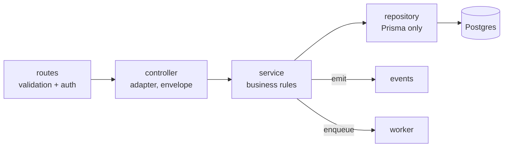

# Module Development Guide

> **Status:** 🟡 Draft · **Owner:** Engineering · **Last updated:** 2026-07-20
> **This is the single recipe every module follows.** `users`, `rides`, `payments` — all of them look identical because they are all built from this guide. Follow the steps in order.

If you (human or AI) are adding or extending a feature, you are building or touching a module in `src/modules/<name>`. Do it exactly this way. Consistency is the point: every module should be navigable by someone who has only read this page.

---

## 0. Before you write code
- **Confirm the module owns the concern.** One bounded context per module ([System Architecture](./SYSTEM_ARCHITECTURE.md)). If it belongs to another domain, call that module — don't reach in.
- **Confirm the boundary rule:** you will import other modules only through their `index.ts`, and you will write **only your own module's tables**.
- **Find the FR** it implements in the [Feature Catalog](../00_PROJECT/FEATURE_CATALOG.md) and the entities in the [ER Diagram](./ER_DIAGRAM.md).

---

## The 12-step recipe

```
1. Prisma Model      →  2. Migration      →  3. DTOs / Types
4. Validation Schema →  5. Repository      →  6. Service (business rules)
7. Controller        →  8. Routes          →  9. Events
10. Queue (if async) → 11. Tests           → 12. Swagger + docs
```

### Step 1 — Prisma model
Add/extend the model in [`prisma/schema.prisma`](../../prisma/schema.prisma). Follow the [Database Guide](./DATABASE_GUIDE.md): **UUID id**, `createdAt`/`updatedAt`, `deletedAt` for soft-deletable master data (never on append-only/money tables), `Decimal` for money, indexes for every query path.

### Step 2 — Migration
```bash
npx prisma format && npx prisma validate
npx prisma migrate dev --name <module>_<change>
```
Migrations are committed and immutable once merged. Get the migration reviewed (indexes, nullability, lock impact).

### Step 3 — DTOs / types (`<name>.types.ts`)
Define the module-local request/response DTOs and domain types. No vendor types leak in; no other module's internals leak out.

### Step 4 — Validation schema (`<name>.routes.ts`, colocated or `*.schema.ts`)
JSON Schema for **every** request and response. Invalid input is rejected at the boundary before any service runs ([API Standards](./API_STANDARDS.md)).

### Step 5 — Repository (`<name>.repository.ts`)
**The only place Prisma is touched for this domain.** Pure data access — no business rules. Applies the soft-delete filter (`deletedAt: null`) by default on reads.

### Step 6 — Service (`<name>.service.ts`)
**The business logic and invariants live here.** Services:
- enforce domain rules and state-machine transitions;
- run money/state changes inside a **transaction**;
- are **idempotent** for money/critical operations;
- return **domain objects, never HTTP responses**;
- throw **typed domain errors** ([Error Handling](../02_ENGINEERING/ERROR_HANDLING.md)) — never build HTTP status codes.

### Step 7 — Controller (`<name>.controller.ts`)
Thin adapter: read validated input → call **one** service method → shape the [response envelope](./API_STANDARDS.md). **No business logic. Never calls Prisma.**

### Step 8 — Routes (`<name>.routes.ts`)
Register endpoints with their schemas, required auth + role (deny by default), and `Idempotency-Key` where money/critical. Routes hold **validation and wiring only — no business logic**. Register the module's routes in `src/routes/index.ts`.

### Step 9 — Events (`<name>.events.ts`)
Emit past-tense domain events for side effects; subscribe to events you react to. Follow the [Event Catalog](./EVENT_CATALOG.md). Emit **after** the transaction commits.

### Step 10 — Queue (if async) — `src/workers/*`
Anything slow, external, time-driven, or must-survive-a-crash goes to a BullMQ worker, not the request path. Make the job idempotent with a clear key ([Queue Guide](./QUEUE_GUIDE.md)).

### Step 11 — Tests (`tests/modules/<name>/`)
Unit-test the **service** rules (happy + failure + idempotency + authorization). Integration-test `routes→…→DB` for critical flows ([Testing Guide](../02_ENGINEERING/TESTING_GUIDE.md)). No merge without tests for new logic.

### Step 12 — Swagger + docs
Route schemas generate Swagger automatically — keep them accurate. Update the relevant doc (Feature Catalog / ER / Events) **in the same PR** if behavior or contracts changed.

---

## The layering contract (hard rules)



| Layer | MUST | MUST NOT |
|---|---|---|
| **Routes** | declare schema, auth, role, idempotency | contain business logic |
| **Controller** | adapt HTTP ↔ service; build the envelope | touch Prisma; hold business rules |
| **Service** | own rules, transactions, idempotency; return domain objects; throw typed errors | return HTTP responses; call Prisma directly |
| **Repository** | be the only Prisma caller; apply `deletedAt: null` | contain business rules |

A layer calls **only** the layer directly below it. See [Coding Standards](../02_ENGINEERING/CODING_STANDARDS.md).

---

## File skeletons (copy these)

**`index.ts` — public surface only**
```ts
export { <name>Routes } from './<name>.routes';
export type { /* only types other modules legitimately need */ } from './<name>.types';
// Do NOT export the repository or internal service methods.
```

**`<name>.repository.ts`**
```ts
export class <Name>Repository {
  constructor(private readonly prisma: PrismaClient) {}

  findById(id: string) {
    return this.prisma.<name>.findFirst({ where: { id, deletedAt: null } });
  }
  // ...only data access; no rules.
}
```

**`<name>.service.ts`**
```ts
export class <Name>Service {
  constructor(private readonly repo: <Name>Repository /*, deps */) {}

  async doThing(input: DoThingInput): Promise<Thing> {
    const entity = await this.repo.findById(input.id);
    if (!entity) throw new NotFoundError('<Name>', input.id);   // typed domain error
    // enforce invariants; wrap money/state in this.prisma.$transaction(...)
    // emit domain event AFTER commit
    return entity;                                              // domain object, not HTTP
  }
}
```

**`<name>.controller.ts`**
```ts
export const <name>Controller = {
  async doThing(req, reply) {
    const result = await <name>Service.doThing(req.validatedBody);
    return reply.send(ok(result));   // ok() builds the standard success envelope
  },
};
```

**`<name>.routes.ts`**
```ts
export async function <name>Routes(app: FastifyInstance) {
  app.post('/<name>/thing', {
    schema: doThingSchema,                     // request + response JSON Schema
    preHandler: [auth(), role('RIDER')],       // deny by default
  }, <name>Controller.doThing);
}
```

---

## Definition of Done (module checklist)
- [ ] Prisma model + reviewed migration (UUID, timestamps, soft-delete where applicable, indexes).
- [ ] Request/response JSON Schemas on every route.
- [ ] Repository is the only Prisma caller; reads filter `deletedAt: null`.
- [ ] Service holds the rules; transactions + idempotency on money/state; returns domain objects; throws typed errors.
- [ ] Controller is a thin adapter building the response envelope; routes wired in `src/routes/index.ts`.
- [ ] Domain events defined/emitted after commit ([Event Catalog](./EVENT_CATALOG.md)).
- [ ] Async work in a worker with an idempotent job key ([Queue Guide](./QUEUE_GUIDE.md)).
- [ ] Auth + role declared on every endpoint; money/critical POSTs require `Idempotency-Key`.
- [ ] Unit tests for service rules + failure/idempotency/authorization; integration test for critical flow.
- [ ] Swagger accurate; related docs updated in the same PR.

Build every module this way and `users`, `rides`, and `payments` will read like the same author wrote them.
