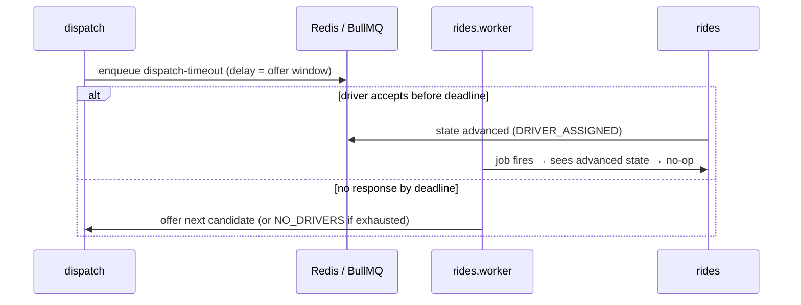

# Queues & Workers

> **Status:** 🟡 Draft · **Owner:** Engineering · **Last updated:** 2026-07-20
> **Answers:** _What runs asynchronously, why, and with what reliability guarantees?_
> **Decision:** [ADR-0005 — Workers own timing](./ADR/0005-bullmq-workers-own-timing.md) · **See also:** [Events](./EVENT_CATALOG.md)

Anything **slow, external, time-driven, or must-survive-a-crash** runs in a BullMQ worker, never in the request path. Workers are a separate process (`Dockerfile.worker`, entry `src/workers/*`) sharing the codebase and database. The request path stays fast; the async path stays durable.

**Golden rule:** _workers own time._ Every deadline, timeout, and retry is a queued job — never a client timer or an in-process `setTimeout` (lost on restart).

---

## 1. Worker map

| Worker                 | Queues / jobs                                                   | Trigger                         | Owns                                                                                                 |
| ---------------------- | --------------------------------------------------------------- | ------------------------------- | ---------------------------------------------------------------------------------------------------- |
| `rides.worker`         | `dispatch-timeout`, `arrival-check`, `stale-trip`               | delayed job on offer; scheduled | dispatch offer timeouts, re-offer to next candidate, no-driver resolution, arrival/stale-trip checks |
| `payments.worker`      | `charge`, `payout`, `refund`, `reconcile`                       | on `trip.completed`; scheduled  | charge capture, driver payout batching, refunds, cash reconciliation                                 |
| `notifications.worker` | `send` (push / sms / inapp)                                     | domain events                   | templated notification fan-out with retry + channel fallback                                         |
| `cleanup.worker`       | `expire-otp`, `stale-locations`, `doc-expiry`, `orphan-uploads` | cron / scheduled                | TTL sweeps, document-expiry, orphaned-upload GC, idempotency-record GC                               |

---

## 2. Reliability contract (every job)

1. **Idempotent** — a job may run more than once (retry, redelivery, at-least-once). Key each job so re-runs are safe:
   - `rides` jobs keyed by `tripId + attempt`; **no-op if the trip already advanced**.
   - `payments` jobs keyed by `idempotencyKey`; the `Payment.idempotencyKey` unique constraint is the DB backstop.
   - `notifications` deduped per `(user, event-id)`.
2. **Retry with backoff** — exponential backoff, bounded max attempts.
3. **Dead-letter on exhaustion** — a job that fails all attempts moves to a dead-letter queue for manual review. **Money jobs never silently drop.**
4. **Observable** — every job carries the originating `requestId`/trace so it correlates with the API log line that spawned it.
5. **Bounded** — job payloads carry IDs, not large blobs; the worker re-reads from the DB.

---

## 3. The dispatch-timeout pattern (why workers own time)

The offer deadline is a **delayed job**, not a timer in the API or the client. If the API restarts, the job still fires. If the driver already accepted, the job is a safe no-op.

---

## 4. Scaling & operations

- Workers **scale horizontally** by queue depth, independently of the API.
- Monitor: queue depth, job latency, failure rate, dead-letter growth (see [Monitoring](../03_OPERATIONS/MONITORING.md)).
- Alert on: rising dead-letter count (especially `payments`), stuck/queued jobs, worker crash-loops.
- Graceful shutdown drains in-flight jobs before exit (`app/shutdown.ts`).

---

## 5. Adding a new job

1. Define the queue/job name and payload (IDs only).
2. Make the handler idempotent and pick its idempotency key.
3. Set retry/backoff and dead-letter policy.
4. Emit/enqueue from the owning service (see [Events](./EVENT_CATALOG.md)).
5. Add a worker test proving re-run safety (see [Testing](../02_ENGINEERING/TESTING_GUIDE.md)).
