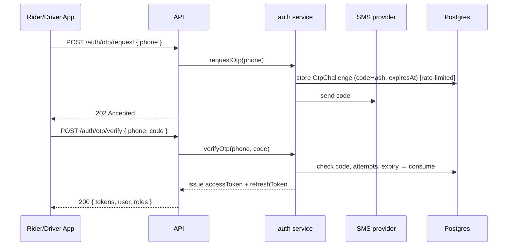
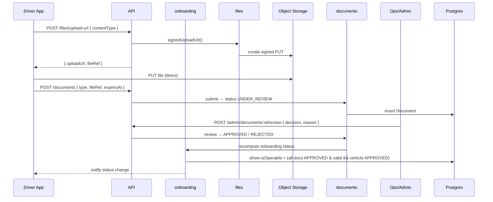
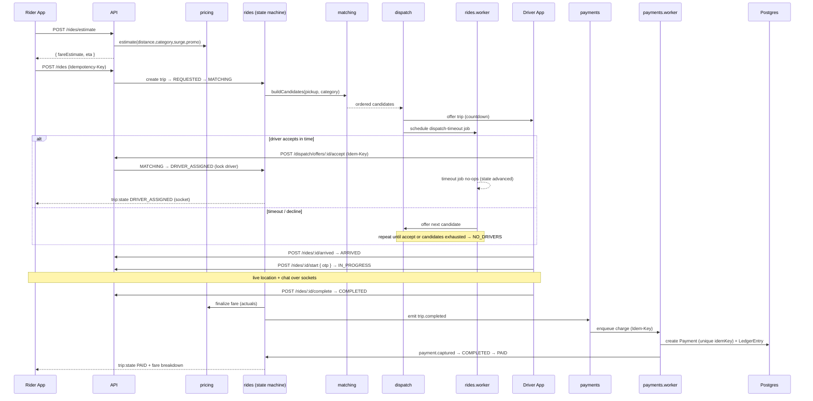
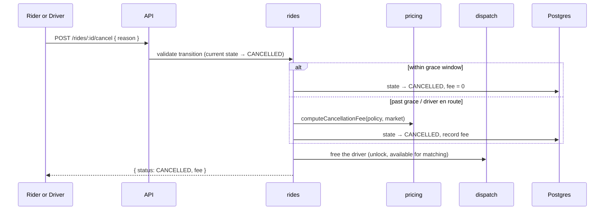
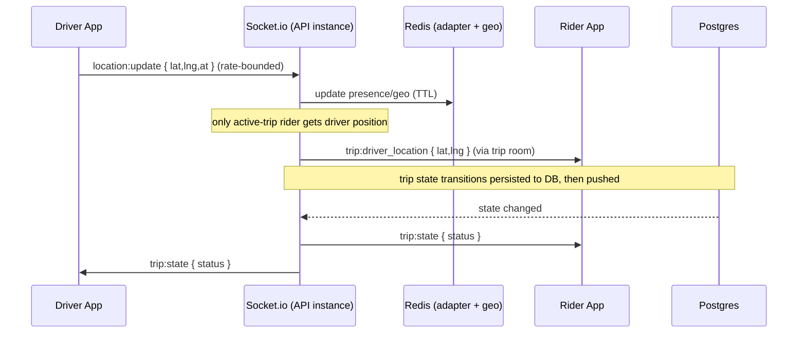
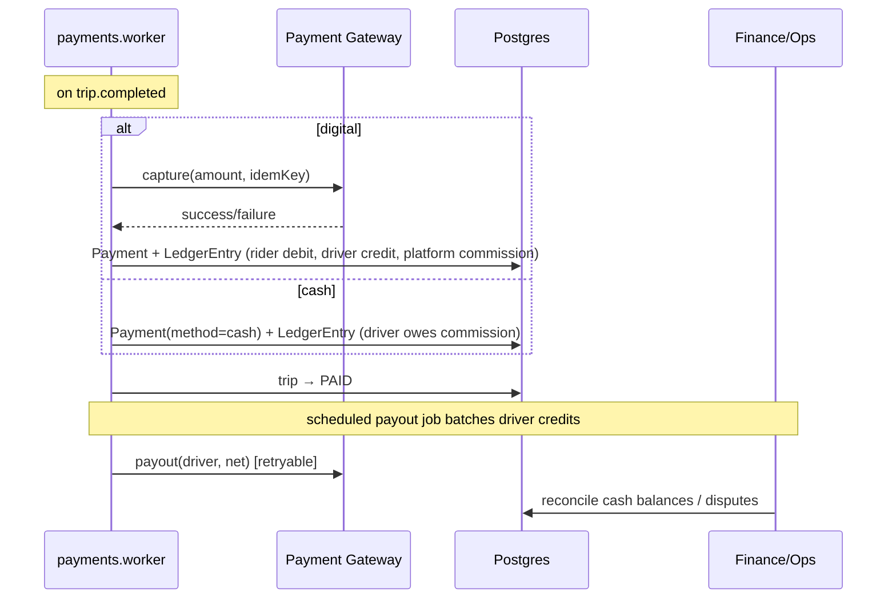
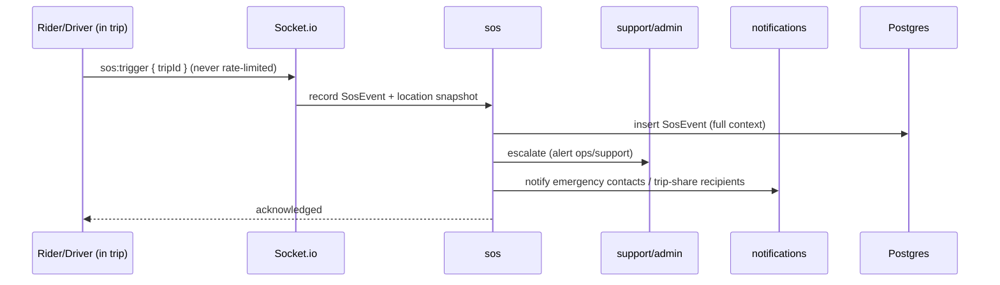
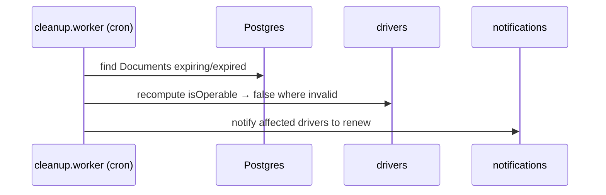

# Workflows — End-to-End Flows

> **Project:** Zaroorat — Ride-Hailing Platform
> **Status:** 🟡 Draft · **Owner:** Engineering · **Last updated:** 2026-07-20
> **Answers:** *How do the key journeys actually run, step by step?*
> **Traces from:** [LLD](./ER_DIAGRAM.md), [HLD](./SYSTEM_ARCHITECTURE.md)

These sequence diagrams show the runtime behavior of the critical journeys. Participants map to modules/processes in the codebase.

---

## 1. Authentication (OTP login) — FR-AUTH


**Failure paths:** too many requests → `429`; wrong/expired code → `401` + attempt counter; exhausted attempts → challenge locked.

---

## 2. Driver onboarding & verification — FR-ONBOARD


**Invariant:** driver cannot go online until `isOperable` is true (LLD §2.2).

---

## 3. Core loop — request → match → dispatch → ride → pay (the money shot)



**Key guarantees shown:**
- The **worker owns the dispatch timeout** — the flow never depends on a client timer.
- **Idempotency-Key** on `POST /rides`, accept, and charge — retries on flaky mobile networks are safe.
- **State machine** advances only forward; a late accept after re-assignment is rejected.
- **Payment is transactional + idempotent** — `Payment.idempotencyKey` unique constraint is the backstop.

---

## 4. Cancellation — FR-DISPATCH


Policy (grace window, fee amount) comes from `settings` per market — open question in PRD §5.

---

## 5. Real-time location & trip state — FR-GEO


On reconnect, clients call `GET /rides/:id` to reconcile with server-authoritative state (HLD §6).

---

## 6. Payment & payout / cash reconciliation — FR-PAYMENTS


Retries use the same idempotency key; a transient gateway failure never double-charges (LLD §4.4, §7).

---

## 7. SOS / safety — FR-SOS


**Invariant:** SOS works in every active-trip state and cannot be blocked by flags/limits (PRD FR-SOS).

---

## 8. Notification fan-out (async) — FR-NOTIFY

```mermaid
sequenceDiagram
    participant Svc as any service
    participant Bus as domain events
    participant NW as notifications.worker
    participant Push as Push/SMS
    participant DB as Postgres

    Svc->>Bus: emit trip.state_changed
    Bus->>NW: enqueue send job (dedup key)
    NW->>DB: resolve template + locale + channel prefs
    NW->>Push: send (push → SMS fallback)
    Note over NW: retry w/ backoff; duplicate events deduped
```
A notification failure never blocks the trip flow (HLD §7).

---

## 9. Document expiry sweep (scheduled) — FR-ONBOARD



---

## Cross-flow rules (apply to all workflows)

1. **Server-authoritative state** — clients reconcile via REST after any socket gap.
2. **Idempotent everywhere** — retried requests, duplicate socket messages, and re-run jobs are safe.
3. **Workers own time** — every timeout/deadline is a scheduled job, never a client timer.
4. **One writer per table** — a flow that needs another domain's data calls its service or emits an event.
5. **Everything money/state emits an audit record** — `TripEvent`, `LedgerEntry`, `SosEvent` are append-only.

See module/API detail in the [LLD](./ER_DIAGRAM.md) and component structure in the [HLD](./SYSTEM_ARCHITECTURE.md).
