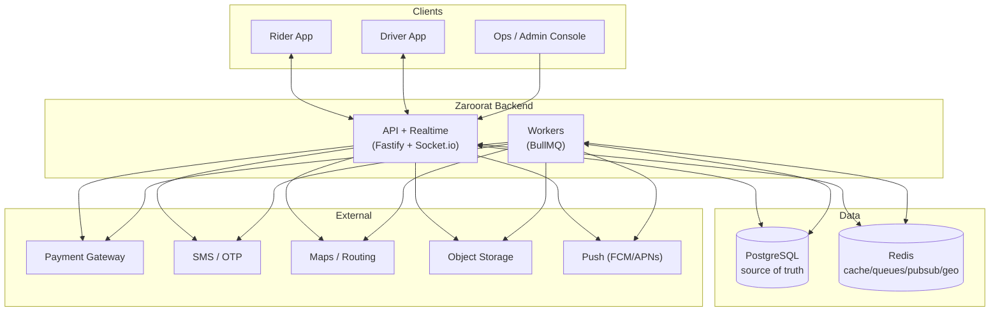
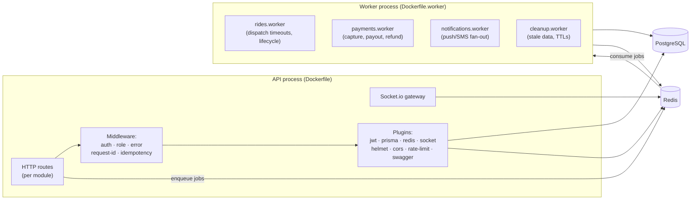
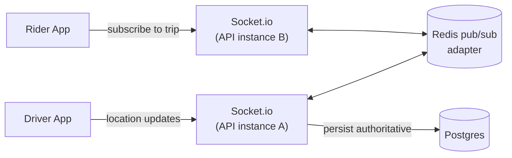
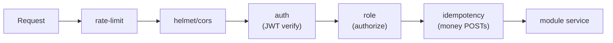
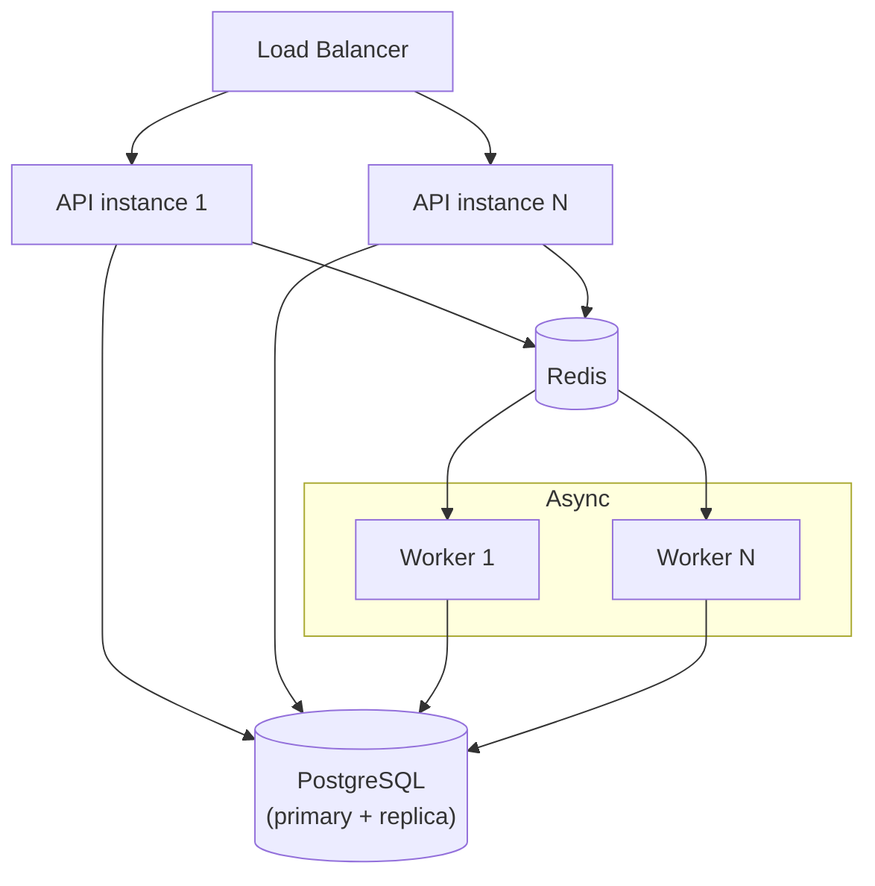

# System Architecture

> **Project:** Zaroorat — Ride-Hailing Platform
> **Status:** 🟡 Draft · **Owner:** Architecture · **Last updated:** 2026-07-20
> **Answers:** *How does the system work at the component/deployment level?*
> **Traces from:** [Feature Catalog](../00_PROJECT/FEATURE_CATALOG.md) · **Traces to:** [ER Diagram](./ER_DIAGRAM.md), [Sequence Diagrams](./SEQUENCE_DIAGRAMS.md)

---

## 1. Architectural style

Zaroorat is a **modular monolith with detachable async workers**.

- **One API codebase**, decomposed into 23 bounded-context modules with enforced boundaries.
- **Separate worker process(es)** sharing the same code and database, for async and scheduled work.
- **Not microservices** — boundaries are enforced in code, not over the network. A module can be extracted into a service later *if and when* it earns it, without rewriting the domain.

**Why:** ride-hailing has a tightly coupled core loop (match ↔ dispatch ↔ ride ↔ pricing ↔ geo). Splitting it into network services on day one adds latency, distributed-transaction pain, and ops cost with no benefit. The monolith keeps the core loop fast and transactional; workers give us independent scaling where it actually matters (payments, notifications, timeouts).

---

## 2. System context (C4 level 1)



---

## 3. Container / process view (C4 level 2)



**Two images, one codebase:**
- `Dockerfile` → API process (`src/app/server.ts`).
- `Dockerfile.worker` → worker process (`src/workers/*`).
- Both boot through `src/app/bootstrap.ts` (config validation + connections) and share `src/modules/*` services.

---

## 4. Component responsibilities

| Component | Responsibility | Key modules |
|---|---|---|
| **API gateway (Fastify)** | HTTP request handling, schema validation, auth, routing to module services | `routes`, `plugins`, `middleware` |
| **Realtime gateway (Socket.io)** | Driver location ingestion, live trip/state push, chat, SOS | `geo`, `rides`, `chat`, `sos` |
| **Domain modules** | Business logic & invariants per bounded context | `src/modules/*` |
| **Workers (BullMQ)** | Async, retryable, scheduled work | `src/workers/*` |
| **Data access** | Type-safe persistence, transactions, migrations | `plugins/prisma`, `prisma/` |
| **Integrations** | Vendor clients behind interfaces | `integrations/`, `config/*` |
| **Cross-cutting** | Config, logging, errors, observability | `config/`, `core/`, `observability/` |

---

## 5. Data stores & their roles

| Store | Role | Rule |
|---|---|---|
| **PostgreSQL** (via Prisma) | System of record: users, trips, payments, documents, ledger, config | The **only** source of truth for money and trip state. |
| **Redis** | Cache, BullMQ queues, Socket.io pub/sub adapter, rate-limit counters, hot geo/presence | **Never** authoritative for money or trip state; treat as loss-tolerant. |
| **Object storage** | Document/media blobs | DB stores references + signed-URL access only. |

**Consistency stance:**
- Money and trip-state writes are **transactional and DB-authoritative** (NFR-5).
- Real-time/geo/cache data is **eventually consistent** and reconstructable.
- If Redis and Postgres disagree about a trip, **Postgres wins**.

---

## 6. Real-time architecture



- Multiple API instances share socket rooms through the **Redis adapter**, so a rider on instance B receives updates from a driver on instance A.
- **Rooms:** one per active trip (`trip:{id}`) join the rider + driver; presence/geo channels per zone.
- **Server-authoritative state:** the socket layer pushes state, but the DB decides it. Clients reconcile on reconnect by fetching current trip state.
- **Duplicate/So reconnect tolerance:** all socket handlers are idempotent (NFR-6).

---

## 7. Async processing & the timeout problem

The core loop cannot depend on clients to fire timing events. Workers own time.

| Worker | Owns |
|---|---|
| `rides.worker` | Dispatch offer timeouts, re-offer to next candidate, no-driver resolution, arrival/stale-trip checks |
| `payments.worker` | Charge capture, payout batching, refund processing, cash reconciliation |
| `notifications.worker` | Push/SMS fan-out with retry and dedup |
| `cleanup.worker` | Stale locations, expired OTPs, orphaned uploads, document-expiry sweeps |

Jobs are **retryable with backoff** and **idempotent**. A crashed worker resumes from the queue; no active trip is orphaned (NFR-9).

---

## 8. Security architecture



- **AuthN:** JWT (access + refresh) issued by `auth`, verified by `middleware/auth.ts`.
- **AuthZ:** `middleware/role.ts` enforces required roles; **deny by default** (NFR-7).
- **Transport hardening:** `helmet`, `cors`, `rate-limit` plugins.
- **Idempotency:** `middleware/idempotency.ts` keys money/critical POSTs.
- **Secrets & config:** validated at boot via `config/env.schema.ts`; app refuses to start on invalid env.
- **PII:** documents behind signed URLs; ops access to private data is audited (NFR-10).

---

## 9. Observability

- **Structured logging** (`config/logger.ts`) — no `console.log`; JSON logs with levels.
- **Request/trace IDs** (`middleware/request-id.ts`) — correlate a request across API → queue → worker → logs (NFR-8).
- **Metrics & traces** — `observability/` stack exposes the KPI and system metrics from the BRD/PRD.
- **Health/readiness** endpoints for orchestration; graceful shutdown drains connections (`app/shutdown.ts`).

---

## 10. Deployment view



- **API scales horizontally** behind a load balancer; sockets shared via Redis adapter.
- **Workers scale independently** by queue pressure.
- **Postgres:** primary for writes, optional read replica for analytics/read-heavy queries.
- **Local/dev parity** via `docker-compose.yml` (API + worker + Postgres + Redis).
- **IaC** in `infrastructure/`; CI/CD gates on lint, tests, and migrations.

---

## 11. Key design decisions (ADR index)

| ADR | Decision | Rationale |
|---|---|---|
| ADR-1 | Modular monolith + workers, not microservices | Core loop is coupled; avoid network cost early |
| ADR-2 | Fastify | Schema-first, fast, plugin encapsulation, Swagger |
| ADR-3 | Prisma + PostgreSQL as source of truth | Type-safe, transactional, migrations, geospatial |
| ADR-4 | Redis for cache/queues/pubsub/geo, never source of truth | Right tool for hot/ephemeral data |
| ADR-5 | BullMQ workers own all timing & async | Don't trust clients for timeouts |
| ADR-6 | Socket.io + Redis adapter | Horizontal real-time scale |
| ADR-7 | Provider abstraction for payments/maps/SMS/storage | Swappable vendors, multi-market |
| ADR-8 | Idempotency on all money/critical writes | Mobile networks retry; never double-charge |

> Full ADRs live in `docs/adr/` (one file each: context → decision → consequences).

---

## 12. Cross-cutting risks & how the design addresses them

| Risk (from BRD) | Design response |
|---|---|
| Double charge / payment error | Idempotency middleware + transactional ledger + retryable capture worker |
| Lost trip on crash/restart | DB-authoritative state + graceful shutdown + queue-resumed workers |
| Connectivity drop mid-trip | Server-authoritative state, reconnect reconciliation, idempotent socket handlers |
| Supply matching quality | `matching` ranking + fresh geo TTL + fairness rules |
| Vendor lock-in | Integration interfaces per provider |
| Unauthorized data access | Deny-by-default auth, role gates, audited ops access |

---

## 13. Key algorithms

The logic behind the core-loop transitions. Tunable parameters (weights, radii, windows) live in the `Setting` table per market (ADR-0007), never hard-coded.

### 13.1 Matching (`matching.service`)
```
input: TripRequest { pickup, category, riderId }
1. candidates = geo.findDriversNear(pickup, radius, category)
     filter: isOnline && isOperable && no active trip && location fresh (< TTL)
2. score each candidate:
     score = w1 * (1/eta) + w2 * fairness(idleTime) - w3 * recentRejections
3. return candidates ordered by score → handed to dispatch
```
- Radius expands in bounded steps if the candidate set is empty.
- Weights `w1..w3` and radius steps come from `settings`.

### 13.2 Dispatch (`dispatch.service` + `rides.worker`)
```
1. offer trip to candidate[i] with a countdown (e.g. 15s), state = MATCHING
2. schedule a delayed job (rides.worker) at the deadline
3a. driver accepts → transition MATCHING → DRIVER_ASSIGNED, cancel job, lock driver
3b. driver declines / job fires (timeout) → i++, offer next candidate
4. candidates exhausted → transition MATCHING → NO_DRIVERS, notify rider
```
- The **worker owns the timeout** (§7). A late "accept" after re-assignment is rejected cleanly (idempotent).

### 13.3 Pricing (`pricing.service`)
```
estimate = base(category, market)
         + perKm(category) * distanceKm
         + perMin(category) * durationMin
estimate = max(estimate, minimum(category))
estimate = estimate * surge(zone, time)     # bounded, disclosed
estimate = applyPromo(estimate, promo)       # validated first
persist Fare { estimateAmount, quoteInputs, surgeMultiplier, breakdown }
# final: recompute with actuals (waiting, tolls, route) → finalAmount, itemized
```
- Deterministic: stored `quoteInputs` reproduce the number (audit).

### 13.4 Idempotency (`middleware/idempotency.ts`)
```
on money/critical POST:
  key = header 'Idempotency-Key' (required)
  if seen(key) → return stored response (no re-execution)
  else execute in txn, store {key → response}, return
DB backstop: Payment.idempotencyKey UNIQUE
```

---

## 14. Traceability (feature → module → artifact)

| Feature (FR) | Module(s) | Key artifacts |
|---|---|---|
| FR-AUTH | auth, users | OtpChallenge, JWT plugin, auth middleware |
| FR-ONBOARD | onboarding, documents, vehicles, files | onboarding state machine, Document/Vehicle |
| FR-GEO | geo | location:update handler, findDriversNear |
| FR-PRICING | pricing | Fare table, pricing.service |
| FR-MATCH | matching | matching.service scoring |
| FR-DISPATCH | dispatch, rides | trip state machine, rides.worker timeouts |
| FR-PAYMENTS | payments | Payment/LedgerEntry, idempotency, payments.worker |
| FR-PROMO | promotions | Promo/PromoRedemption |
| FR-NOTIFY | notifications | notifications.worker, templates |
| FR-CHAT | chat | Message, chat:message socket |
| FR-SOS | sos | SosEvent, sos:trigger |
| FR-REVIEW | reviews | Rating |
| FR-SUPPORT/ADMIN | support, admin | audited actions |
| FR-ANALYTICS | analytics | event-fed read model |
| FR-CONFIG | settings | Setting table |

See [ER Diagram](./ER_DIAGRAM.md), [Events](./EVENT_CATALOG.md), [Queues](./QUEUE_GUIDE.md), [Sequence Diagrams](./SEQUENCE_DIAGRAMS.md), and the [Database Guide](./DATABASE_GUIDE.md) for data model, events, queues, flows, and API detail.
