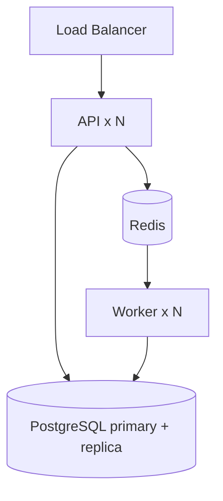

# Deployment

> **Status:** 🟡 Draft · **Owner:** Engineering / DevOps · **Last updated:** 2026-07-20
> **See also:** [System Architecture §10](../01_ARCHITECTURE/SYSTEM_ARCHITECTURE.md), [Release Checklist](./RELEASE_CHECKLIST.md)

Two images, one codebase. Reproducible from local to production.

---

## 1. Artifacts

| Image      | Built from          | Runs             | Entry               |
| ---------- | ------------------- | ---------------- | ------------------- |
| **API**    | `Dockerfile`        | HTTP + Socket.io | `src/app/server.ts` |
| **Worker** | `Dockerfile.worker` | BullMQ jobs      | `src/workers/*`     |

Both share `src/`, boot via `src/app/bootstrap.ts` (validate config → connect DB/Redis), and shut down via `src/app/shutdown.ts`.

## 2. Topology

- API scales horizontally (sockets shared via Redis adapter).
- Workers scale on queue depth, separately from the API.

## 3. Pipeline (CI/CD)

1. **CI on PR:** lint → type-check → unit → integration → build. Red = no merge.
2. **On merge to `main`:** build & tag both images.
3. **Migrations:** `npx prisma migrate deploy` runs as a gated step **before** the new app starts. Migrations are backward-compatible so old and new instances can briefly coexist.
4. **Deploy:** rolling update; health/readiness gates each instance.
5. **Post-deploy:** smoke-check the core loop; watch dashboards ([Monitoring](./MONITORING.md)).

## 4. Config & secrets

- All config via environment, validated at boot (fail-fast). See [Environment](../02_ENGINEERING/ENVIRONMENT_GUIDE.md).
- Secrets come from the platform secret store, never the image or Git.
- Runtime business config (fares, surge, flags) lives in the `Setting` table — changed without a deploy.

## 5. Migrations & zero-downtime

- **Expand → migrate → contract:** add columns/tables (backward-compatible) → deploy code that uses them → later remove the old shape.
- Never ship a migration that breaks the currently-running version during a rolling deploy.
- Long/locking migrations run as planned online operations, not inline with a release.

## 6. Health & lifecycle

- `/health` (liveness) and `/ready` (readiness — DB/Redis reachable) endpoints.
- **Graceful shutdown:** on SIGTERM, stop accepting new work, drain in-flight requests/jobs, close DB/Redis/queues (`app/shutdown.ts`). No orphaned active trips.

## 7. Rollback

- Roll back by redeploying the previous image tag.
- If a migration must be reversed, use the tested down-path; prefer forward-fixes for data migrations.
- Follow [Incident Response](./INCIDENT_RESPONSE.md) if a deploy causes an incident.

## 8. Local & staging parity

- `docker-compose.yml` runs API + worker + Postgres + Redis locally — same images, same config shape as prod.
- Staging mirrors prod topology for pre-release verification.
