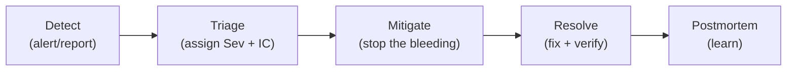

# Incident Response

> **Status:** 🟡 Draft · **Owner:** Engineering / On-call · **Last updated:** 2026-07-20
> **See also:** [Runbook](./RUNBOOK.md), [Monitoring](./MONITORING.md)

An incident is any unplanned event degrading the service for real users. This is how we respond calmly and consistently.

---

## 1. Severity levels
| Sev | Meaning | Examples | Response |
|---|---|---|---|
| **SEV1** | Critical / safety / money at scale | SOS not escalating; widespread payment failure; core loop down; data loss | Page now; all-hands; comms |
| **SEV2** | Major feature broken for many | Matching down in a market; realtime broken; auth failing | Page; urgent fix |
| **SEV3** | Partial / degraded | Elevated latency; one P1 feature flaky; single provider degraded | Business-hours urgent |
| **SEV4** | Minor / cosmetic | Small bug, low impact | Normal backlog |

**Safety (SOS) is always SEV1.**

## 2. Roles
- **Incident Commander (IC):** coordinates, decides, owns comms. Not necessarily the one typing fixes.
- **Responder(s):** investigate and mitigate.
- **Scribe:** timestamps actions in the incident channel for the postmortem.

For small incidents one person may hold several roles — but name the IC explicitly.

## 3. Lifecycle

### Detect
- Alert fires ([Monitoring](./MONITORING.md)) or a report comes in. Anyone can declare an incident.

### Triage
- Assign severity and an IC. Open the incident channel. Post initial impact statement.

### Mitigate (stop the bleeding first)
- **Restore service before root-causing.** Options: roll back a bad deploy, feature-flag off a broken P1 feature, scale workers, fail over a dependency (vendors are swappable — ADR-0007).
- Follow the matching [Runbook](./RUNBOOK.md) entry.
- **Money rule:** never "fix" a stuck payment by re-charging blindly — idempotency keys make deliberate retries safe; a blind retry risks a double charge.

### Resolve
- Apply the real fix, verify the **core loop** works, watch dashboards return to baseline, close the incident with a summary.

### Postmortem
- Blameless, within a few days for SEV1/2. Cover: timeline, impact, root cause, what went well/poorly, and **action items with owners**.
- Every action item becomes a tracked ticket. The goal is that this class of incident can't recur silently.

## 4. Communication
- One source of truth: the incident channel. IC posts status updates at a steady cadence.
- Keep stakeholders (support, finance for money incidents, leadership for SEV1) informed in plain language: impact, what we're doing, ETA.
- For user-facing outages, coordinate external comms through the agreed channel.

## 5. Golden rules
1. **Safety first** — SOS/rider-safety incidents outrank everything.
2. **Mitigate before you diagnose.**
3. **Don't make it worse** — no blind money retries, no unreviewed prod DB writes.
4. **One IC, one channel, one timeline.**
5. **Blameless postmortems** — fix systems, not people.
