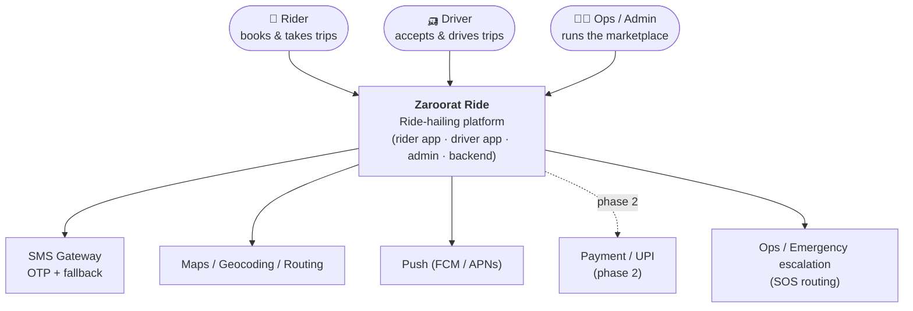
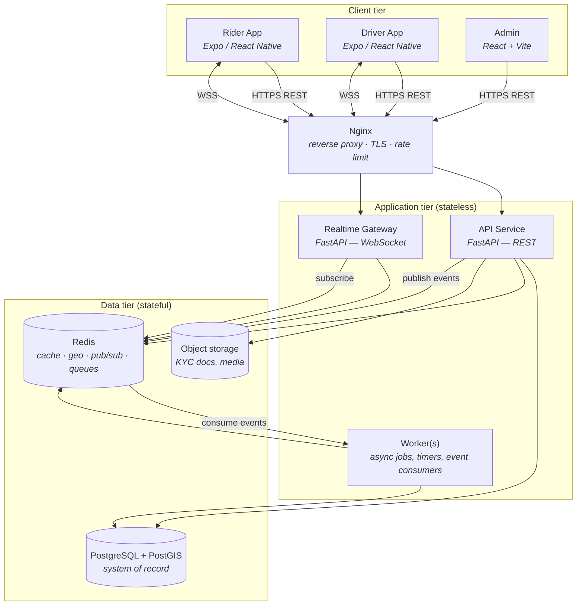

# System Context & Containers (C4)

**Owner:** Architecture · **Last reviewed:** 2026-07-06

We use the [C4 model](https://c4model.com): zoom from **Context** (the system and the world
around it) → **Containers** (the deployable/runnable pieces) → **Components** (inside a container,
covered in [02](02_component-architecture.md)). This keeps diagrams honest about their level of
detail.

---

## Level 1 — System Context

Who and what interacts with Zaroorat Ride, and the external systems it depends on.

**Reading it:** three human actor types, one system, five external dependencies. Every external
dependency is a **failure domain** we design around — most critically SMS (OTP fallback, A6.1) and
Maps (fare estimate + routing). If Maps is down we degrade to straight-line estimates; if push is
down we fall back to SMS.

---

## Level 2 — Containers

The runnable/deployable units and how they communicate.

### Container responsibilities

| Container              | Responsibility                                                            | Scaling                                          |
| ---------------------- | ------------------------------------------------------------------------- | ------------------------------------------------ |
| **Rider / Driver App** | UX, location capture, offline queueing, realtime trip view                | Client devices                                   |
| **Admin**              | Ops console, dashboards, config                                           | Static SPA                                       |
| **Nginx**              | TLS termination, routing REST vs WSS, edge rate-limiting                  | Fronts the cluster                               |
| **API Service**        | Request/response business operations (REST)                               | Horizontal, stateless                            |
| **Realtime Gateway**   | WebSocket connections; pushes live location & trip events                 | Horizontal; sticky by connection, state in Redis |
| **Worker**             | Matching timers, offer expiry, notifications, settlement, event consumers | Horizontal, by queue                             |
| **PostgreSQL+PostGIS** | Durable state, transactions, geo (zones/polygons)                         | Primary + read replicas                          |
| **Redis**              | Driver geo index, pub/sub, job queues, cache, rate limits                 | Managed/clustered                                |
| **Object storage**     | KYC documents, images                                                     | Managed                                          |

> **Why split API and Realtime?** REST is request/response and scales trivially. WebSockets are
> long-lived, connection-stateful, and have a different scaling and failure profile. Separating
> them means a flood of realtime connections can't starve the transactional API, and each scales
> on its own signal (NFR-SCALE-01).

---

## Deployment view (preview)

At launch these containers run on a small Kubernetes cluster (or equivalent) with the data tier as
managed services. Full topology, environments, and network zones are in
[05_deployment-architecture.md](05_deployment-architecture.md).

## Trust boundaries (preview)

The Nginx edge is the primary trust boundary: everything behind it is the private cluster network;
clients are untrusted. Authorization is enforced at the API/WS layer on every request
(NFR-SEC-04). Full security-zone diagram is in Volume 15.
