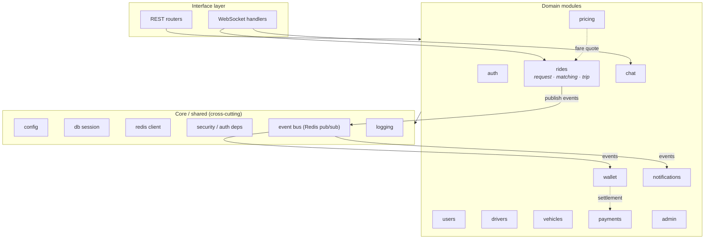
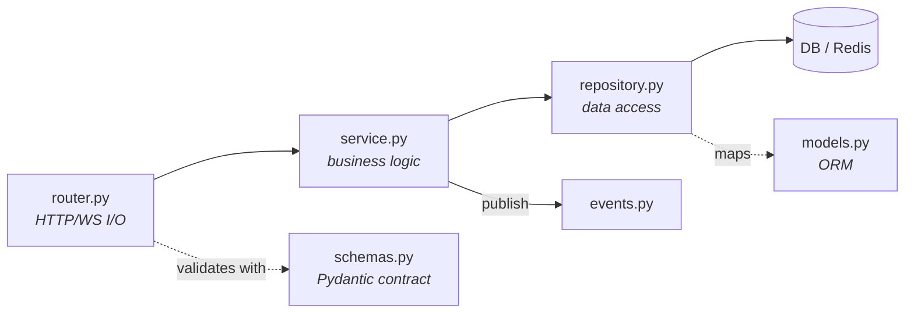
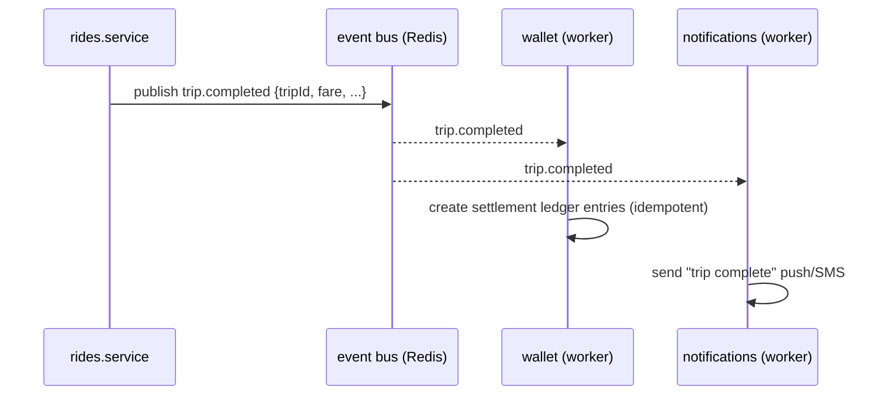

# Component Architecture

**Owner:** Architecture · **Last reviewed:** 2026-07-06

Level 3 of C4: inside the backend container. Zaroorat Ride's backend is a **modular monolith** —
one deployable, split into domain modules with **enforced boundaries** (see
[ADR-0004](../00_Project/adr/0004-modular-monolith.md)). This page defines those modules, the
layering inside each, and the rules that keep the boundaries from eroding.

---

## Module map

---

## Modules and their responsibilities

| Module          | Owns                                                  | Key business rules              |
| --------------- | ----------------------------------------------------- | ------------------------------- |
| `auth`          | OTP, tokens, sessions, rate limits                    | R-ACCOUNT-1, FR-AUTH-*          |
| `users`         | rider/driver profiles, roles, suspension              | R-ACCOUNT-2/3/4                 |
| `drivers`       | onboarding, KYC state, online/offline, eligibility    | R-KYC-*, R-AVAIL-1              |
| `vehicles`      | vehicle records, type, driver↔vehicle mapping         | R-KYC-4                         |
| `rides`         | **ride request, matching, trip lifecycle** (the core) | R-AVAIL-_, R-TRIP-_, R-CANCEL-* |
| `pricing`       | fare calc, surge, zones, config                       | R-PRICE-*                       |
| `wallet`        | ledger, balances, earnings, payouts                   | R-PAY-1..4/6, BR-8              |
| `payments`      | external gateway/UPI (phase 2), refunds               | R-PAY-5, FR-PAY-05              |
| `notifications` | push + SMS, templates, fallback                       | FR-NOTIF-*                      |
| `chat`          | rider↔driver messaging / call-mask                    | E13                             |
| `admin`         | ops operations, RBAC, audit, config                   | R-DATA-2, FR-ADMIN-*            |

> The **`rides`** module is the heart and the most complex — it internally separates _request_,
> _matching_, and _trip_ concerns. Volume 5 details its state machine and the matching algorithm.

---

## Layering inside a module

Every module follows the same four-layer shape with a strict one-way dependency rule (introduced
in [Volume 1](../00_Project/01_repository-structure.md), formalized here):

| Layer              | May depend on                                                           | May **not** do                          |
| ------------------ | ----------------------------------------------------------------------- | --------------------------------------- |
| `router`           | its own `service`, `schemas`, security deps                             | touch the DB, hold business logic       |
| `service`          | its `repository`, `events`, other modules' **services** (via interface) | build HTTP responses, run raw SQL       |
| `repository`       | `models`, DB/Redis sessions                                             | know about HTTP, contain business rules |
| `models`/`schemas` | (leaf)                                                                  | import routers/services                 |

### Cross-module communication — two allowed paths

1. **Synchronous, in-process:** a service calls another module's **service** through a narrow,
   typed interface (e.g. `rides` asks `pricing` for a fare quote). No module reaches into another
   module's repository or models. Ever.
2. **Asynchronous, via events:** a service publishes a **domain event** to the Redis event bus;
   interested modules consume it in a worker. Used to decouple side-effects (e.g. `trip.completed`
   → `wallet` settles, `notifications` notifies, `ratings` opens).

Events are **idempotent by design** (keyed by event id / trip id) so a redelivery after a worker
crash doesn't double-settle (R-PAY-1, NFR-RESIL-02).

---

## Boundary enforcement (so this doesn't rot)

Rules on paper decay. We enforce boundaries mechanically:

- **Import-linter (or equivalent) in CI** — forbids illegal imports (router→repository across
  modules, cross-module models access). A violation fails the build.
- **CODEOWNERS** per module directory.
- **Review checklist** (Volume 12/16) explicitly checks layering.

This is what makes "extract a module into a service later" cheap: because the module already only
talks to the outside world through its service interface and events, replacing the in-process call
with a network call is a localized change (ADR-0004).

---

## Why a modular monolith, not microservices (at launch)

| Concern                          | Microservices now                            | Modular monolith (chosen)        |
| -------------------------------- | -------------------------------------------- | -------------------------------- |
| Dev speed at small team size     | slow (infra, contracts, deploys per service) | fast (one repo, one deploy)      |
| Transactional integrity (money!) | hard (distributed txns/sagas)                | easy (single DB transaction)     |
| Operational overhead             | high                                         | low                              |
| Path to scale a hot module       | already separate                             | boundaries make extraction cheap |

We pay the microservices tax only when a specific module's scale or team boundary justifies it —
matching and realtime are the likely first candidates. Full rationale:
[ADR-0004](../00_Project/adr/0004-modular-monolith.md).
