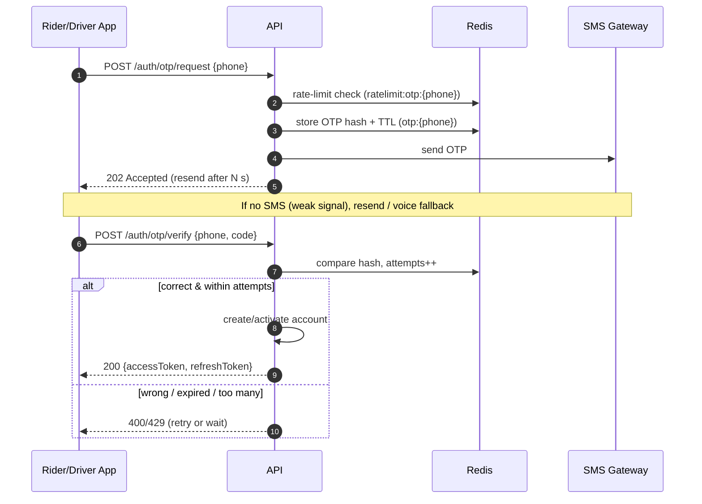
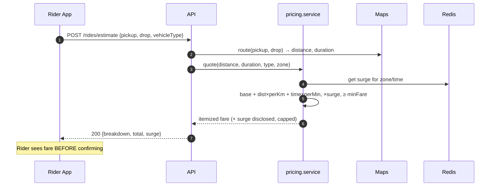
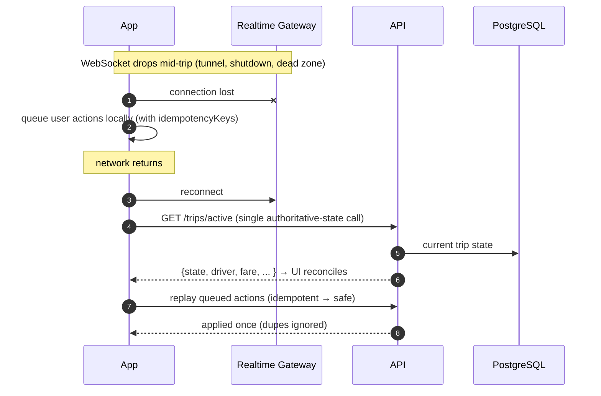

# Runtime Flows

**Owner:** Architecture · **Last reviewed:** 2026-07-06

The static structure ([02](02_component-architecture.md)) shows the boxes; this page shows them
**in motion**. These sequence diagrams are the reference for how the core scenarios actually
execute across containers. Each flow notes the requirements it realizes.

---

## Flow 1 — OTP authentication (FR-AUTH-01/02, A6.1)



Key points: OTP is stored **hashed with a TTL in Redis**, never in Postgres; attempts and requests
are rate-limited per phone (FR-AUTH-03); SMS is the delivery channel with resend fallback for the
poor-connectivity market.

---

## Flow 2 — Fare estimate before booking (FR-RIDE-02, R-PRICE-4)



If Maps is unavailable, `pricing` degrades to a straight-line-distance estimate flagged as
approximate (resilience). Surge is read from Redis (hot config) and always disclosed and capped
(R-PRICE-3).

---

## Flow 3 — Request → Matching → Accept (FR-MATCH-01..05, R-AVAIL-*)

This is the marketplace core. Matching runs off an **event + worker + timers**, not a blocking
request.

```mermaid
sequenceDiagram
    autonumber
    participant App as Rider App
    participant API
    participant PG as PostgreSQL
    participant Bus as Redis (events/geo)
    participant WK as Matching Worker
    participant WS as Realtime Gateway
    participant DApp as Driver App

    App->>API: POST /rides {pickup, drop, type, idempotencyKey}
    API->>PG: create ride_request (state=SEARCHING)
    API->>Bus: publish ride.requested
    API-->>App: 201 {rideId, state:SEARCHING}

    Bus-->>WK: ride.requested
    loop until accepted / expired
        WK->>Bus: GEOSEARCH nearby eligible drivers (type, radius)
        WK->>PG: filter eligible (approved, online, free)
        WK->>WS: offer to best candidate (timeout T)
        WS-->>DApp: ride offer {pickup, fare, eta}
        alt driver accepts (atomic claim)
            DApp->>API: POST /rides/{id}/accept {driverId, idempotencyKey}
            API->>PG: compare-and-set state SEARCHING→ACCEPTED (only 1 wins)
            API->>Bus: publish ride.matched
            API-->>DApp: 200 assigned
            WS-->>App: matched {driver, vehicle, eta}
        else declines / times out
            WK->>WK: exclude driver, next candidate; expand radius
        end
    end
    opt no driver in radius/time
        WK->>PG: state=EXPIRED
        WS-->>App: no drivers available
    end
```

Guarantees:

- **At-most-one assignment** via an atomic compare-and-set on trip state (FR-MATCH-05) — two
  drivers can't both win.
- **No immediate re-offer** to a decliner (R-AVAIL-5) — the worker tracks exclusions per request.
- **Radius expansion + expiry** (R-AVAIL-6) driven by worker timers.
- The rider's POST is **idempotent** (idempotencyKey) so a retry after a connectivity drop doesn't
  create a second request (NFR-RESIL-02).

---

## Flow 4 — Trip lifecycle → settlement (FR-TRIP-_, R-TRIP-_, R-PAY-*)

```mermaid
sequenceDiagram
    autonumber
    participant DApp as Driver App
    participant RApp as Rider App
    participant API
    participant PG as PostgreSQL
    participant Bus as Redis events
    participant Wallet as wallet (worker)
    participant Notif as notifications

    Note over DApp,RApp: state = ACCEPTED → ARRIVING
    DApp->>API: driver arrived
    API->>PG: state=ARRIVED
    DApp->>API: POST /trips/{id}/start {pickupOtp}
    API->>PG: verify OTP; if ok state=IN_PROGRESS
    Note over API: wrong OTP → cannot start (R-TRIP-2)
    DApp->>API: POST /trips/{id}/complete {finalDistance,time,route}
    API->>PG: state=COMPLETED; persist actuals + final fare
    API->>Bus: publish trip.completed
    Bus-->>Wallet: trip.completed (idempotent by tripId)
    Wallet->>PG: double-entry ledger (fare, commission, GST, net)
    Bus-->>Notif: trip.completed
    Notif-->>RApp: push/SMS "trip complete + fare"
    Notif-->>DApp: push "earnings updated"
```

- **Exactly one settlement** per completed trip (FR-TRIP-05) — enforced by idempotent event
  handling keyed on `tripId`; a redelivered `trip.completed` is a no-op.
- Ledger entries carry **fare, commission, GST/tax, net** (FR-PAY-01) so revenue, payout, and tax
  are each reconcilable.
- Cash vs wallet only changes _which_ ledger accounts move, not the flow.

---

## Flow 5 — Connectivity drop & resync (A6.1, FR-TRIP-07, NFR-RESIL-*)

The market-defining flow. A dropped connection must never strand a trip or duplicate an action.



Design guarantees that make this work:

- **Server is the source of truth**; the client reconciles to it, never the reverse.
- **One call returns authoritative current state** (`GET /trips/active`, FR-TRIP-07 / NFR-RESIL-05).
- **Every mutating call is idempotent** (idempotency key), so replay is safe (NFR-RESIL-02).
- **SMS fallback** covers the events the rider must know even if the app never reconnects
  (FR-NOTIF-02).

---

## Why these flows shape the data model & APIs

- The **atomic state transitions** (Flows 3–4) require trip state in a transactional store
  (Postgres) with row-level guarantees → Volume 6.
- **Idempotency** requires an idempotency-key store and dedupe → Volume 6/7.
- **Events** require a defined event catalog and delivery semantics → Volume 5 (`events.py` per
  module) and Volume 7 (async/WebSocket contracts).
