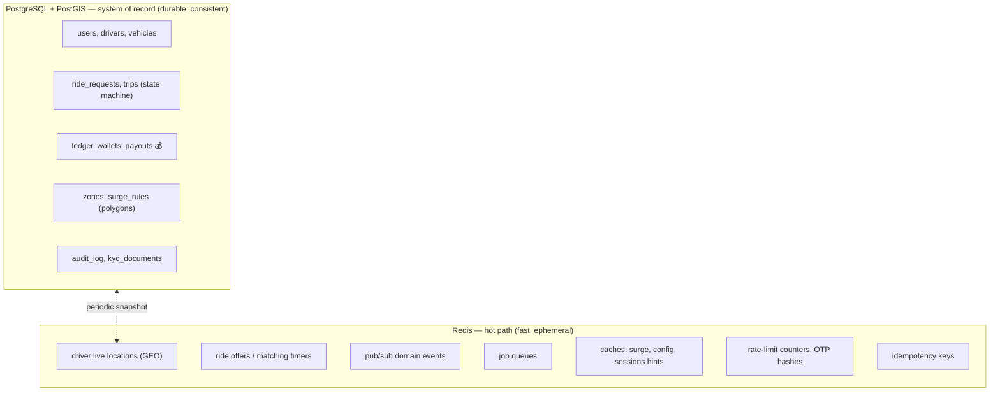

# Data & State Architecture

**Owner:** Architecture · **Last reviewed:** 2026-07-06

Where does each kind of state live, and why? Getting this split right is the single most important
data decision in the system. The rule: **Postgres is truth; Redis is speed.** This page defines
the split, the realtime plumbing, and the consistency model. Exact schemas are Volume 6.

---

## The two-store split



### What goes where — the decision rule

| If the data is…                                       | It lives in…           | Example                            |
| ----------------------------------------------------- | ---------------------- | ---------------------------------- |
| Money, or must survive a crash, or needs transactions | **Postgres**           | trips, ledger, wallets, KYC        |
| Geospatial polygons / analytical geo                  | **Postgres + PostGIS** | zones, surge areas                 |
| Written many times/second and disposable              | **Redis**              | driver GPS pings                   |
| A message between modules                             | **Redis pub/sub**      | `trip.completed`                   |
| A short-lived token/counter with a TTL                | **Redis**              | OTP, rate limits, idempotency keys |
| A binary blob                                         | **Object storage**     | KYC document scans                 |

> **The load-bearing decision:** driver location updates arrive every few seconds per online
> driver — thousands/sec at scale. Writing those to Postgres would melt it. They live in Redis
> (`GEO` index for "nearby drivers" queries) and are **snapshotted** to Postgres only periodically
> for history/analytics (ADR-0003, NFR-SCALE-04).

---

## PostGIS: geospatial queries

Two distinct geo needs, two mechanisms:

| Need                                                 | Mechanism                             | Why                                       |
| ---------------------------------------------------- | ------------------------------------- | ----------------------------------------- |
| "Which drivers are near this pickup **right now**?"  | **Redis GEO** (live, ephemeral)       | high write churn, sub-100ms reads         |
| "Is this point inside a surge/serviceable **zone**?" | **PostGIS** `ST_Contains` on polygons | durable, complex geometry, indexed (GiST) |
| "Trip route/distance history for analytics/disputes" | **PostGIS** geometry columns          | durable, queryable                        |

So a match uses **both**: Redis finds candidates fast; PostGIS/config determines the zone (for
surge and serviceability). See [ADR-0003](../00_Project/adr/0003-postgis-for-geo.md).

---

## Realtime architecture (WebSocket + pub/sub)

Riders and drivers need live updates (driver location, offers, trip state). This runs over
WebSockets, decoupled from the REST API, backed by Redis pub/sub so it scales across many gateway
instances.

```mermaid
flowchart LR
    subgraph gw["Realtime Gateway instances (stateless-ish)"]
        WS1["WS #1"]
        WS2["WS #2"]
    end
    D["Driver App"] -->|location ping| API
    API -->|GEOADD + publish loc:{tripId}| RD[("Redis")]
    RD -->|pub/sub loc:{tripId}| WS1
    WS1 -->|push| R["Rider App (on that trip)"]
    R <-->|WSS| WS2
    RD -->|pub/sub| WS2
```

- A client connects to **any** gateway instance (connection state is minimal and re-derivable).
- Channels are **scoped** (`loc:{tripId}`, `offer:{driverId}`) so a client only receives its own
  events — no broadcasting the world.
- Because fan-out goes through **Redis pub/sub**, a location published by the API reaches whichever
  gateway instance holds the relevant client's socket. Gateways scale horizontally (NFR-SCALE-01).
- On disconnect, the client reconnects and calls the authoritative-state endpoint (Flow 5) — the
  gateway holds no irreplaceable state.

---

## Consistency & transaction model

| Domain                    | Model                                                                 | Rationale                                              |
| ------------------------- | --------------------------------------------------------------------- | ------------------------------------------------------ |
| Trip state transitions    | **Strong** — single Postgres transaction, compare-and-set             | Two drivers must not both win a request (FR-MATCH-05)  |
| Money / ledger            | **Strong** — double-entry within a transaction; idempotent settlement | Financial correctness is non-negotiable (R-PAY-1)      |
| Driver live location      | **Eventual/ephemeral** — best-effort, latest-wins in Redis            | Staleness of a second is fine; durability isn't needed |
| Cross-module side-effects | **Eventual** — via events, idempotent consumers                       | Decoupling; a lagging notification is acceptable       |

Rule of thumb: **anything involving money or the trip state machine is strongly consistent and
transactional; everything else can be eventual.**

---

## Idempotency & dedupe (resilience backbone)

Because the network is unreliable (A6.1), **every state-changing operation carries a client
idempotency key**. The server records processed keys (Redis, with TTL) and returns the original
result on replay instead of acting twice. This is what makes "retry after a drop" safe across
booking, accept, start, complete, and wallet debit (NFR-RESIL-02, R-PAY-6). Details in Volume 7.

---

## Data lifecycle: soft delete, audit, retention

- **Financial & safety records are append-only / soft-deleted** (`deleted_at`), never hard-deleted
  (R-DATA-1, FR-DATA-01).
- **Admin actions on money/accounts/pricing are audit-logged** with actor + before/after
  (R-DATA-2).
- **Retention** for KYC/PII/location follows the policy in Volume 14; trip location is retained
  long enough for incident investigation (R-SAFE-4).
- Partitioning/archival of high-volume tables (locations, events) is a Volume 6 concern.
