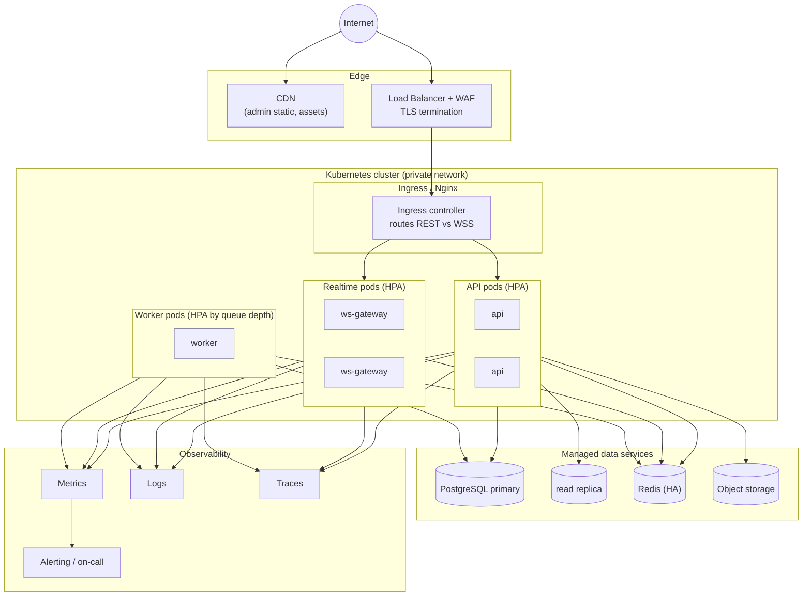
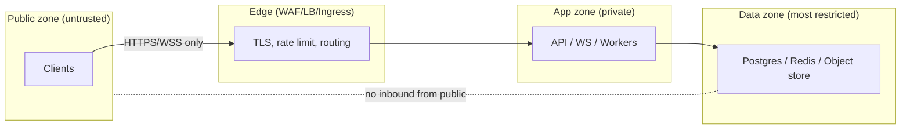

# Deployment Architecture

**Owner:** Architecture & SRE · **Last reviewed:** 2026-07-06

How the containers from [01](01_system-context.md) are deployed, isolated, scaled, and secured at
the topology level. This is the _shape_ of production; the concrete manifests, pipelines, and infra
code are **Volume 11 (Infrastructure & DevOps)**.

---

## Environments

| Env            | Purpose                         | Data                        | Deploy trigger              |
| -------------- | ------------------------------- | --------------------------- | --------------------------- |
| **local**      | dev laptops                     | Docker Compose, seeded (V1) | manual                      |
| **staging**    | pre-prod mirror, QA, load tests | prod-like, anonymized       | auto on merge to `main`     |
| **production** | live                            | real, backed up (PITR)      | tagged release, gated (V13) |

Environments are **configuration, not code** — the same images run everywhere; only env/secrets
differ (Volume 1 principle). No env-specific branches.

---

## Production topology

### Scaling strategy

| Tier          | Scales on          | Mechanism                                       |
| ------------- | ------------------ | ----------------------------------------------- |
| API pods      | CPU / request rate | Horizontal Pod Autoscaler                       |
| Realtime pods | active connections | HPA on connection count                         |
| Worker pods   | queue depth        | HPA on Redis queue length                       |
| Postgres      | read load          | read replicas; primary vertically scaled + PITR |
| Redis         | throughput/memory  | managed HA / clustering                         |

The **stateless app tiers scale out freely** (NFR-SCALE-01); the stateful tier scales with more
deliberate capacity planning. Seasonal tourist peaks (A6.3) are absorbed by autoscaling headroom,
not redesign (NFR-SCALE-03).

---

## Zero-downtime deploys

- **Rolling updates** with readiness/liveness probes — new pods must pass health checks before old
  ones drain (NFR-AVAIL-03).
- **Backward-compatible migrations** — schema changes are expand→migrate→contract so old and new
  code run simultaneously during rollout (Volume 6/11).
- **Graceful WS drain** — realtime pods stop accepting new connections and let clients reconnect
  elsewhere; because gateways are near-stateless, this is safe (Flow 5).

---

## Network & security zones (topology level)

- Only the **edge** is internet-facing. App and data zones are private (no public IPs).
- The **data zone** accepts connections only from the app zone — never from the internet.
- Secrets are injected at runtime (Volume 14); no secrets in images (Volume 1).
- Authorization is enforced **in the app tier on every request** (NFR-SEC-04) — the network zoning
  is defense-in-depth, not the only control.

Full security controls, threat model, and secret management are **Volume 15 (Security)**.

---

## Availability & disaster recovery (targets; runbooks in V13)

| Property                    | Target                 | Mechanism                           |
| --------------------------- | ---------------------- | ----------------------------------- |
| Core API availability       | ≥ 99.5% launch         | multi-pod, health-gated deploys     |
| RPO (data loss window)      | ≤ 5 min                | Postgres PITR / continuous backup   |
| RTO (recovery time)         | ≤ 1 h                  | restore + replica promotion runbook |
| In-progress trip durability | no loss on pod failure | trip state in Postgres, not memory  |

DR drills, backup verification, and incident runbooks live in **Volume 13/14** — a backup you have
never restored is not a backup.
