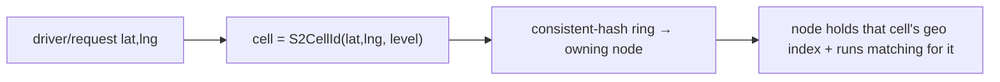
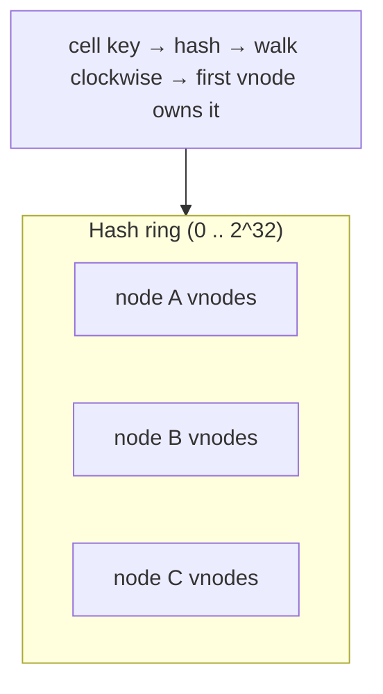
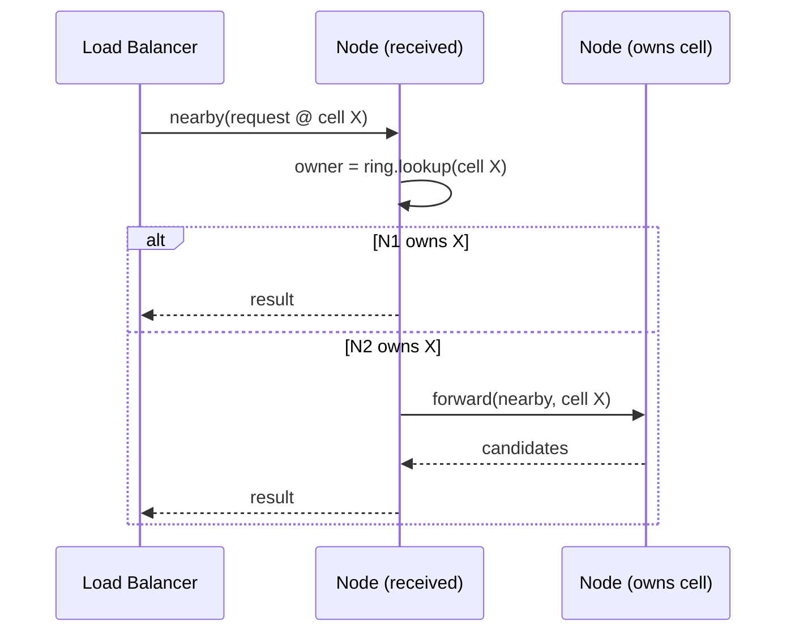
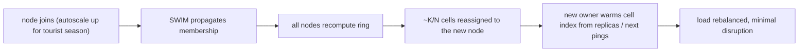

# Advanced Scaling: Consistent Hashing & Geospatial Sharding

**Owner:** Engineering (Architecture) · **Last reviewed:** 2026-07-06
**Realizes:** [ADR-0005](../00_Project/adr/0005-geospatial-sharding-consistent-hashing.md), NFR-SCALE-*, A6.3
**Status:** Target architecture (evolution) — **not adopted at launch** (see "When to adopt")

This is the scale-out design for the geo-matching hot path — the Uber-DISCO-class architecture our
matching tier evolves into when a single geo index is no longer enough. It is the _most advanced_
part of the system, and precisely because of that, we adopt it **only on evidence**, not by default.
Read [ADR-0005](../00_Project/adr/0005-geospatial-sharding-consistent-hashing.md) first for the why.

> **Launch reality check:** today, matching = Redis GEO + stateless workers (ADR-0003). This document
> is what we build _when_ the trigger metrics below fire — and the modular-monolith boundary
> (ADR-0004) is what makes that extraction a localized change, not a rewrite.

---

## 1. The problem this solves

The geo hot path has three demands that eventually break a single node:

1. **Write firehose** — every online driver pings location every few seconds. Thousands→millions/sec.
2. **Low-latency proximity** — "nearby eligible drivers" in <100ms (NFR-PERF-07), constantly.
3. **Locality of compute** — the matching offer loop wants the candidate set _where the data lives_,
   not after a network round-trip to a far index.

A single Redis GEO index scales impressively (and covers us for a long time), but has a ceiling on
write throughput, a single blast radius, and no compute co-location. The fix used at Uber scale:
**partition the world geographically and distribute the partitions across a self-organizing
cluster.**

---

## 2. Geospatial sharding — partition the world into cells

We divide the service area into **cells** using a hierarchical grid — **S2 cells** (preferred) or
geohash. A cell is a small geographic tile (e.g. a few km²). Drivers and requests are mapped to the
cell containing their location.

- **Level choice** is a trade-off: finer cells (higher level) = more, smaller shards = better load
  spread but more cross-cell queries near boundaries; coarser = fewer shards, more hotspots. We tune
  level per density (a dense Srinagar core vs. sparse outskirts may use different levels).
- **Boundary queries:** a pickup near a cell edge must consider **neighbor cells** (S2 gives cheap
  neighbor enumeration). The matching query fans out to the owning cell + its ring of neighbors,
  then merges — this is why S2's hierarchy matters.

The unit of sharding is the **cell**, not the driver — so a driver moving within a city stays in the
same shard most of the time, and "nearby" is answered by a handful of adjacent shards.

---

## 3. Consistent hashing — map cells → nodes with minimal movement

Cells are assigned to nodes via a **consistent hash ring**. This is the core mechanism, and the
reason it's consistent hashing and **not** `hash(cell) % N`:

> With `mod N`, changing N (a node joins/leaves) remaps **almost every** cell → a full reshuffle
> storm. With consistent hashing, a join/leave moves only **~K/N** cells (K cells, N nodes). That
> minimal movement is the entire point.

Design details:

- **Virtual nodes (vnodes):** each physical node is placed at **many** points on the ring (e.g.
  100–200 vnodes/node). This smooths distribution (no node gets a huge arc by luck) and makes
  rebalancing granular. Without vnodes, consistent hashing distributes poorly with few nodes.
- **Ownership:** a cell hashes to a point; walking clockwise to the first vnode gives its owner.
- **Replication:** the next **R distinct physical nodes** clockwise are replicas (see §6).
- The ring is derived from the **membership list** (§4) — every node computes the _same_ ring from
  the same membership, so ownership is agreed without a coordinator.

---

## 4. Membership & failure detection — SWIM gossip (Ringpop-style)

Nodes must agree on _who is in the cluster_ to compute the same ring. We use a **gossip membership
protocol (SWIM)** — the mechanism behind Ringpop:

- **Gossip:** nodes periodically exchange membership state with random peers; changes propagate
  epidemically (fast, no central registry).
- **Failure detection:** SWIM's ping / indirect-ping (ping-req via peers) detects a dead node
  without false positives from a single bad link; a **suspicion** phase avoids flapping.
- **Result:** an eventually-consistent, self-healing membership list. When it changes, every node
  recomputes the ring — and only the affected cells move (§3).

> **Honest note (improving on Uber):** Ringpop/SWIM is powerful but operationally heavy (gossip
> tuning, split-brain edge cases). Where a managed alternative suffices — a coordination service
> (etcd/Consul-style) driving membership, or a managed sharded store — we prefer it for lower ops
> burden. SWIM is the answer when we truly need decentralized, coordinator-free membership at scale.
> "More advanced than Uber" here means _choosing the simpler correct option_, not the fanciest.

---

## 5. Request forwarding — route to the owning node

A location ping or matching request can land on **any** node (behind the load balancer). That node
computes the owning node from the ring and **forwards** if it isn't the owner:

- The **load balancer stays dumb** (round-robin) — the _ring_ does the smart routing. This is the
  Ringpop model: any node is an entry point; correctness comes from consistent forwarding.
- Forwarding adds at most **one** hop (the receiver knows the owner directly), so latency stays
  bounded. Clients don't need ring awareness.

---

## 6. Replication & HA — a shard is never a single point of failure

Each cell is owned by a primary and replicated to the next **R−1** distinct physical nodes on the
ring:

- **Reads** (nearby queries) can be served by primary or replica.
- **Writes** (location pings) go to the primary and replicate; because live location is _ephemeral_
  (ADR-0003), replication can be relaxed/async — a lost recent ping self-heals on the next ping.
- **On node failure:** SWIM detects it → ring recomputes → the failed node's cells are already
  present on replicas, which take over. **No cell is orphaned**, and only that node's share
  rebalances (§3), not the whole cluster.

Because the sharded data is **live geo state** (reconstructable from ongoing pings), not the system
of record, we get HA cheaply — the durable truth still lives in Postgres (ADR-0003). This is a
deliberate advantage of our two-store split: the thing we shard is the thing we can afford to lose.

---

## 7. Dynamic node add/remove & rebalancing

The cluster scales elastically — critical for **seasonal tourist peaks** (A6.3):

- **Scale up** (season/event): new nodes join, take a proportional slice of cells (minimal movement),
  and warm their geo index from replicas or the next round of pings (seconds — ephemeral data).
- **Scale down** (off-season): a node leaves gracefully → its cells shift to neighbors on the ring →
  it drains and terminates. Graceful drain (Volume 10 §05) ensures in-flight offers finish.
- **Rebalance cost is bounded** by consistent hashing (~K/N), so scaling is smooth, not a stampede.

### Hot-cell handling (the Kashmir hotspot problem, A6.3)

A tourist surge at **Gulmarg/Pahalgam** makes one cell white-hot while others idle — a classic
**shard hotspot**. Mitigations:

- **Cell splitting:** subdivide a hot S2 cell into children (finer level) so its load spreads across
  more ring positions/nodes.
- **Virtual nodes** already spread a physical node's load, reducing coincidental hotspots.
- **Load-aware assignment:** weight vnode placement by observed cell load so a known hotspot cell
  isn't stacked on an already-busy node.
  This is where the design earns its keep for _our_ market specifically — geographic demand here is
  spiky and _localized_, exactly the hot-shard case.

---

## 8. How the matching module maps onto this (from V5 §03)

The matching logic (eligibility, ranking, offer loop — Volume 5 §03) is **unchanged in intent**;
only _where_ it runs changes:

| Today (launch)                        | Sharded tier (target)                                                        |
| ------------------------------------- | ---------------------------------------------------------------------------- |
| Redis GEO index (single/cluster)      | per-cell geo index on the owning node                                        |
| Worker queries Redis for candidates   | matching runs **on the node owning the cell** (compute co-located with data) |
| `ride:matchlock:{id}` in Redis        | lock owned by the cell's node (or Redis)                                     |
| FSM accept = Postgres CAS (unchanged) | **still Postgres CAS** — money/state stays transactional (ADR-0003/0004)     |

Crucially, **the trip FSM and money never move to the sharded tier** — only the _geo candidate
search and offer loop_ do. Correctness-critical state stays in Postgres with its
strong-consistency guarantees (Volume 5 §02/§05). We shard the _hot, ephemeral, throwaway_ part and
keep the _durable, must-be-correct_ part transactional. That separation is the whole architecture.

---

## 9. Testing the sharded tier (you asked for this specifically)

This tier is only trustworthy if its distributed properties are **tested** — these join the Volume 12
catalog:

| Test                    | Asserts                                                                                                             |
| ----------------------- | ------------------------------------------------------------------------------------------------------------------- |
| `T-SHARD-01` (property) | **distribution uniformity** — with V vnodes/node, cell→node load is within X% of even across N nodes                |
| `T-SHARD-02` (property) | **minimal movement** — adding/removing a node remaps ≤ ~K/N cells (not a full reshuffle)                            |
| `T-SHARD-03`            | **shard allocation correctness** — every cell has exactly one primary + R−1 replicas; no cell orphaned              |
| `T-SHARD-04`            | **membership convergence** — after a node join/leave, all nodes converge to the same ring within bound T            |
| `T-SHARD-05`            | **failure takeover** — kill the primary of a cell → a replica serves it; no lost availability for that cell         |
| `T-SHARD-06`            | **request forwarding** — a query to a non-owning node returns the same result as to the owner (≤1 hop)              |
| `T-SHARD-07` (load)     | **rebalance under load** — add/remove nodes during a location firehose; SLOs hold, no dropped pings, load re-levels |
| `T-SHARD-08`            | **hot-cell split** — a hotspot cell splits and load redistributes across nodes                                      |

`T-SHARD-01/02` are **property-based tests** (run over many random cell/node configurations) —
consistent hashing's guarantees are statistical, so we assert them statistically. `T-SHARD-07` is a
chaos+load test (Volume 12 §03/§05): churn membership _while_ hammering the geo tier and prove it
self-levels without violating latency SLOs — the real-world scenario of autoscaling during a
tourist surge.

---

## 10. When to adopt (trigger metrics — do NOT adopt early)

Adopt this tier **only** when the launch design (Redis GEO + workers) actually strains. Triggers:

| Signal                     | Threshold (illustrative)                                   |
| -------------------------- | ---------------------------------------------------------- |
| Geo index write throughput | approaching the Redis Cluster ceiling we've validated      |
| Nearby-query P95           | drifting above NFR-PERF-07 (100ms) despite scaling Redis   |
| Single-index blast radius  | a geo-tier incident takes down matching for a whole region |
| Cities/scale               | many cities / density where a single index is a bottleneck |

Until then, this document is the **plan**, and ADR-0004's boundaries keep the door open. Building it
early would be textbook over-engineering — operating a gossip-sharded cluster for two cities is the
_opposite_ of advanced. **The advanced move is knowing exactly what to build and exactly when.**

---

## 11. Where we can genuinely beat Uber's original

Being honest and specific (not just "we're better"):

- **Lean on managed infra first:** Redis Cluster / managed sharded stores get us far with a fraction
  of Ringpop's ops cost — adopt custom gossip-sharding only past their ceiling.
- **Shard only the ephemeral tier:** by keeping money/FSM in Postgres and sharding _only_ live geo
  (our two-store split), our sharded tier is stateless-ish and cheap to rebalance — Uber's early
  designs entangled more state.
- **Hotspot-aware from day one of the design:** localized seasonal demand (A6.3) is a first-class
  case here (§7), not an afterthought.
- **Property-tested invariants:** distribution and minimal-movement are asserted continuously (§9),
  not assumed.

"More advanced than Uber" = _the right pattern, adopted at the right time, tested rigorously, and
kept as simple as the scale allows._ That discipline is the advanced part.
