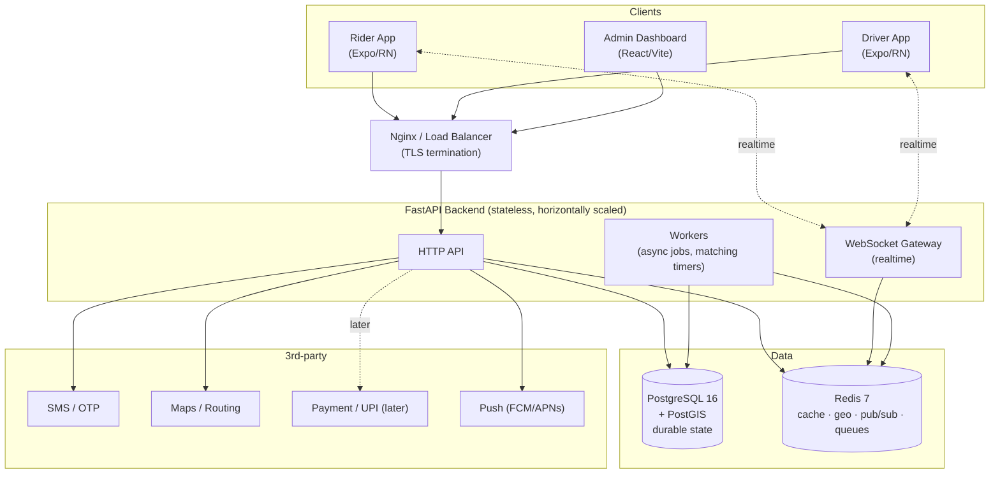

# Volume 4 — High-Level Architecture

> How the pieces of Zaroorat Ride fit together at a system level — the shape of the thing before
> we zoom into any one module (that's Volume 5). If you're joining the team, read this to build a
> mental model of the whole system in ~20 minutes.

**Owner:** Engineering (Architecture) · **Last reviewed:** 2026-07-06

---

## Contents

| Doc                                                                        | Topic                                                                                                                             |
| -------------------------------------------------------------------------- | --------------------------------------------------------------------------------------------------------------------------------- |
| [01_system-context.md](01_system-context.md)                               | C4 context + container diagrams: actors, systems, and the big boxes                                                               |
| [02_component-architecture.md](02_component-architecture.md)               | Backend module boundaries, layering, and the dependency rules                                                                     |
| [03_runtime-flows.md](03_runtime-flows.md)                                 | Sequence diagrams: OTP auth, request→match→trip→settle, connectivity recovery                                                     |
| [04_data-and-state.md](04_data-and-state.md)                               | Where state lives (Postgres vs Redis), realtime (WebSocket/pub-sub)                                                               |
| [05_deployment-architecture.md](05_deployment-architecture.md)             | Environments, topology, scaling, network & security zones                                                                         |
| [06_technology-decisions.md](06_technology-decisions.md)                   | The stack and _why_ — links to ADRs                                                                                               |
| [07_advanced-scaling-and-sharding.md](07_advanced-scaling-and-sharding.md) | **Uber-DISCO-class evolution:** consistent hashing, geospatial sharding, SWIM membership, dynamic rebalancing (adopt-on-evidence) |

---

## Architecture in one picture

---

## The five architectural principles

Everything downstream follows from these. When a design decision is unclear, return here.

1. **Stateless services, stateful stores.** API/WS instances hold no session state; all state is
   in Postgres (durable) or Redis (ephemeral/fast). Any instance can serve any request → we scale
   by adding instances (NFR-SCALE-01/02).

2. **Two stores, clear split.** Postgres is the **system of record** (money, trips, users — must
   be durable and consistent). Redis handles **hot, high-churn, ephemeral** data (driver live
   locations, geo queries, pub/sub, queues, rate limits). See [ADR-0003](../00_Project/adr/0003-postgis-for-geo.md).

3. **Modular monolith first, service-extractable later.** The backend is **one deployable** split
   into strong domain modules with enforced boundaries. We get service-like separation without
   distributed-systems overhead at launch — and can extract a hot module (e.g. matching) into its
   own service if scale demands, because the boundaries already exist. (See
   [ADR-0004](../00_Project/adr/0004-modular-monolith.md).)

4. **Async & event-driven at the core.** The marketplace is inherently event-driven (ride
   requested, driver accepted, trip completed). Modules publish **domain events** to Redis;
   others react. This decouples matching, notifications, and settlement.

5. **Resilience is a first-class requirement, not a feature.** Idempotency, SMS fallback, and
   reconnect-and-resync are baked into the architecture because the target market's connectivity
   demands it (A6.1, NFR-RESIL-*).

---

## What this volume does _not_ cover

- Internal design of each module (state machines, class shapes) → **Volume 5 (LLD)**.
- Exact table schemas → **Volume 6 (Database)**.
- Exact API contracts → **Volume 7 (API)**.
- K8s manifests, CI/CD pipelines → **Volume 11**.

This volume is the map; those are the streets.
