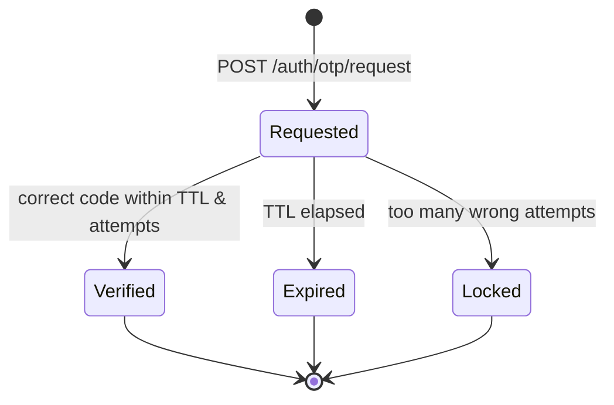

# LLD — Authentication (`auth`)

**Owner:** Engineering · **Last reviewed:** 2026-07-06
**Realizes:** FR-AUTH-01..07, R-ACCOUNT-1..4, NFR-SEC-02, A6.1

Auth is the gate for everything. It's phone + OTP (no passwords) with JWT sessions, hardened against
abuse and designed for a market with unreliable SMS delivery.

---

## 1. Responsibility

`auth` verifies phone ownership via OTP, issues and refreshes tokens, and enforces
rate-limits/suspension. It owns _identity verification and sessions_, not profile data (`users`).

---

## 2. OTP lifecycle — FR-AUTH-01/02/03



- **Store:** the OTP is **hashed** (never plaintext) in Redis at `otp:{phone}` with a **TTL**
  (e.g. 5 min). It never touches Postgres. On verify we compare hashes and increment an attempts
  counter; too many wrong → lock for a cooldown.
- **Rate limits (Redis counters, TTL):** per-phone request rate, per-phone verify attempts, and
  per-device/IP caps — to stop OTP-bombing and brute force (FR-AUTH-03, NFR-SEC-06).
- **Delivery + fallback (A6.1):** send via SMS; expose **resend** after an interval; optional
  **voice OTP** fallback. SMS delivery failures must degrade gracefully, never dead-end the user.

```python
async def request_otp(self, phone: Phone) -> None:
    await self._limits.check(f"otp:req:{phone}")           # rate limit or 429
    code = generate_numeric_otp()
    await self._redis.setex(f"otp:{phone}", OTP_TTL, hash_otp(code))
    await self._sms.send_otp(phone, code)                  # fallback handled in notifications

async def verify_otp(self, phone: Phone, code: str) -> TokenPair:
    stored = await self._redis.get(f"otp:{phone}")
    attempts = await self._redis.incr(f"otp:att:{phone}")
    if attempts > MAX_ATTEMPTS:
        raise OtpLockedError(phone)
    if stored is None or not verify_hash(code, stored):
        raise InvalidOtpError(phone)
    await self._redis.delete(f"otp:{phone}", f"otp:att:{phone}")
    user = await self._users.get_or_create(phone)          # activate account (R-ACCOUNT-1)
    return self._issue_tokens(user)
```

---

## 3. Tokens — JWT access + refresh — FR-AUTH-04/07, NFR-SEC-02

| Token       | TTL      | Contents                      | Storage                                        |
| ----------- | -------- | ----------------------------- | ---------------------------------------------- |
| **Access**  | ~30 min  | `sub` (user id), roles, `exp` | client memory; sent as `Authorization: Bearer` |
| **Refresh** | ~30 days | opaque id → server record     | client secure storage; rotated on use          |

- **Access tokens are stateless JWTs** (signed, short-lived) → any API instance validates without a
  DB hit (NFR-SCALE-02).
- **Refresh tokens are server-tracked** so they can be **revoked** (logout, suspension). Rotation:
  each refresh issues a new refresh token and invalidates the old (detects token theft/replay).
- **Suspension** (R-ACCOUNT-4): a suspended user's refresh tokens are revoked and access is denied
  by an authz check; short access-token TTL bounds the window.

---

## 4. Roles & dual-role — R-ACCOUNT-2/3

- One account per phone **per role**; a person may hold **both** rider and driver roles on one
  identity (R-ACCOUNT-3). Roles are claims in the access token; driver capabilities unlock only
  after KYC approval (see [06_drivers-kyc.md](06_drivers-kyc.md)).
- Authorization is **default-deny** and enforced on every endpoint via a dependency (NFR-SEC-04);
  no endpoint trusts client-side role state.

---

## 5. Edge cases & failure handling

| Edge case                               | Handling                                                                                                              |
| --------------------------------------- | --------------------------------------------------------------------------------------------------------------------- |
| SMS never arrives (weak signal)         | Resend after interval; voice fallback; generous but rate-limited retries (A6.1).                                      |
| User requests many OTPs (abuse)         | Per-phone + per-device rate limits → 429.                                                                             |
| Brute-forcing the code                  | Attempts counter → lock + cooldown; short numeric-space mitigated by attempt cap.                                     |
| Refresh token reuse (theft)             | Rotation detects reuse of an already-rotated token → revoke the whole chain.                                          |
| Clock skew on JWT `exp`                 | Small leeway; short TTL limits exposure.                                                                              |
| Duplicate `verify` after a network drop | Idempotent: first consumes the OTP; retry finds it gone → re-issue tokens for the now-active user or a clean re-auth. |

## 6. Invariants & traceability

**Invariants**

- **A-1** OTP is stored only hashed, with a TTL, only in Redis. (NFR-SEC-02)
- **A-2** Account activates only after OTP verification. (R-ACCOUNT-1)
- **A-3** Suspended/logged-out refresh tokens cannot mint access tokens. (R-ACCOUNT-4)
- **A-4** Every endpoint enforces authz server-side (default-deny). (NFR-SEC-04)

| Design element                  | Satisfies                 |
| ------------------------------- | ------------------------- |
| OTP hash + TTL + attempts       | FR-AUTH-01/03, NFR-SEC-02 |
| Resend/voice fallback           | FR-AUTH-02, A6.1          |
| Access JWT + tracked refresh    | FR-AUTH-04/07             |
| One-account-per-role, dual role | R-ACCOUNT-2/3, FR-AUTH-05 |
| Suspension revokes tokens       | R-ACCOUNT-4, FR-AUTH-06   |
