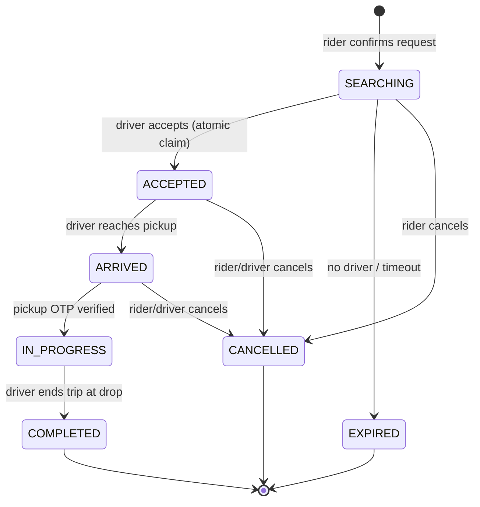

# LLD — Trip State Machine (`rides`)

**Owner:** Engineering · **Last reviewed:** 2026-07-06
**Realizes:** FR-TRIP-01..07, FR-MATCH-05, R-TRIP-1..5, R-CANCEL-*, A6.1

The trip is the spine of the platform. Its lifecycle is modeled as an **explicit finite state
machine (FSM)** stored in Postgres. Every meaningful thing (matching, tracking, settlement,
safety) hangs off a trip state transition. Getting this FSM right — especially its guards and
concurrency — is the single most important piece of backend correctness.

---

## 1. Responsibility

The `rides` trip sub-module owns the **authoritative lifecycle** of a single ride from creation to
a terminal state. It does _not_ compute fares (`pricing`), move money (`wallet`), or send messages
(`notifications`) — it **emits events** and those modules react (Volume 4, Flow 4). It owns exactly
one thing: _what state is this trip in, and is a given transition legal right now?_

---

## 2. States



| State         | Meaning                                        | Terminal? |
| ------------- | ---------------------------------------------- | --------- |
| `SEARCHING`   | Request created, matching in progress          | no        |
| `ACCEPTED`    | A driver is assigned, en route to pickup       | no        |
| `ARRIVED`     | Driver is at pickup, awaiting OTP start        | no        |
| `IN_PROGRESS` | Rider on board, trip underway                  | no        |
| `COMPLETED`   | Trip finished, settlement triggered            | **yes**   |
| `EXPIRED`     | No driver matched in time                      | **yes**   |
| `CANCELLED`   | Cancelled by rider or driver before completion | **yes**   |

**Invariant I-1:** the three terminal states are mutually exclusive and final — once terminal, no
further transitions (R-TRIP-5).

---

## 3. Transition table (the contract)

The diagram shows _shape_; this table is the _law_. Each transition = (from, event, guard → to,
side-effects). An event that doesn't match a legal (from, guard) pair is **rejected**, not ignored
silently — it returns a conflict the client can reconcile against.

| #   | From                 | Event            | Guard                                                | To            | Side-effects (events emitted)                 |
| --- | -------------------- | ---------------- | ---------------------------------------------------- | ------------- | --------------------------------------------- |
| T1  | —                    | `request.create` | rider active, no other active trip                   | `SEARCHING`   | `ride.requested`                              |
| T2  | `SEARCHING`          | `driver.accept`  | driver eligible **and** trip still `SEARCHING` (CAS) | `ACCEPTED`    | `ride.matched`                                |
| T3  | `SEARCHING`          | `match.timeout`  | radius exhausted / TTL elapsed                       | `EXPIRED`     | `ride.expired`                                |
| T4  | `SEARCHING`          | `rider.cancel`   | —                                                    | `CANCELLED`   | `ride.cancelled(free)`                        |
| T5  | `ACCEPTED`           | `driver.arrived` | —                                                    | `ARRIVED`     | `ride.arrived`                                |
| T6  | `ACCEPTED`/`ARRIVED` | `rider.cancel`   | —                                                    | `CANCELLED`   | `ride.cancelled(fee?)`                        |
| T7  | `ACCEPTED`/`ARRIVED` | `driver.cancel`  | —                                                    | `CANCELLED`   | `ride.cancelled(no rider fee)` + driver score |
| T8  | `ARRIVED`            | `trip.start`     | **pickup OTP matches**                               | `IN_PROGRESS` | `trip.started`                                |
| T9  | `IN_PROGRESS`        | `trip.complete`  | —                                                    | `COMPLETED`   | `trip.completed`                              |

**Guard on T8 is safety-critical** (R-TRIP-2): a wrong OTP does **not** transition; it returns an
error and the trip stays `ARRIVED`. This is what prevents wrong-rider trips.

**Guard on T2 is correctness-critical** (FR-MATCH-05): the accept only succeeds if the trip is
_still_ `SEARCHING` at commit time — see concurrency below.

---

## 4. Core logic (pseudocode)

The transition function is the single choke point. **All** state changes go through it; nothing
mutates `trip.state` directly.

```python
# rides/trip_service.py
class TripService:
    ILLEGAL = TripTransitionError

    async def transition(self, trip_id: int, event: TripEvent, ctx: TripContext) -> Trip:
        async with self._uow.transaction():                 # single DB transaction
            trip = await self._repo.get_for_update(trip_id)  # SELECT … FOR UPDATE (row lock)
            rule = TRANSITIONS.get((trip.state, event.type))
            if rule is None:
                raise self.ILLEGAL(trip.state, event.type)   # illegal transition → 409
            if not rule.guard(trip, ctx):                    # e.g. OTP match, eligibility
                raise rule.guard_error(trip, ctx)
            trip.state = rule.to_state
            trip.apply(event, ctx)                           # timestamps, actuals, driver_id…
            await self._repo.save(trip)
            await self._events.publish(rule.emit(trip, ctx)) # outbox → Redis (see §5)
            return trip
```

Key properties:

- **Row lock** (`FOR UPDATE`) serializes concurrent transitions on the same trip — no lost updates.
- **Table-driven** — `TRANSITIONS` is the transition table above as data, so the FSM is auditable
  and testable in isolation.
- **Events emitted inside the same transaction** via the outbox pattern (§5) so state change and
  event publication are atomic.

---

## 5. Concurrency & consistency

### The double-accept race (the classic ride-hailing bug)

Two drivers tap "accept" on the same `SEARCHING` request within milliseconds. Only one may win.

```mermaid
sequenceDiagram
    participant D1 as Driver A
    participant D2 as Driver B
    participant API
    participant PG as Postgres
    D1->>API: accept(trip 42)
    D2->>API: accept(trip 42)
    API->>PG: BEGIN; SELECT trip 42 FOR UPDATE  (D1 gets lock)
    Note over PG: D2 blocks on the row lock
    API->>PG: state SEARCHING→ACCEPTED; COMMIT (D1)
    API->>PG: (D2 acquires lock) state is now ACCEPTED
    Note over API: guard fails: not SEARCHING → 409 to D2
```

The **`FOR UPDATE` lock + state-equals-SEARCHING guard** makes accept a compare-and-set. D2 gets a
clean 409 "already taken", not a corrupt double-assignment (FR-MATCH-05, Invariant I-2).

### Transactional outbox (exactly-once-ish events)

Publishing to Redis _after_ commit risks losing the event on a crash; publishing _before_ risks a
phantom event if the commit rolls back. We use the **outbox pattern**: the event is written to an
`outbox` table **in the same transaction** as the state change; a relay worker publishes committed
outbox rows to Redis and marks them sent. Consumers are idempotent, so at-least-once delivery is
safe (R-PAY-1, NFR-RESIL-02).

**Invariant I-2:** a trip is `ACCEPTED` by **at most one** driver.
**Invariant I-3:** every terminal transition emits exactly one terminal event (`completed`/
`cancelled`/`expired`), and `trip.completed` triggers exactly one settlement (idempotent consumer).

---

## 6. Edge cases & failure handling

| Edge case                                                         | Handling                                                                                                                                            |
| ----------------------------------------------------------------- | --------------------------------------------------------------------------------------------------------------------------------------------------- |
| **Client retries `accept` after a network drop**                  | Idempotency key: same key → return the original result (D still assigned), not a second transition (A6.1).                                          |
| **Client sends `trip.start` twice**                               | Second call: state already `IN_PROGRESS` → transition illegal → 409; client reconciles via `GET /trips/active`.                                     |
| **Wrong pickup OTP**                                              | Guard fails, stays `ARRIVED`, error returned; rate-limit OTP attempts to prevent brute force.                                                       |
| **Driver cancels after accept**                                   | T7: no rider fee, driver score impact, trip re-enters matching **as a new request** (product decision) or is cancelled per policy.                  |
| **Rider cancels during grace window**                             | T4/T6: fee only if past grace window (R-CANCEL-2), disclosed before charging.                                                                       |
| **`match.timeout` fires just as a driver accepts**                | Both hit the row lock; whichever commits first wins. If accept wins, timeout sees `ACCEPTED` → no-op. If timeout wins, accept sees `EXPIRED` → 409. |
| **Worker crash between commit and event publish**                 | Outbox relay re-publishes on restart; idempotent consumers dedupe. No lost settlement.                                                              |
| **Trip stuck in a non-terminal state** (driver app dies mid-trip) | Watchdog job flags trips inactive beyond a threshold for ops intervention; never auto-completes a trip that moves money without evidence.           |

---

## 7. Invariants (become tests — Volume 12)

- **I-1** Terminal states are final and mutually exclusive. → `T-TRIP-05`
- **I-2** At most one driver per trip. → `T-TRIP-01`, `T-MATCH-*`
- **I-3** Exactly one settlement per completed trip. → `T-TRIP-04`, `T-PAY-01`
- **I-4** `IN_PROGRESS` requires a verified pickup OTP. → `T-TRIP-02`
- **I-5** Every state change goes through `transition()`; no direct `trip.state` writes. → boundary test
- **I-6** State survives process/connectivity failure (durable in Postgres). → `T-RESIL-01`

## 8. Traceability

| Design element                           | Satisfies             |
| ---------------------------------------- | --------------------- |
| FSM + transition table                   | R-TRIP-1, FR-TRIP-01  |
| OTP guard on T8                          | R-TRIP-2, FR-TRIP-02  |
| CAS accept + row lock                    | FR-MATCH-05, R-TRIP-1 |
| Terminal exclusivity                     | R-TRIP-5, FR-TRIP-06  |
| `trip.completed` → one settlement        | R-TRIP-4, FR-TRIP-05  |
| Outbox + idempotent consumers            | R-PAY-1, NFR-RESIL-02 |
| Authoritative-state read after reconnect | A6.1, FR-TRIP-07      |
