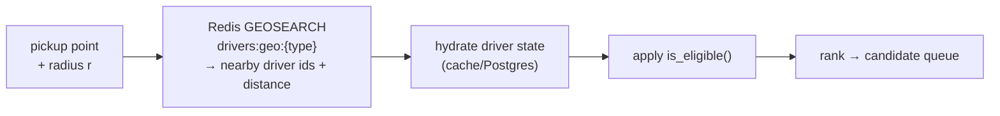

# LLD — Matching Engine (`rides`)

**Owner:** Engineering · **Last reviewed:** 2026-07-06
**Realizes:** FR-MATCH-01..05, R-AVAIL-1..6, NFR-PERF-04/07

Matching turns a `SEARCHING` request into an `ACCEPTED` trip by finding an eligible nearby driver
and getting them to accept. It runs as an **event-driven loop in a worker** (Volume 4, Flow 3), not
a blocking API call, because it involves waiting on human drivers and expanding search over time.

---

## 1. Responsibility

Given a ride request, the matching engine: (a) finds **eligible** drivers near the pickup, (b)
**ranks** them, (c) **offers** the trip to the best candidate with a timeout, (d) on decline/timeout
moves to the next, expanding radius, until accepted or expired. It owns candidate selection and the
offer loop; it does **not** own the trip FSM transition itself (that's `trip_service.transition`,
which the accept call invokes).

**Design stance for MVP:** a **rules-based** greedy engine (nearest + fairness), not ML. It's
predictable, debuggable, and good enough at launch density. ML dispatch is an explicit later step
(Volume 4 deferred decisions).

---

## 2. Eligibility (the hard filter) — R-AVAIL-1/2/3

A driver is a candidate **only if all** hold:

```python
def is_eligible(driver, request) -> bool:
    return (
        driver.status == ONLINE
        and driver.kyc == APPROVED
        and driver.active_trip_id is None            # not already on a trip
        and driver.vehicle_type == request.vehicle_type
        and driver.location_age <= MAX_LOCATION_AGE   # recent fix (R-AVAIL-2)
        and driver.id not in request.excluded_drivers # didn't just decline (R-AVAIL-5)
        and not driver.is_suspended
    )
```

Eligibility is checked **twice**: coarsely at candidate-fetch time (fast, from Redis/cache) and
**again atomically at accept time** inside the trip transaction (authoritative). The second check is
what actually guarantees correctness — the first is just an optimization.

---

## 3. Candidate search — Redis GEO + Postgres filter

Two-stage to be both fast and correct:



- **Redis `GEOSEARCH`** on a per-vehicle-type geo set returns nearby driver ids in ~ms
  (NFR-PERF-07). Driver locations are written here on each ping (Volume 4, data split).
- We **do not** scan Postgres for "nearby" — that's what Redis GEO is for. Postgres is queried only
  to hydrate/verify state for the small candidate set.
- **Zone/serviceability** (is pickup inside a serviceable area? surge zone?) uses PostGIS on the
  request once, not per driver.

---

## 4. Ranking & fairness — R-AVAIL-4

Pure "nearest" starves drivers who sit slightly farther out and clusters trips on a few drivers.
We rank by a **score** that blends proximity with fairness:

```
score(driver) =  w_dist * norm(distance)          # closer is better  (primary)
              +  w_idle * norm(-idle_time)         # longer-idle driver gets a boost (fairness)
              +  w_rating * norm(-rating_penalty)  # slight nudge by quality
              +  w_accept * norm(-accept_rate)     # reward reliable acceptors

# lower score = better; weights are CONFIG (R-PRICE-6 style), tunable by ops without deploy
```

Proximity dominates (a great match 2 km away still beats a fair one 8 km away — pickup ETA matters,
NFR-PERF), but fairness breaks near-ties so earnings spread. All weights are configuration.

**Kashmir note (A6.2):** "distance" for ranking uses road/ETA distance where routing is available,
falling back to great-circle — because terrain makes straight-line distance a poor proxy.

---

## 5. The offer loop

```python
async def run_matching(request_id: int) -> None:
    req = await repo.get(request_id)
    radius = INITIAL_RADIUS
    while req.state == SEARCHING and not req.deadline_passed():
        candidates = rank(eligible(geo_search(req.pickup, radius, req.vehicle_type), req))
        for driver in candidates:
            if req.reload().state != SEARCHING:      # someone/something changed it
                return
            offered = await offer(driver, req, timeout=OFFER_TTL)   # push via WS
            if offered.accepted:
                return                                # accept path did the FSM transition (T2)
            req.exclude(driver.id, ttl=REOFFER_COOLDOWN)            # R-AVAIL-5
        radius = min(radius * RADIUS_GROWTH, MAX_RADIUS)           # R-AVAIL-6: expand
        await sleep(RESCAN_INTERVAL)
    if req.state == SEARCHING:
        await trip_service.transition(req.id, MATCH_TIMEOUT, ...)  # → EXPIRED (T3)
```

- **Offer** = push the trip to one driver via the realtime gateway with an `OFFER_TTL`. Accept
  arrives as an API call that runs the FSM transition (T2) under the row lock.
- **Exclusion set** (Redis, TTL) implements "no immediate re-offer" (R-AVAIL-5).
- **Radius expansion + deadline** implement R-AVAIL-6.
- The loop constantly **re-checks `req.state`** so a rider cancellation or a race resolves cleanly.

### Sequential vs. parallel offers

MVP offers **sequentially** (one driver at a time) — simplest and avoids two drivers accepting.
A later optimization is **broadcast-to-N** with first-accept-wins; the FSM's CAS accept already
makes that safe (only one can win T2), so it's a tuning change, not a redesign.

---

## 6. Concurrency & consistency

- **Accept correctness** is delegated entirely to the trip FSM's compare-and-set (see
  [02_trip-state-machine.md](02_trip-state-machine.md) §5) — matching never mutates trip state
  directly. This is why the double-accept race is impossible regardless of offer strategy.
- **One matching loop per request** — guarded by a Redis lock keyed on `request_id` so a redelivered
  `ride.requested` event doesn't spawn two loops.
- **Driver on-trip flag** is set within the accept transaction, so a driver can't be offered two
  trips that both commit.

---

## 7. Edge cases & failure handling

| Edge case                                  | Handling                                                                                                                |
| ------------------------------------------ | ----------------------------------------------------------------------------------------------------------------------- |
| No eligible drivers at any radius          | Loop hits `MAX_RADIUS` + deadline → `EXPIRED` (T3), rider told "no drivers available".                                  |
| Driver goes offline mid-offer              | Offer times out; excluded; next candidate.                                                                              |
| Rider cancels while offering               | Loop's `req.state != SEARCHING` check exits; if a stray accept arrives, FSM guard 409s it.                              |
| Matching worker crashes mid-loop           | Request still `SEARCHING` in Postgres; a reaper re-enqueues `ride.requested`; Redis lock TTL lets a new loop take over. |
| Driver accepts after `OFFER_TTL` expired   | Accept still hits FSM; if trip is still `SEARCHING` and driver eligible, it can win (late but valid); else 409.         |
| Two requests target the last free driver   | First accept wins via `active_trip_id`/FSM; second re-scans, finds none, expands/expires.                               |
| GPS jitter puts driver just outside radius | `RADIUS_GROWTH` re-includes on next scan; `MAX_LOCATION_AGE` filters stale fixes.                                       |

---

## 8. Invariants & traceability

**Invariants**

- **M-1** A request has at most one active matching loop. (Redis lock)
- **M-2** An offered-and-declined driver isn't re-offered within `REOFFER_COOLDOWN`. (R-AVAIL-5)
- **M-3** Only eligible drivers are offered; eligibility re-verified atomically at accept. (R-AVAIL-1/2/3)
- **M-4** Search terminates: it either matches or expires within the deadline. (R-AVAIL-6)

**Traceability**

| Design element              | Satisfies                  |
| --------------------------- | -------------------------- |
| `is_eligible()` filter      | R-AVAIL-1/2/3, FR-MATCH-01 |
| Redis GEO candidate search  | NFR-PERF-07, FR-MATCH-01   |
| Score with fairness         | R-AVAIL-4, FR-MATCH-02     |
| Exclusion set               | R-AVAIL-5, FR-MATCH-03     |
| Radius expansion + deadline | R-AVAIL-6, FR-MATCH-04     |
| CAS accept (via FSM)        | FR-MATCH-05                |
