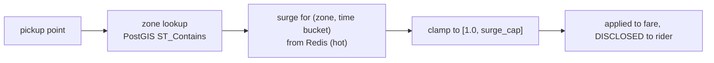

# LLD — Pricing Engine (`pricing`)

**Owner:** Engineering · **Last reviewed:** 2026-07-06
**Realizes:** FR-PRICE-01..05, FR-RIDE-02, R-PRICE-1..8

Pricing computes the fare a rider sees **before** booking and the fare charged **after** the trip.
It must be transparent, deterministic given inputs, and fully **config-driven** so ops can tune it
without a deploy (R-PRICE-6). All money is `Decimal` in INR — never `float`.

---

## 1. Responsibility

`pricing` answers two questions: _"what will this trip cost?"_ (estimate, pre-booking) and _"what
did this trip cost?"_ (final fare, on completion). It owns the fare formula, surge, zones, and the
pricing configuration. It does **not** store money movements (that's `wallet`) or decide who pays
(that's the trip/settlement flow).

---

## 2. The fare formula — R-PRICE-1/2

```
fare_before_surge = base_fare
                  + per_km   × distance_km
                  + per_min  × duration_min
                  + booking_fee

surged            = fare_before_surge × surge_multiplier      # surge ≥ 1.0, capped
fare              = max(surged, minimum_fare)                 # R-PRICE-2
total             = fare + tolls + waiting_charges            # itemized, R-PRICE-8
```

Every parameter (`base_fare`, `per_km`, `per_min`, `booking_fee`, `minimum_fare`, `surge_cap`) is
**per (city, vehicle_type)** and lives in configuration, not code.

```python
# pricing/service.py
def quote(self, cfg: PricingConfig, route: Route, surge: Decimal) -> FareBreakdown:
    base = cfg.base_fare + cfg.per_km * route.distance_km + cfg.per_min * route.duration_min
    base += cfg.booking_fee
    surge = min(max(surge, Decimal("1.0")), cfg.surge_cap)     # clamp: ≥1, ≤ cap (R-PRICE-3)
    fare = max(base * surge, cfg.minimum_fare)                  # R-PRICE-2
    return FareBreakdown(
        base_fare=cfg.base_fare, distance=cfg.per_km * route.distance_km,
        time=cfg.per_min * route.duration_min, booking_fee=cfg.booking_fee,
        surge_multiplier=surge, subtotal=base, total=fare.quantize(PAISA),
    )
```

The `FareBreakdown` is **itemized** so the rider (and a dispute) can see exactly how the number was
built (R-PRICE-4/8, transparency principle from Volume 2).

**Kashmir note (A6.2):** the `per_min` (time) component carries more weight here than in flat cities
— terrain, traffic, and winter detours mean a short-distance trip can be long in time. Config for
J&K cities reflects that; it's a config choice, not a code change.

---

## 3. Surge — R-PRICE-3



- **Zone** is resolved by PostGIS containment on surge/serviceability polygons (durable geometry).
- **Current surge multiplier** per zone/time bucket is computed from live demand/supply ratio by a
  background job and cached in **Redis** for fast reads at estimate time.
- Surge is **always clamped to the cap** and **always disclosed** before booking (R-PRICE-3/4).
  There is no code path that applies undisclosed or uncapped surge — that's an invariant.

---

## 4. Estimate vs. final fare, and the fare lock — R-PRICE-5

| Phase                      | Inputs                            | Distance/time source          |
| -------------------------- | --------------------------------- | ----------------------------- |
| **Estimate** (pre-booking) | pickup, drop, type, current surge | routing provider _prediction_ |
| **Final** (on completion)  | actual route driven               | measured actuals (FR-TRIP-04) |

**Fare lock policy (R-PRICE-5):** the estimate shown at booking is **honored** for the trip unless
the route _materially_ changes (rider adds a stop / changes destination). We persist the quoted
breakdown and the surge at booking time on the trip. On completion:

```
if route_materially_changed(quoted, actual):
    final = recompute(actual, surge_at_booking)   # re-price on actuals, same surge
else:
    final = quoted.total                          # honor the quote (R-PRICE-5)
```

"Materially changed" is a config threshold (e.g. added waypoint, or >X% distance delta from a
rider-initiated change — not from normal routing variance). Surge is **locked at booking** so a
rider is never surprised by surge that spiked mid-trip.

---

## 5. Configuration model — R-PRICE-6 (the key design point)

Pricing parameters are **data, versioned, ops-editable**, never literals:

```
PricingConfig(city, vehicle_type):
    base_fare, per_km, per_min, booking_fee, minimum_fare,
    surge_cap, cancellation_fee, cancellation_grace_sec,
    effective_from, version        # changes are versioned + audited (R-DATA-2)
```

- Changing a price is an **admin action** (FR-ADMIN-05), audit-logged with before/after, taking
  effect for **new estimates** only (never retroactively re-pricing quoted trips).
- Configs are **versioned** and stamped on each quote, so we can always answer "what price did this
  trip use, and why?" for disputes/finance.
- Read path is cached (Redis) for latency; writes invalidate the cache.

---

## 6. Cancellation fees — R-CANCEL-2/4

Pricing exposes the cancellation fee; the trip/cancel flow decides _whether_ it applies:

```python
def cancellation_fee(cfg, trip, now) -> Decimal:
    if trip.cancelled_by == DRIVER:            # R-CANCEL-3: no rider fee
        return Decimal(0)
    if now - trip.accepted_at <= cfg.cancellation_grace_sec:   # within grace
        return Decimal(0)                      # R-CANCEL-2
    return cfg.cancellation_fee                # disclosed before charging (R-CANCEL-4)
```

The fee must be **disclosed to the rider before it's charged** and recorded in the ledger — the UI
shows it, the `wallet` module records it.

---

## 7. Edge cases & failure handling

| Edge case                         | Handling                                                                                                          |
| --------------------------------- | ----------------------------------------------------------------------------------------------------------------- |
| Routing provider down at estimate | Fall back to great-circle distance × road-factor, flag estimate as approximate; never block booking (resilience). |
| Surge cache miss                  | Default to `1.0` (no surge) rather than fail — never over-charge on a cache miss.                                 |
| Config missing for (city, type)   | Reject with a clear error; do **not** guess a price. Money bugs > availability bugs here.                         |
| Negative/absurd computed fare     | Clamp at `minimum_fare`; assert `fare > 0` invariant.                                                             |
| Rounding                          | Quantize to paisa at the end only; carry full `Decimal` precision through the calc.                               |

---

## 8. Invariants & traceability

**Invariants**

- **P-1** `fare ≥ minimum_fare > 0`. (R-PRICE-2)
- **P-2** `1.0 ≤ surge_applied ≤ surge_cap`. (R-PRICE-3)
- **P-3** Every quote is itemized and stamped with its config version. (R-PRICE-4, R-DATA-2)
- **P-4** No parameter is a code literal — all from `PricingConfig`. (R-PRICE-6)
- **P-5** A booked quote is honored unless the rider changed the route. (R-PRICE-5)

**Traceability**

| Design element          | Satisfies                           |
| ----------------------- | ----------------------------------- |
| Fare formula + min fare | R-PRICE-1/2, FR-PRICE-01            |
| Surge clamp + disclose  | R-PRICE-3, FR-PRICE-03              |
| Estimate before booking | R-PRICE-4, FR-RIDE-02               |
| Fare lock               | R-PRICE-5, FR-PRICE-04              |
| Config model + audit    | R-PRICE-6, FR-PRICE-02, FR-ADMIN-05 |
| Cancellation fee logic  | R-CANCEL-2/3/4, FR-CANCEL-02        |
