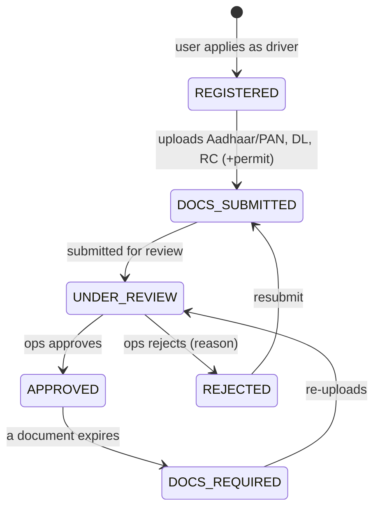

# LLD — Drivers, Vehicles & KYC (`drivers`, `vehicles`)

**Owner:** Engineering · **Last reviewed:** 2026-07-06
**Realizes:** FR-KYC-01..06, R-KYC-1..5, R-AVAIL-1, NFR-COMPLY-03

Controls who is allowed to drive and with which vehicle. The output that matters to the rest of the
system is a single derived boolean per driver: **eligible to receive requests?** Everything here
exists to compute that safely and compliantly.

---

## 1. Responsibility

`drivers` owns onboarding, KYC state, and online/offline + eligibility. `vehicles` owns vehicle
records, type, and the driver↔vehicle mapping. Document _storage_ is object storage; document
_review_ is an ops workflow (Volume 8).

---

## 2. Driver onboarding state machine — FR-KYC-01..04



| State                                                                 | Can go online? | Can receive requests? |
| --------------------------------------------------------------------- | :------------: | :-------------------: |
| REGISTERED / DOCS_SUBMITTED / UNDER_REVIEW / REJECTED / DOCS_REQUIRED |       ❌       |          ❌           |
| **APPROVED**                                                          |       ✅       | ✅ (if online + free) |

**Invariant D-1:** only an `APPROVED` driver can transition to online or be matched (R-KYC-2,
BR-2). Every non-approved state hard-blocks requests.

**Document expiry (R-KYC-3):** a scheduled job checks expiry dates; when a required document lapses,
the driver moves `APPROVED → DOCS_REQUIRED`, which immediately removes them from matching. This is
compliance-critical.

**Config-driven doc set (NFR-COMPLY-03):** the required documents (Aadhaar/PAN, DL, RC, permit,
fitness) are **configuration**, so MoRTH/J&K rule changes don't require code changes.

---

## 3. Vehicles & mapping — FR-KYC-05

- A vehicle has: registration (RC) number, `vehicle_type` (car/auto/bike/…), approval state.
- **Driver↔vehicle is not permanently 1:1.** A driver may change vehicles; a fleet owner may assign
  a vehicle across drivers over time (Kamran persona). The model uses an assignment record with
  validity, not a foreign key hard-coding one driver per vehicle. This decision protects the future
  fleet feature (Volume 2 personas) without over-building it now.
- A trip records **which vehicle** was used, resolved from the active assignment at match time.

---

## 4. Online/offline & live location — R-AVAIL-1/2

- Going online requires `APPROVED`. Online state is tracked; location pings flow to **Redis GEO**
  (Volume 4 data split), keyed by vehicle type for matching.
- **Eligibility** (consumed by matching) is the derived predicate from
  [03_matching.md](03_matching.md) §2: `APPROVED ∧ online ∧ free ∧ correct type ∧ recent fix ∧ not
suspended ∧ not excluded`.

```python
def eligibility(driver) -> Eligibility:
    reasons = []
    if driver.state != APPROVED: reasons.append("not_approved")
    if not driver.is_online: reasons.append("offline")
    if driver.active_trip_id: reasons.append("on_trip")
    if driver.location_age > MAX_LOCATION_AGE: reasons.append("stale_location")
    if driver.is_suspended: reasons.append("suspended")
    return Eligibility(ok=not reasons, reasons=reasons)   # reasons help ops/debugging
```

Returning **reasons** (not just a bool) makes "why am I not getting trips?" answerable in the driver
app and ops console — a real driver-experience win (Imran persona).

---

## 5. Edge cases & failure handling

| Edge case                            | Handling                                                                                           |
| ------------------------------------ | -------------------------------------------------------------------------------------------------- |
| Document expires mid-shift           | Expiry job moves driver to `DOCS_REQUIRED`; if mid-trip, current trip completes but no new offers. |
| Driver online but GPS stale          | Filtered by `MAX_LOCATION_AGE`; app nudges to restore location.                                    |
| Vehicle reassigned to another driver | Assignment records with validity windows; matching uses the active one.                            |
| Rejected driver resubmits repeatedly | Allowed, but ops can flag; audit trail on each review (R-DATA-2).                                  |
| KYC document access                  | Restricted (RBAC) and access-audited on sensitive fields (NFR-SEC-03).                             |

## 6. Invariants & traceability

**Invariants**

- **D-1** Only `APPROVED` drivers are online/matchable. (R-KYC-2, BR-2)
- **D-2** Expired required document ⇒ not matchable. (R-KYC-3)
- **D-3** A trip's vehicle is the active assignment at match time. (FR-KYC-05)

| Design element         | Satisfies                  |
| ---------------------- | -------------------------- |
| Onboarding FSM         | R-KYC-1/2, FR-KYC-01/02/03 |
| Expiry → DOCS_REQUIRED | R-KYC-3, FR-KYC-04         |
| Assignment (not 1:1)   | FR-KYC-05, fleet persona   |
| Config-driven doc set  | NFR-COMPLY-03              |
| Eligibility predicate  | R-AVAIL-1/2, FR-MATCH-01   |
