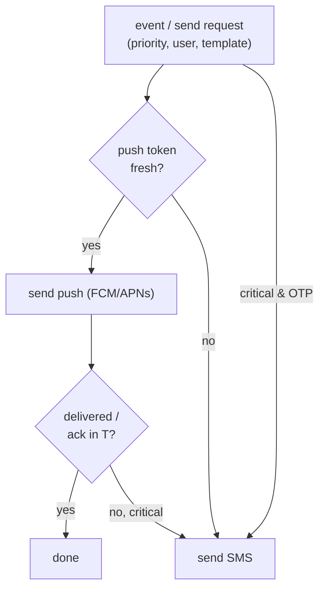

# LLD — Notifications (`notifications`)

**Owner:** Engineering · **Last reviewed:** 2026-07-06
**Realizes:** FR-NOTIF-01/02, FR-AUTH-02, A6.1, R-SAFE-3

Notifications deliver time-sensitive messages (OTP, ride lifecycle, safety) across push and SMS. In
this market the **push→SMS fallback is the whole point**: connectivity is unreliable, so a rider must
still learn their trip is complete even if the app never reconnects (A6.1).

---

## 1. Responsibility

`notifications` owns channel selection, delivery, templating, and fallback. It is a **consumer of
domain events** (Volume 4) and a service other modules call for direct sends (e.g. OTP). It does not
own business decisions — it delivers what it's told, reliably.

---

## 2. Channels & selection



- **Priority tiers:** `critical` (OTP, SOS, trip-complete/settlement) vs `normal` (driver arriving,
  promos). Only `critical` events trigger **SMS fallback** when push is unavailable/unacked
  (FR-NOTIF-02) — SMS costs money, so we don't fall back for everything.
- **Push** via FCM/APNs when a fresh device token exists. **SMS** for OTP always, and as fallback
  for critical events on stale/failed push (A6.1).
- **SOS** (R-SAFE-3) routes on its own high-priority path to ops/emergency, independent of normal
  delivery, and is always logged.

---

## 3. Reliability: idempotent, queued, retried

```python
# notifications consume trip.completed
async def on_trip_completed(self, evt: TripCompleted) -> None:
    key = f"notif:trip_completed:{evt.trip_id}"
    if await self._dedupe.seen(key):        # idempotent (event may redeliver)
        return
    msg = self._render("trip_completed", locale=user.locale, ctx=evt)  # i18n (A6.4)
    await self._deliver(user, msg, priority=CRITICAL)
    await self._dedupe.mark(key)
```

- **Idempotent** on the event key so a redelivered event doesn't double-notify.
- **Queued + retried** with backoff via the worker/queue (Redis). A transient SMS/push failure
  retries; permanent failure is logged and (for critical) alerts.
- **Templated + localized** — messages render from templates by the user's locale (NFR-USE-01,
  A6.4: English + regional).

---

## 4. Edge cases & failure handling

| Edge case                              | Handling                                                                               |
| -------------------------------------- | -------------------------------------------------------------------------------------- |
| Push token stale/unregistered          | Detect on send failure; fall back to SMS for critical; prune token.                    |
| SMS provider down                      | Retry with backoff; for OTP, surface resend/voice fallback (auth); alert if sustained. |
| Event redelivered                      | Dedupe key → single notification.                                                      |
| User has no push & no SMS reachability | Best-effort; in-app authoritative state on next open covers it (Flow 5).               |
| Notification storm (many events)       | Rate-limit/coalesce per user for `normal` tier; never drop `critical`.                 |

## 5. Invariants & traceability

**Invariants**

- **N-1** Critical events fall back to SMS if push is unavailable/unacked. (FR-NOTIF-02, A6.1)
- **N-2** A given event notifies a user at most once (idempotent).
- **N-3** OTP and SOS never depend solely on app data connectivity. (A6.1, R-SAFE-3)

| Design element               | Satisfies            |
| ---------------------------- | -------------------- |
| Push with SMS fallback       | FR-NOTIF-01/02, A6.1 |
| Priority tiers               | cost control + A6.1  |
| Idempotent event consumption | NFR-RESIL-02         |
| Localized templates          | NFR-USE-01, A6.4     |
| SOS path                     | R-SAFE-3             |
