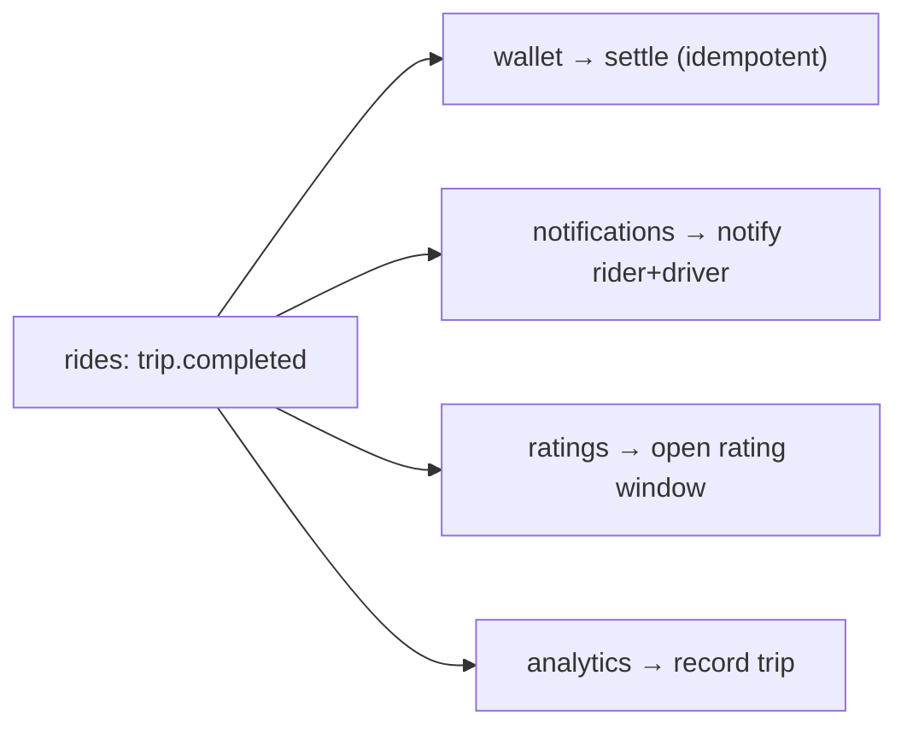

# LLD — Domain Events (cross-cutting)

**Owner:** Engineering · **Last reviewed:** 2026-07-06
**Realizes:** the event-driven principle (Volume 4), NFR-RESIL-02, R-PAY-1

Modules decouple by publishing **domain events** to the Redis event bus; other modules react in
workers (Volume 4, §2). This page is the **event catalog** and the **delivery contract** — the
shared language between modules. An event is a fact that already happened, named in the past tense.

---

## 1. Delivery semantics

- **At-least-once delivery.** The bus may redeliver (crash/retry). Therefore **every consumer is
  idempotent**, keyed on the event id or a natural key (e.g. `trip_id`). This is a hard rule, not a
  guideline (NFR-RESIL-02).
- **Transactional outbox.** Producers write the event to an `outbox` table **in the same DB
  transaction** as the state change (see [trip FSM §5](02_trip-state-machine.md)); a relay publishes
  committed rows. This makes "state changed ⇔ event published" atomic — no lost or phantom events.
- **Ordering** is best-effort per key, not global. Consumers must not assume cross-key ordering.
- **Events are facts, not commands.** `trip.completed` states what happened; it does not tell
  `wallet` to settle — `wallet` _chooses_ to settle on it. Producers don't know their consumers.

---

## 2. Event envelope

Every event shares one envelope so consumers can handle them uniformly:

```jsonc
{
  "id": "evt_01H...", // unique — idempotency/dedupe key
  "type": "trip.completed", // dot-namespaced, past tense
  "version": 1, // schema version for evolution
  "occurred_at": "2026-07-06T10:12:00Z",
  "trip_id": 4821, // natural key where applicable
  "payload": {/* type-specific, additive-only across versions */},
}
```

**Schema evolution:** payloads change **additively** (new optional fields); breaking changes bump
`version` and are consumed side-by-side during migration. Never repurpose a field.

---

## 3. The catalog

| Event                  | Producer | Key consumers                                          | Payload highlights                              |
| ---------------------- | -------- | ------------------------------------------------------ | ----------------------------------------------- |
| `ride.requested`       | rides    | matching worker                                        | pickup, drop, vehicle_type, rider_id            |
| `ride.matched`         | rides    | notifications, realtime                                | driver, vehicle, eta                            |
| `ride.arrived`         | rides    | notifications                                          | trip_id, at                                     |
| `ride.expired`         | rides    | notifications, analytics                               | reason, radius_reached                          |
| `ride.cancelled`       | rides    | wallet (fee?), notifications, driver-score             | cancelled_by, fee, reason                       |
| `trip.started`         | rides    | notifications, analytics                               | started_at, pickup_verified                     |
| `trip.completed`       | rides    | **wallet (settle)**, notifications, ratings, analytics | fare, distance, time, commission_rate, gst_rate |
| `wallet.settled`       | wallet   | analytics, driver earnings                             | entries summary, net, commission, tax           |
| `wallet.topup`         | wallet   | notifications                                          | amount                                          |
| `payout.completed`     | wallet   | notifications                                          | amount, trips_covered                           |
| `driver.kyc_approved`  | drivers  | notifications                                          | driver_id                                       |
| `driver.docs_required` | drivers  | notifications, matching (deactivate)                   | expired_docs                                    |
| `safety.sos_triggered` | rides    | **ops/emergency**, notifications                       | location, rider, trip                           |

> The **`trip.completed` fan-out** is the busiest and most important: one fact drives settlement,
> notification, rating, and analytics — each an independent, idempotent consumer. This is the
> decoupling that lets us add a consumer (e.g. a new analytics sink) without touching `rides`.



---

## 4. Consumer contract (what every consumer must do)

1. **Be idempotent** — dedupe on `id`/natural key before acting.
2. **Be tolerant** — ignore unknown fields (forward-compatible with additive changes).
3. **Fail safely** — on transient error, let it retry (don't ack); on poison message, dead-letter
   and alert, never silently drop (especially money/safety events).
4. **Not assume ordering** across keys.
5. **Emit its own events** for its state changes rather than reaching into the producer.

---

## 5. Why this matters (traceability)

| Design element                       | Satisfies                              |
| ------------------------------------ | -------------------------------------- |
| At-least-once + idempotent consumers | NFR-RESIL-02                           |
| Transactional outbox                 | R-PAY-1 (no lost settlement), trip I-3 |
| Facts-not-commands decoupling        | modular monolith boundaries (ADR-0004) |
| Additive schema versioning           | maintainability (NFR-MAINT)            |
| Dead-letter + alert on poison        | operability (NFR-OBS-03)               |

This event catalog is the seam along which a module could later be extracted into its own service
(ADR-0004): the events already exist and are the contract, so extraction swaps in-process pub/sub
for a network broker without changing producers or consumers.
