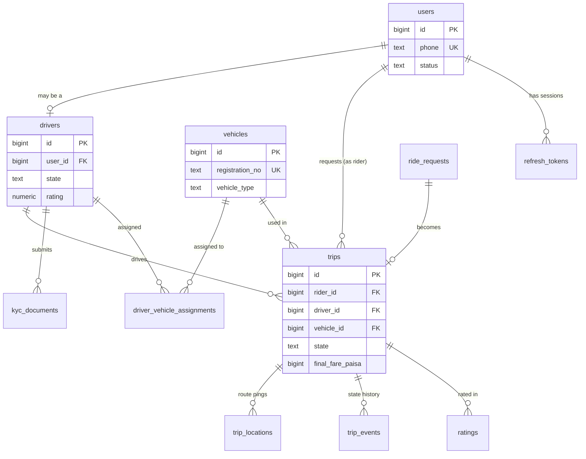
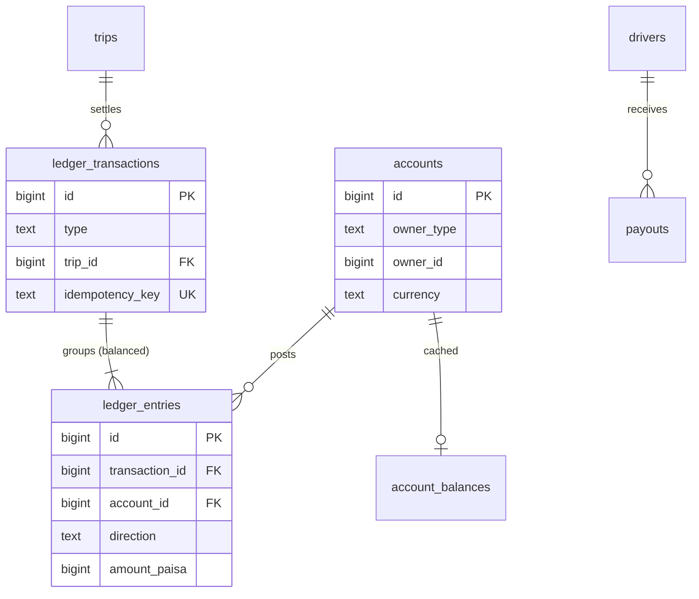
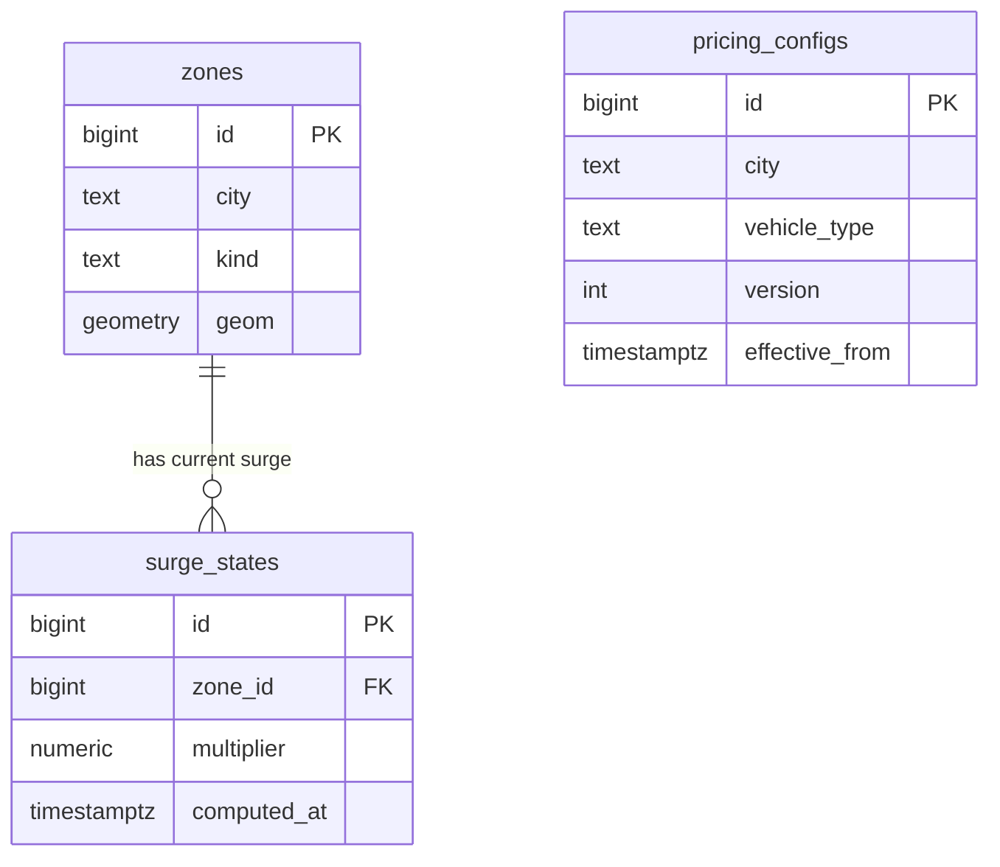
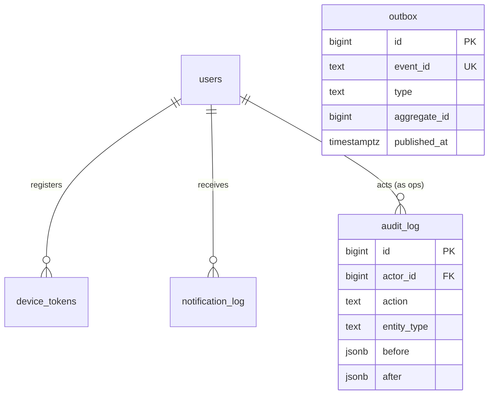

# Entity-Relationship Diagram

**Owner:** Engineering (Data) · **Last reviewed:** 2026-07-06

The map of entities and how they relate. Detail (columns, types, constraints) is in
[02_schema-postgres.md](02_schema-postgres.md); this page is the shape and the relationships.

---

## Core marketplace

## Money (double-entry ledger)

## Pricing & geo

## Cross-cutting

---

## Key relationship notes (the non-obvious ones)

- **`users` ↔ `drivers` is 1-to-(0 or 1).** A user _may_ also be a driver (R-ACCOUNT-3). Driver-only
  data lives in `drivers`, keyed by `user_id`. Rider identity is just the `users` row.
- **`ride_requests` → `trips` is 1-to-(0 or 1).** A request that matches becomes a trip; a request
  that expires never produces a trip. (Implementation may collapse these into one `trips` table with
  a `state`; the ER shows the conceptual split — see [02](02_schema-postgres.md) for the decision.)
- **`driver_vehicle_assignments` is a join with validity**, not a direct `vehicle.driver_id`. This
  is deliberate — a driver changes vehicles and a fleet owner shares vehicles over time (Volume 5,
  D-3, fleet persona). A trip records the `vehicle_id` resolved at match time.
- **`ledger_entries` belong to a `ledger_transaction`** that must be **balanced** (Σ debits =
  Σ credits, W-1). The DB can't fully enforce "sum to zero across rows" cheaply, so it's enforced in
  the posting function + a reconciliation check; the schema makes it _representable and auditable_.
- **`account_balances` is a cache** of the derived balance for fast reads; the entries are the truth.
- **`outbox` and `audit_log`** are cross-cutting infra tables written by many modules.
