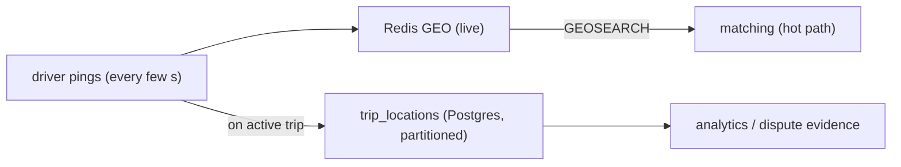

# PostGIS & Geospatial Data

**Owner:** Engineering (Data) · **Last reviewed:** 2026-07-06
**Realizes:** ADR-0003, R-PRICE-3 (zones), R-SAFE-4 (route history)

Two geo needs, two mechanisms (Volume 4, data split): **live "nearby drivers" → Redis GEO**;
**durable polygons & history → PostGIS**. This page covers the PostGIS half — zones, geometry
columns, SRID, and spatial indexing.

---

## SRID and types

- We use **SRID 4326** (WGS84 lat/lng) everywhere — the coordinate system GPS and mapping providers
  speak.
- **Points** (pickup, dropoff, location pings) use `geography(Point,4326)` — `geography` computes in
  **meters on the spheroid**, so `ST_Distance` and `ST_DWithin` return real-world distances without
  projection math. Correct for "within 3 km" queries.
- **Polygons** (zones) use `geometry(Polygon,4326)` with `ST_Contains`/`ST_Intersects` for
  containment — `geometry` is the right type for spatial predicates and GiST indexing of areas.

> Rule of thumb: **`geography` for distance** (points), **`geometry` for shape/containment**
> (polygons). Mixing them up is the most common PostGIS bug.

---

## Zones & surge state

```sql
CREATE TABLE zones (
    id          BIGINT GENERATED ALWAYS AS IDENTITY PRIMARY KEY,
    city        TEXT NOT NULL,
    name        TEXT NOT NULL,
    kind        TEXT NOT NULL CHECK (kind IN ('serviceable','surge','airport','restricted')),
    geom        geometry(Polygon,4326) NOT NULL,
    created_at  TIMESTAMPTZ NOT NULL DEFAULT now(),
    updated_at  TIMESTAMPTZ NOT NULL DEFAULT now()
);
CREATE INDEX ix_zones_geom ON zones USING GIST (geom);       -- spatial index (essential)
CREATE INDEX ix_zones_city_kind ON zones (city, kind);

CREATE TABLE surge_states (              -- durable snapshot; live value cached in Redis
    id           BIGINT GENERATED ALWAYS AS IDENTITY PRIMARY KEY,
    zone_id      BIGINT NOT NULL REFERENCES zones(id),
    multiplier   NUMERIC(4,2) NOT NULL CHECK (multiplier >= 1.00),
    computed_at  TIMESTAMPTZ NOT NULL DEFAULT now()
);
CREATE INDEX ix_surge_states_zone_time ON surge_states (zone_id, computed_at DESC);
```

The **GiST index on `zones.geom`** is what makes "which zone is this pickup in?" fast. Without it,
every estimate would scan all polygons.

---

## The queries that matter

### Which zone(s) contain a pickup? (pricing/surge, serviceability)

```sql
SELECT z.id, z.kind
FROM zones z
WHERE z.city = :city
  AND z.kind IN ('serviceable','surge')
  AND ST_Contains(z.geom, ST_SetSRID(ST_MakePoint(:lng, :lat), 4326));
```

Used once per estimate to (a) confirm the pickup is serviceable and (b) find the surge zone
(R-PRICE-3). GiST-indexed → milliseconds.

### Trip distance / route length (from recorded pings — analytics, disputes)

```sql
SELECT ST_Length(
         ST_MakeLine(point::geometry ORDER BY recorded_at)::geography
       ) AS route_meters
FROM trip_locations
WHERE trip_id = :trip_id;
```

Note: the **billed** distance comes from the routing provider / odometer at completion
(FR-TRIP-04); this reconstruction from pings is for verification and dispute evidence (R-SAFE-4),
not the primary fare input.

### "Nearby drivers" — **NOT** in PostGIS

Deliberately **not** a Postgres query. Live driver proximity is served by **Redis `GEOSEARCH`**
(see [04_redis-keys.md](04_redis-keys.md)) because driver locations churn thousands of times/second
and must not touch Postgres (ADR-0003, NFR-SCALE-04). PostGIS handles the _durable_ geo; Redis
handles the _live_ geo.

---

## Live locations → periodic snapshot

Driver live locations live in Redis. For history/analytics we **snapshot** periodically into
Postgres (`trip_locations` while on a trip; aggregate driver telemetry off-trip if needed), rather
than writing every ping to Postgres. This keeps the write load off the system of record while
preserving what we need for R-SAFE-4 and analytics.



---

## Operational notes

- **Enable PostGIS** via the container init script (`CREATE EXTENSION IF NOT EXISTS postgis;`) — the
  local `postgis/postgis` image does this ([Volume 1 Docker](../00_Project/06_docker-setup.md)).
- **Always create the GiST index** on any queried geometry column, or containment scans everything.
- **Store SRID explicitly** (`ST_SetSRID(..., 4326)`); an unset SRID (0) breaks distance math.
- **Validate polygons** on zone import (`ST_IsValid`); invalid geometry silently breaks `ST_Contains`.
