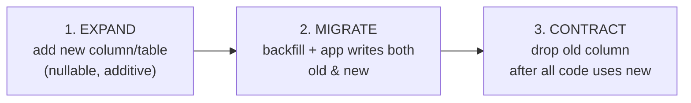

# Audit, Soft Delete, Immutability & Migrations

**Owner:** Engineering (Data) · **Last reviewed:** 2026-07-06
**Realizes:** R-DATA-1/2/3, FR-DATA-01/02, NFR-MAINT-04, NFR-AVAIL-03

Data has a lifecycle and a paper trail. This page covers how we delete (softly), what we never
delete (money, safety, audit), how we record who did what, and how schema changes ship safely.

---

## Soft delete — R-DATA-1, FR-DATA-01

- **Soft-deletable tables carry `deleted_at TIMESTAMPTZ NULL`.** "Deleting" sets the timestamp;
  rows are never physically removed by application code.
- **Every query excludes soft-deleted rows by default.** The repository layer applies
  `WHERE deleted_at IS NULL` centrally (a base query/mixin), so a developer can't forget it.
- **Why:** disputes, safety investigations, and compliance frequently need data a user "deleted".
  Physical deletion destroys evidence and breaks foreign keys.

| Soft-deletable                                  | Never deleted (append-only)                                                   | Hard-deletable                                            |
| ----------------------------------------------- | ----------------------------------------------------------------------------- | --------------------------------------------------------- |
| `users`, `drivers`, `vehicles`, `kyc_documents` | `ledger_entries`, `ledger_transactions`, `audit_log`, `trip_events`, `outbox` | ephemeral Redis keys, expired partitions (archived first) |

> **The ledger is immutable, full stop.** No `updated_at`, no `deleted_at`, no `UPDATE`, no `DELETE`.
> A mistake is fixed by posting a **reversing transaction** (Volume 5, W-2). This is the single most
> important data-integrity rule in the system.

---

## Audit logging — R-DATA-2

Every admin action on **money, accounts, or pricing** writes an `audit_log` row with actor,
action, entity, and **before/after** JSONB snapshots.

```python
# admin actions go through an audited wrapper
async def audited(actor, action, entity_type, entity_id, before, after, do):
    result = await do()
    await audit_repo.record(actor, action, entity_type, entity_id, before, after)
    return result
```

- Written **in the same transaction** as the change, so an action and its audit record are atomic.
- `audit_log` is **append-only and partitioned** (Volume 6, §05) — it grows forever and is compliance
  evidence.
- Examples: `pricing.update` (before/after config), `refund.issue` (amount, reason), `driver.approve`
  / `driver.reject` (reason), `user.suspend`.

**Sensitive-field access** (KYC docs, PII) is also access-audited (NFR-SEC-03) — reads of protected
data, not just writes, where policy requires.

---

## Data retention & privacy — R-DATA-3, NFR-COMPLY-02

- Retention periods are **policy-driven** (Volume 14) and enforced by scheduled jobs: e.g. archive
  `trip_locations` after the safety-retention window, prune `notification_log` after N months.
- PII handling (KYC documents, contact data) follows applicable Indian data-protection obligations;
  documents in object storage are encrypted and access-controlled.
- **Retention never overrides immutability** for financial/safety records — we _archive_ (move to
  cold storage), we don't shred what compliance or a dispute may need.

---

## Migrations — Alembic, expand→contract — NFR-MAINT-04, NFR-AVAIL-03

Schema changes ship as **Alembic migrations**, versioned in git, applied by CI/CD (Volume 11). They
must be **reversible** and **zero-downtime**, which means backward-compatible during rollout.

### The expand→migrate→contract pattern

Because old and new app code run simultaneously during a rolling deploy (Volume 4), a migration must
never break the currently-running version. So a breaking change is done in **three deploys**:



Example — renaming/splitting a column:

1. **Expand:** add the new column (nullable), deploy code that writes both.
2. **Migrate:** backfill existing rows; switch reads to the new column.
3. **Contract:** once no code reads the old column, drop it in a later migration.

A single "rename column" migration would break the old pods mid-rollout — forbidden.

### Migration rules

| Rule                                                                | Why                                |
| ------------------------------------------------------------------- | ---------------------------------- |
| Every migration has a working `downgrade()`                         | rollback safety                    |
| No destructive change in the same deploy that stops using the data  | expand→contract                    |
| Large backfills run in **batches**, off the migration critical path | avoid long locks                   |
| Adding an index on a big table uses `CREATE INDEX CONCURRENTLY`     | no write lock                      |
| New columns on big tables are **nullable or have a fast default**   | avoid full-table rewrite/lock      |
| Migrations are tested against a prod-like DB in staging             | catch lock/perf issues before prod |
| Data + schema migrations are separate, ordered steps                | reviewability, safety              |

### Seed & reference data

Reference data (initial `zones`, `pricing_configs`, singleton `accounts` like platform/tax) is
loaded by **idempotent seed migrations/scripts** so environments are reproducible
([Volume 1 `make seed`](../00_Project/05_development-environment.md)).

---

## Backups & recovery (targets; runbooks in V13)

- **PITR** (point-in-time recovery) on Postgres → RPO ≤ 5 min, RTO ≤ 1 h (NFR-AVAIL-04).
- Backups are **tested by periodic restore drills** — an untested backup is not a backup (Volume 13).
- Object storage (KYC docs) has its own versioned, encrypted backup.

---

## Traceability

| Design element                         | Satisfies                  |
| -------------------------------------- | -------------------------- |
| `deleted_at` + default-exclude queries | R-DATA-1, FR-DATA-01       |
| Append-only ledger/audit/events        | R-DATA-1, R-PAY-1 (W-2)    |
| `audit_log` before/after, in-txn       | R-DATA-2, FR-ADMIN-04      |
| Retention/archival jobs                | R-DATA-3, NFR-COMPLY-02    |
| Expand→contract migrations             | NFR-AVAIL-03, NFR-MAINT-04 |
| PITR + restore drills                  | NFR-AVAIL-04               |
