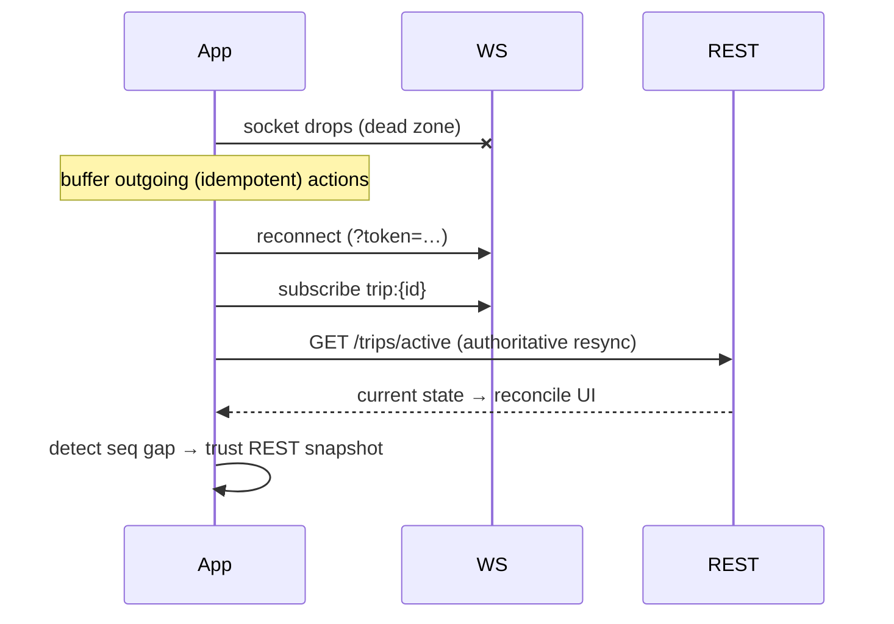

# WebSocket Contracts

**Owner:** Engineering (API) · **Last reviewed:** 2026-09-02
**Realizes:** FR-TRIP-03, FR-MATCH-02, Volume 4 realtime architecture

> **Implementation note (2026-09):** The live backend uses **Socket.IO** on the API port at
> `REALTIME_PATH` (default `/socket.io`) with JWT auth in the handshake (`auth.token`), not a
> separate `/api/v1/ws` listener. Server events use the names in
> [`src/modules/realtime/events.ts`](../../src/modules/realtime/events.ts), including
> `ride.driver.location` and `ride.eta.updated`.

REST handles request/response; **WebSockets handle the live, server-pushed stream** — driver
location to the rider, ride offers to the driver, trip-state changes to both. This page is the
message contract. The realtime _architecture_ (gateways, Redis pub/sub, scaling) is
[Volume 4, §04](../04_Architecture/04_data-and-state.md); here we define the _messages_.

---

## Connection

```
WSS /api/v1/ws?token=<access_jwt>
```

- **Auth on connect** via the access token (same JWT as REST). Rejected with a close code if
  invalid. Token expiry mid-connection → client refreshes and reconnects.
- After connecting, the client **subscribes** to the channels it's entitled to (its own driver
  channel, or its active trip). The server authorizes every subscription — a client can only
  subscribe to its own trip/driver channels (NFR-SEC-04).
- **Heartbeat:** ping/pong every ~20 s; a missed heartbeat closes the socket and the client
  reconnects. On the flaky target network this is expected and cheap (A6.1).

---

## Message envelope

All messages (both directions) share one envelope:

```jsonc
{
  "type": "trip.state_changed", // dot-namespaced
  "channel": "trip:t_4821", // what it's scoped to
  "ts": "2026-07-06T10:12:00Z",
  "seq": 42, // per-channel monotonic; client detects gaps
  "data": {/* type-specific */},
}
```

`seq` lets a client detect a missed message (gap) and recover by calling `GET /trips/active`
(REST) to re-sync authoritative state — the realtime stream is an _optimization_, REST is the
_truth_ (Flow 5). **Never** treat a WebSocket message as the source of truth for money or trip state.

---

## Channels & authorization

| Channel             | Who may subscribe                      | Carries                                |
| ------------------- | -------------------------------------- | -------------------------------------- |
| `driver:{driverId}` | that driver                            | ride offers, assignment updates        |
| `trip:{tripId}`     | the trip's rider & driver              | state changes, live location, ETA      |
| `share:{token}`     | anyone with the share link (read-only) | limited live location for shared trips |

Subscription to any other channel is rejected. The share channel exposes a **reduced** payload (no
PII beyond what the share feature intends, R-SAFE-01).

---

## Server → client messages

| `type`                 | Channel       | `data`                                       | Realizes    |
| ---------------------- | ------------- | -------------------------------------------- | ----------- |
| `ride.offer`           | `driver:{id}` | pickup, drop, fare, etaMinutes, expiresInSec | FR-MATCH-02 |
| `ride.offer_revoked`   | `driver:{id}` | tripId, reason (taken/expired)               | FR-MATCH-03 |
| `trip.state_changed`   | `trip:{id}`   | state, timestamps, (driver/vehicle on match) | FR-TRIP-01  |
| `trip.driver_location` | `trip:{id}`   | lat, lng, heading, etaMinutes                | FR-TRIP-03  |
| `trip.eta_updated`     | `trip:{id}`   | etaMinutes                                   | FR-TRIP-03  |
| `chat.message`         | `trip:{id}`   | from, text, ts                               | E13         |

```jsonc
// ride offer to a driver
{
  "type": "ride.offer",
  "channel": "driver:d_77",
  "ts": "…",
  "seq": 5,
  "data": {
    "tripId": "t_4821",
    "pickup": { "lat": 34.08, "lng": 74.79 },
    "drop": { "lat": 34.1, "lng": 74.81 },
    "fare": { "amount": 15000, "currency": "INR", "display": "₹150.00" },
    "etaMinutes": 3,
    "expiresInSec": 15,
  },
}
```

```jsonc
// live driver location to the rider
{
  "type": "trip.driver_location",
  "channel": "trip:t_4821",
  "ts": "…",
  "seq": 88,
  "data": { "lat": 34.086, "lng": 74.792, "heading": 210, "etaMinutes": 2 },
}
```

> **Accepting an offer is a REST call, not a WS message.** The offer arrives over WS, but
> `POST /trips/{id}/accept` (idempotent, transactional, FSM CAS) does the actual accept. Realtime
> delivers; REST commits. This keeps the authoritative transition on the transactional path
> (Volume 5, §02) and avoids trusting a fire-and-forget socket message with money-adjacent state.

## Client → server messages

Kept minimal — most actions are REST. The main client→server WS traffic is:

| `type`            | `data`            | Note                                                         |
| ----------------- | ----------------- | ------------------------------------------------------------ |
| `subscribe`       | channel           | authorized server-side                                       |
| `unsubscribe`     | channel           |                                                              |
| `driver.location` | lat, lng, heading | high-frequency pings while online (may also be REST-batched) |
| `chat.message`    | tripId, text      | E13                                                          |
| `ping`            | —                 | heartbeat                                                    |

Driver location pings can flow over WS (low overhead) or be batched via
`POST /drivers/me/location` when the socket is down — either way they land in Redis GEO
(Volume 6, §04).

---

## Reconnection & resilience (A6.1)



- The WS stream **may lose messages**; the client recovers via REST, never by guessing.
- **`seq` gaps** are the trigger to resync.
- Critical events the rider must know even if the socket never returns (trip complete, SOS) also go
  via **push/SMS** (Volume 5 notifications) — WS is never the only channel for critical facts.

---

## Traceability

| Contract element                | Satisfies                      |
| ------------------------------- | ------------------------------ |
| `trip.driver_location` stream   | FR-TRIP-03                     |
| `ride.offer` / accept-over-REST | FR-MATCH-02, FR-MATCH-05       |
| `seq` + REST resync             | FR-TRIP-07, A6.1, NFR-RESIL-05 |
| Per-channel authorization       | NFR-SEC-04                     |
| Share channel reduced payload   | R-SAFE-01                      |
