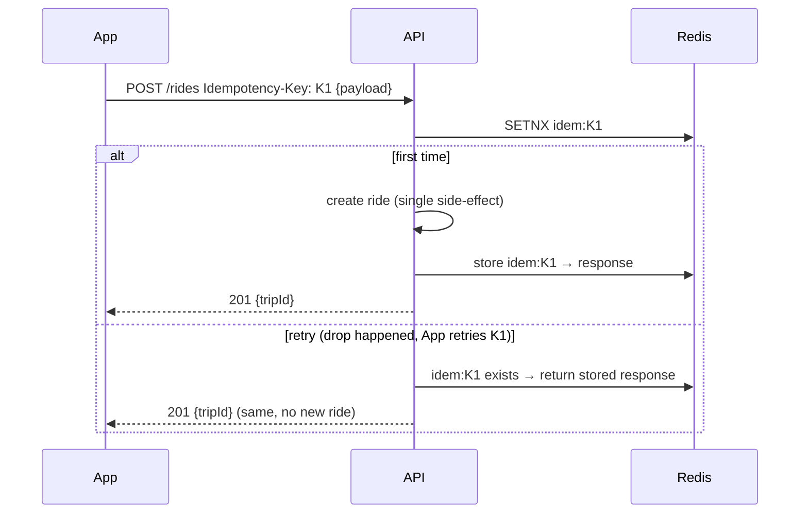

# Errors, Pagination, Filtering & Idempotency

**Owner:** Engineering (API) · **Last reviewed:** 2026-07-06

The cross-cutting protocols every endpoint shares. Getting these uniform is what makes the API feel
like one system and makes clients simple to write.

---

## 1. Error model — one shape, always

Every error returns the **same envelope**, regardless of endpoint or cause:

```jsonc
{
  "error": {
    "code": "invalid_pickup_otp", // STABLE machine-readable string — clients switch on this
    "message": "The pickup OTP is incorrect.", // human, localized (Accept-Language)
    "details": { "attemptsLeft": 2 }, // optional, structured, type-specific
    "requestId": "req_01H…", // correlate with server logs (NFR-OBS-01)
  },
}
```

Rules:

- **`code` is stable and never reused for a different meaning.** Clients branch on `code`, never on
  `message` (which is prose and localized). Codes are documented in OpenAPI.
- **HTTP status carries the class** (4xx client, 5xx server); `code` carries the specific reason.
- **Validation errors** (`400`) include per-field detail:
  ```jsonc
  {
    "error": {
      "code": "validation_error",
      "message": "…",
      "details": { "fields": [{ "field": "phone", "issue": "invalid_format" }] },
    },
  }
  ```
- **Never leak internals** (stack traces, SQL) in `message`. Server errors log detail internally and
  return a generic message + `requestId`.

### Canonical error codes (excerpt)

| `code`                 | HTTP | Meaning                                        |
| ---------------------- | ---- | ---------------------------------------------- |
| `validation_error`     | 400  | malformed/invalid input                        |
| `unauthenticated`      | 401  | missing/expired token → refresh                |
| `forbidden`            | 403  | RBAC denial                                    |
| `not_found`            | 404  | no such resource (or not visible)              |
| `illegal_transition`   | 409  | FSM transition not allowed from current state  |
| `ride_already_taken`   | 409  | another driver won the request (double-accept) |
| `invalid_pickup_otp`   | 409  | wrong pickup OTP (R-TRIP-2)                    |
| `insufficient_funds`   | 422  | wallet too low (R-PAY-2)                       |
| `driver_not_approved`  | 409  | KYC not approved (R-KYC-2)                     |
| `rate_limited`         | 429  | too many requests (e.g. OTP)                   |
| `idempotency_conflict` | 409  | same key, different payload (see §3)           |
| `internal_error`       | 500  | unexpected; retry idempotently                 |

> These map to the **domain exceptions** raised by services (Volume 5); a single exception handler
> translates them to this envelope. Services never build HTTP responses themselves (Volume 1).

---

## 2. Pagination & filtering

### Cursor pagination (default for lists)

We use **cursor-based** pagination for collections that grow and change (trips, transactions,
drivers) — offset pagination breaks when rows are inserted mid-scroll and is slow at depth.

```http
GET /api/v1/users/me/trips?limit=20&cursor=eyJpZCI6NDgwMH0
→ 200 OK
{ "data": [ { … }, … ],
  "page": { "nextCursor": "eyJpZCI6NDc4MH0", "hasMore": true, "limit": 20 } }
```

- `limit` is bounded (default 20, max 100).
- `cursor` is **opaque** (base64 of the server's keyset position) — clients pass it back verbatim.
- `nextCursor: null` / `hasMore: false` means the end.
- Backed by keyset queries on indexed columns (Volume 6, §05) — fast at any depth.

### Filtering, sorting

- **Filter** via explicit query params: `?state=completed&from=2026-07-01&to=2026-07-06`.
- **Sort** via `?sort=-createdAt` (`-` = descending). Only whitelisted sortable fields are allowed.
- Filters map to indexed columns; arbitrary field filtering is **not** exposed (prevents slow scans).

---

## 3. Idempotency protocol (the resilience backbone) — A6.1, NFR-RESIL-02

Because the target network drops constantly, **every mutating flow is idempotent** so a client can
safely retry without fear of double-booking, double-charging, or double-accepting.

### How it works

1. Client generates a unique **`Idempotency-Key`** (UUID) per logical operation and sends it as a
   header on `POST` mutations (marked `⏱` in the [catalog](02_endpoint-catalog.md)).
2. Server, on first receipt: processes the request, **stores the key → response** (`idem:{key}` in
   Redis, ~24 h; Volume 6, §04), returns the result.
3. On a **retry with the same key + same payload**: server returns the **stored original response**
   without re-executing. One booking, one debit, one accept.
4. On the **same key but a _different_ payload**: `409 idempotency_conflict` — the client reused a
   key for a different operation (a client bug).



### Defense in depth

Idempotency is enforced in **two tiers** (Volume 6, §04): the Redis key for speed, **and** database
unique constraints as the ultimate guarantee (`uq_ledger_txn_idem`, `uq_rider_one_active_trip`). Even
if the Redis key is lost, a duplicate settlement or double-active-trip is rejected by the DB. **The
network being unreliable can never cause a money or state bug** — that's the whole point.

### Client responsibility

- Generate one key per operation; **reuse the same key on retries** of that operation.
- Never reuse a key across different operations.
- Safe to retry `⏱` endpoints and all `GET`s freely; treat `5xx`/timeout as "retry with same key".

---

## Traceability

| Protocol                                  | Satisfies                              |
| ----------------------------------------- | -------------------------------------- |
| Uniform error envelope + stable codes     | maintainability, client simplicity     |
| Domain-exception → envelope mapping       | Volume 1 layering, Volume 5 exceptions |
| Cursor pagination on indexed keysets      | NFR-PERF, Volume 6 §05                 |
| Idempotency-Key protocol + DB constraints | A6.1, NFR-RESIL-02, R-PAY-1/6          |
