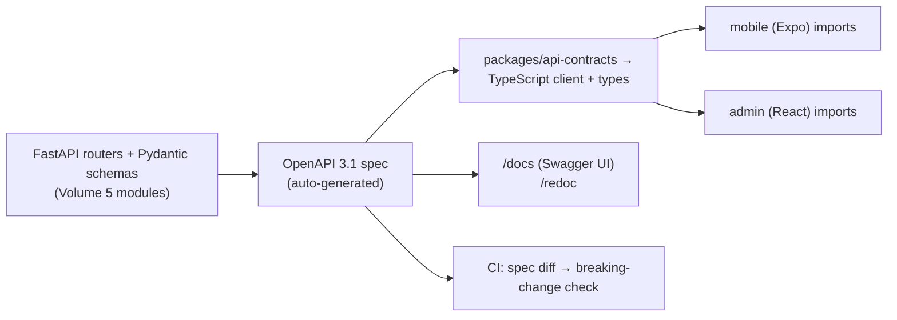

# OpenAPI, Client Generation & Auth

**Owner:** Engineering (API) · **Last reviewed:** 2026-07-06
**Realizes:** Volume 1 "contract is generated" rule, NFR-SEC-01..04

The API contract has **one source of truth**: the OpenAPI spec, produced by the backend. Clients are
**generated** from it, never hand-written. This section covers that pipeline and the auth details
that apply across all endpoints.

---

## OpenAPI as the single source of truth

- **The backend emits OpenAPI** because every request/response is a Pydantic model and every route is
  typed. The spec is generated, not maintained by hand.
- **Clients are generated** into `packages/api-contracts` and imported by mobile and admin. A field
  rename on the server surfaces as a **TypeScript compile error** in the clients — drift is caught at
  build time, not in production (Volume 1 rule, the whole reason for the monorepo, ADR-0001).
- **`/docs` (Swagger UI)** and **`/redoc`** are served from the same spec for human exploration.
- **CI diffs the spec** between the base and the PR; a **breaking change** (removed field, changed
  type, new required input) fails CI unless the version is bumped (`/api/v2`) — see [01](01_rest-conventions.md).

### Contract-change workflow

1. Change a Pydantic schema / route in a backend module.
2. CI regenerates the OpenAPI spec and the TS client.
3. If clients no longer compile → the change is breaking → either make it additive or bump the API
   version. Because it's a monorepo, backend + client changes land in **one atomic PR** (ADR-0001).

---

## Authentication (applies to all `🔒` endpoints)

- **Access token:** JWT in `Authorization: Bearer <token>`, ~30 min TTL, validated statelessly by
  any API instance (Volume 5 auth, NFR-SCALE-02).
- **Refresh:** `POST /auth/token/refresh` with the refresh token → new access + rotated refresh. On
  any `401 unauthenticated`, the client refreshes once and retries; if refresh fails, it re-auths
  (OTP).
- **Transport:** TLS everywhere (NFR-SEC-01); tokens never sent as query params except the WS connect
  handshake (where headers aren't available), over WSS.

## Authorization (RBAC)

- **Default-deny:** every endpoint declares its required scope; no scope declared = no access
  (NFR-SEC-04). Enforced by a FastAPI dependency, server-side, on every request — clients never
  self-authorize.
- **Scopes** gate `👮` admin/ops endpoints (e.g. `pricing:write`, `refund:issue`, `driver:approve`,
  `user:suspend`). Roles → scopes mapping lives in the admin RBAC design (Volume 8).
- **Ownership checks:** a rider can only read _their_ trips; a driver only _their_ offers. Resource
  handlers verify ownership, returning `404` (not `403`) for resources the caller shouldn't even know
  exist.

## Rate limiting & abuse protection

- **Edge + application rate limits** (Nginx + Redis counters, Volume 6 §04): per-IP/device on auth
  endpoints, per-user on expensive endpoints. Exceed → `429 rate_limited` with a `Retry-After`.
- OTP endpoints have stricter, phone-scoped limits (Volume 5 auth) to prevent OTP-bombing.

## Security headers & CORS

- Standard security headers at the edge (HSTS, no-sniff, frame-deny) — Volume 15.
- **CORS** is locked to the admin origin(s); the mobile app is native (no CORS). No wildcard origins.
- Request bodies are size-limited; payloads are validated by Pydantic (reject unknown/oversized).

---

## Observability of the API (NFR-OBS)

- Every request carries/gets an `X-Request-ID`, logged in structured JSON and echoed in error
  `requestId` — one id ties a client report to server logs to a trace.
- Latency and error-rate metrics per endpoint feed the dashboards/alerts (Volume 13).
- The request→match→trip→settle path is traced end-to-end (Volume 4, NFR-OBS-04).

---

## Summary: why this pipeline matters

The generated-contract pipeline is what lets a small team keep three apps in lockstep: the server
defines truth, the clients inherit it, and the build breaks the moment they disagree. Combined with
the uniform error/idempotency protocols ([04](04_errors-pagination-idempotency.md)), a client
developer writes against a **predictable, typed, drift-proof** API — which is exactly what a
fast-moving, connectivity-challenged product needs.
