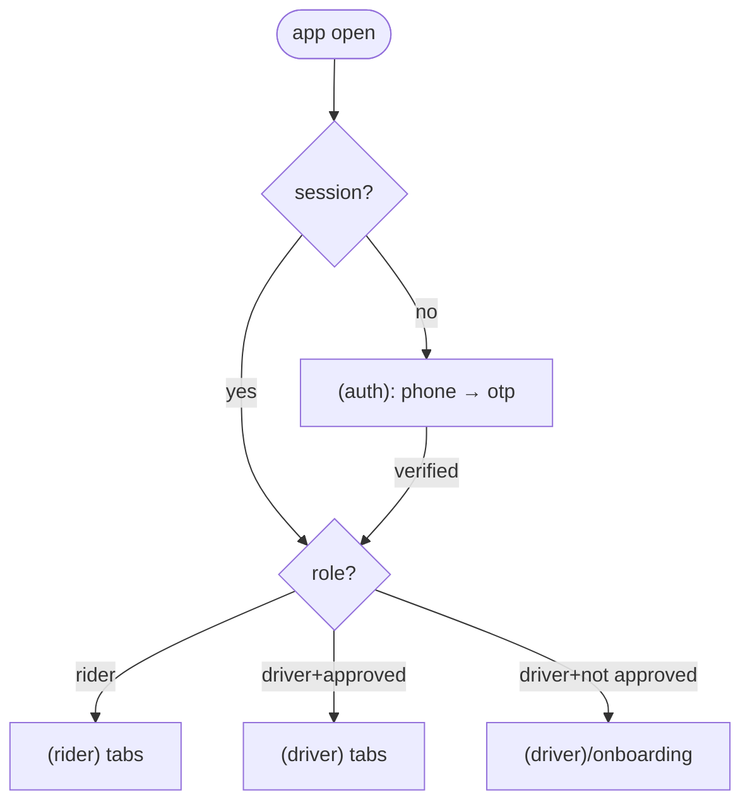

# Mobile Project Structure

**Owner:** Engineering (Mobile) · **Last reviewed:** 2026-07-06

The folder layout and navigation model. It's **feature-sliced**: code is grouped by feature
(booking, wallet, earnings), not by technical type (all components / all hooks). This keeps a
feature's code together and its blast radius small — the same philosophy as the backend's module
boundaries (Volume 1).

---

## Folder layout

```
apps/mobile/
├── app.config.ts              # Expo config, env-driven (EXPO_PUBLIC_*)
├── app/                       # Expo Router — file-based routes (navigation)
│   ├── _layout.tsx            #   Root: providers (QueryClient, auth gate, i18n)
│   ├── (auth)/                #   Unauthenticated stack
│   │   ├── phone.tsx          #     enter phone
│   │   └── otp.tsx            #     enter OTP
│   ├── (rider)/               #   Rider tabs (guarded: role=rider)
│   │   ├── _layout.tsx
│   │   ├── index.tsx          #     book a ride (home)
│   │   ├── trip/[id].tsx      #     live trip tracking
│   │   ├── wallet.tsx
│   │   └── profile.tsx
│   ├── (driver)/              #   Driver tabs (guarded: role=driver, approved)
│   │   ├── _layout.tsx
│   │   ├── index.tsx          #     online/offline + incoming offers
│   │   ├── trip/[id].tsx      #     active trip (navigate, collect)
│   │   ├── earnings.tsx
│   │   └── onboarding/        #     KYC upload flow
│   └── share/[token].tsx      #   public shared-trip view (no auth)
│
├── src/
│   ├── features/              # Feature slices (the bulk of the app)
│   │   ├── booking/           #   estimate, request, vehicle select
│   │   ├── trip/              #   trip state view, live location (rider+driver)
│   │   ├── offers/            #   driver ride offers
│   │   ├── wallet/            #   balance, transactions, topup
│   │   ├── earnings/          #   driver earnings breakdown
│   │   ├── onboarding/        #   KYC
│   │   └── safety/            #   share trip, SOS
│   │       └── (each feature: components/, hooks/, api.ts, store.ts, types.ts)
│   ├── api/                   # thin wrappers over the generated client + query keys
│   ├── store/                 # global Zustand stores (session, connectivity)
│   ├── lib/                   # cross-cutting: maps, location, push, storage, offline queue
│   ├── components/            # app-level shared UI (or from packages/ui-kit)
│   └── i18n/                  # translations (A6.4)
└── assets/
```

Rule: **`app/` is thin.** A route file wires a screen to a feature; the logic lives in
`src/features/<feature>`. Routes are the _map_; features are the _territory_.

---

## Navigation (Expo Router)

- **File-based routing** → the folder structure _is_ the navigation graph, and deep links map to
  routes for free ([05](05_push-deeplinking-ota.md)).
- **Route groups** `(auth)`, `(rider)`, `(driver)` partition the app by auth/role. The root
  `_layout.tsx` is the **gate**: it reads session + role and redirects.



- **Active-trip takeover:** if the user has an active trip (`GET /trips/active`), the app deep-links
  straight into `trip/[id]` regardless of which tab — you never lose your live ride behind
  navigation. This is a resilience requirement, not a nicety (Flow 5).

---

## Screen anatomy (the standard shape)

Every screen follows the same pattern so they're predictable:

```tsx
// app/(rider)/trip/[id].tsx
export default function TripScreen() {
  const { id } = useLocalSearchParams<{ id: string }>();
  const { data: trip, isLoading } = useTrip(id); // React Query (server state)
  const follow = useTripLocation(id); // WS live location subscription
  if (isLoading) return <TripSkeleton />; // never a blank screen
  return <TripView trip={trip} driverLocation={follow.location} />;
}
```

- **Data via a feature hook** (`useTrip`) that wraps React Query + the generated client.
- **Loading/empty/error states are mandatory** — no screen renders blank or crashes on missing data
  (low-connectivity means these states are common, not rare).
- **Presentational components** (`TripView`) are dumb; hooks hold the wiring.

---

## Shared code & the design system

- Components used by both roles (and shared with the admin web) live in **`packages/ui-kit`**
  (Volume 1) — buttons, cards, money display, map wrappers — with design tokens so rider, driver,
  and admin look like one product.
- App-only shared components live in `src/components`.
- **Money is always rendered via a shared `<Money>`** from the `amount`/`currency` object (Volume 7)
  — never string-concatenated, so formatting/locale is consistent (NFR-USE-04).
