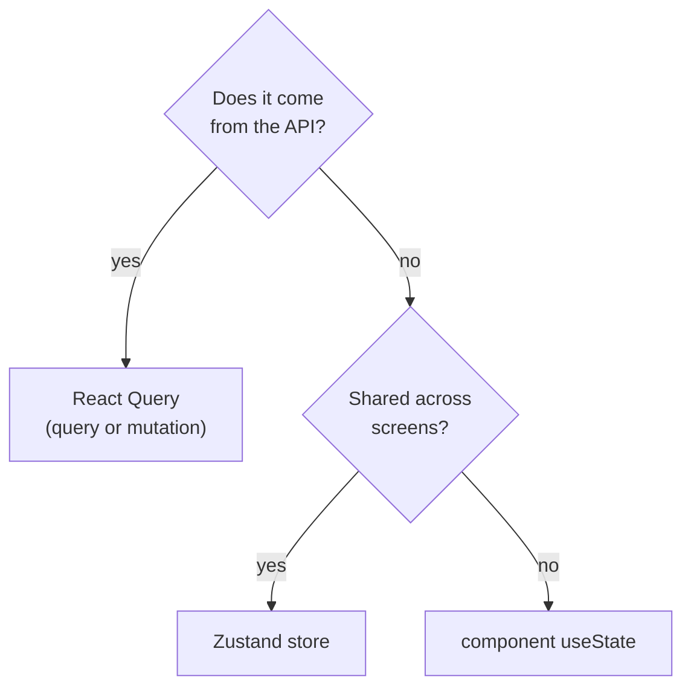

# Mobile State Management

**Owner:** Engineering (Mobile) · **Last reviewed:** 2026-07-06

The single most common mobile-architecture mistake is conflating **server state** with **client
state** and hand-rolling a global store for data that belongs to the server. We don't. This page is
the rule for what goes where.

---

## The two kinds of state

|              | Server state                                       | Client state                                                               |
| ------------ | -------------------------------------------------- | -------------------------------------------------------------------------- |
| **What**     | data owned by the backend (trips, wallet, profile) | UI/session/device state (selected tab, connectivity, draft input)          |
| **Truth**    | the server                                         | the app                                                                    |
| **Tool**     | **React Query**                                    | **Zustand** (or component `useState`)                                      |
| **Examples** | active trip, fare estimate, earnings, transactions | is-map-following, current pickup pin, session tokens, online-toggle intent |

> **Never cache server data in Zustand.** If it comes from an API, it lives in React Query, which
> owns caching, refetching, invalidation, and offline mutation. A global store holding a copy of
> server data is a stale-data bug waiting to happen.

---

## Server state — React Query

### Query keys are structured & centralized

```ts
// src/api/keys.ts
export const qk = {
  tripActive: ['trips', 'active'] as const,
  trip: (id: string) => ['trips', id] as const,
  wallet: ['wallet', 'me'] as const,
  earnings: (period: string) => ['earnings', period] as const,
};
```

Centralized keys make **invalidation precise**: completing a trip invalidates `qk.wallet` and
`qk.earnings`, not the whole cache.

### A query hook (server read)

```ts
export function useActiveTrip() {
  return useQuery({
    queryKey: qk.tripActive,
    queryFn: () => api.trips.getActive(), // generated client
    refetchInterval: (q) => (isLiveState(q.state.data) ? 5_000 : false),
    staleTime: 2_000,
  });
}
```

- Live states (searching/accepted/in_progress) **poll** as a backstop to the WS stream; terminal
  states don't. WS pushes are the fast path; polling is the safety net (Flow 5).
- `GET /trips/active` is the **authoritative resync** endpoint — after any reconnect, invalidate this
  key and the UI reconciles ([03](03_offline-resilience.md)).

### A mutation hook (server write) — with idempotency & optimism

```ts
export function useBookRide() {
  const qc = useQueryClient();
  return useMutation({
    mutationFn: (input: BookRideInput) =>
      api.rides.create(input, { idempotencyKey: input.idempotencyKey }), // Volume 7 ⏱
    onSuccess: () => qc.invalidateQueries({ queryKey: qk.tripActive }),
    retry: (n, err) => isRetriable(err) && n < 5, // safe: idempotent
  });
}
```

- Every mutation attaches an **`Idempotency-Key`** (Volume 7) so React Query's retries — and the
  offline queue's replays — are safe.
- Mutations are **queued when offline** and replayed on reconnect (next doc).

---

## Client state — Zustand

Small, focused stores for genuinely-local state:

```ts
// src/store/session.ts
export const useSession = create<SessionState>((set) => ({
  accessToken: null,
  role: null,
  setSession: (s) => set(s),
  clear: () => set({ accessToken: null, role: null }),
}));

// src/store/connectivity.ts — drives the offline UI banner & queue flushing
export const useConnectivity = create<{ online: boolean; set: (o: boolean) => void }>((set) => ({
  online: true,
  set: (online) => set({ online }),
}));
```

- **Session** (tokens, role) — tokens themselves persist in **SecureStore** (keychain), not plain
  storage; the store holds the in-memory working copy.
- **Connectivity** — a single source of truth for online/offline, fed by a network listener, used to
  show the offline banner and trigger queue flushes.
- **Ephemeral UI** (map-follow toggle, draft destination) — component `useState` unless it must be
  shared across screens.

---

## Persistence

| Data                    | Where                               | Why                                                        |
| ----------------------- | ----------------------------------- | ---------------------------------------------------------- |
| Tokens                  | **SecureStore** (keychain/keystore) | secrets (NFR-SEC)                                          |
| React Query cache       | **MMKV-backed persister**           | survive app restart → instant warm start, offline reads    |
| Offline action queue    | **MMKV**                            | must survive kill/restart ([03](03_offline-resilience.md)) |
| UI prefs (locale, etc.) | MMKV                                | trivial                                                    |

Persisting the React Query cache means the app **opens showing last-known data instantly**, then
revalidates — critical when the network is slow or absent on launch (A6.1).

---

## Decision flowchart



When in doubt: **API data → React Query. Everything else → the smallest thing that works.**
