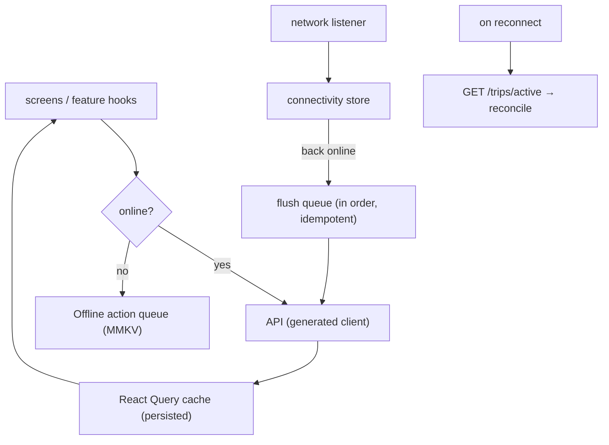

# Offline & Connectivity Resilience (Client)

**Owner:** Engineering (Mobile) · **Last reviewed:** 2026-07-06
**Realizes:** A6.1, NFR-RESIL-01..05, FR-TRIP-07

This is the most important document in the mobile volume. In Kashmir, connectivity is intermittent —
tunnels, dead zones, low bandwidth, and network disruptions are normal, not exceptional. The app
**must not strand a user or corrupt state** when the network drops. Resilience is a **layer**, built
once, not `try/catch` scattered everywhere.

---

## The contract (what "resilient" means here)

1. **Reads work offline** — last-known server state is shown instantly from the persisted cache.
2. **Writes survive offline** — user intents are queued and replayed when connectivity returns.
3. **Replays are safe** — every write carries an idempotency key, so a replay never double-acts.
4. **Reconnect always resyncs to server truth** — the app never guesses; it asks
   `GET /trips/active` and reconciles.
5. **Critical facts reach the user out-of-band** — trip-complete/SOS arrive via push/SMS even if the
   app never reconnects (server-side, Volume 5 notifications).

These map 1:1 to the server-side resilience design (Volume 4, Flow 5; Volume 7 idempotency). The two
halves are designed together.

---

## Architecture



Three cooperating pieces:

- **Persisted React Query cache** — offline reads.
- **Offline action queue** — offline writes.
- **Reconnect resync** — truth reconciliation.

---

## 1. Offline reads (persisted cache)

The React Query cache is persisted to MMKV ([02](02_state-management.md)). On launch or when offline,
screens render **last-known data** immediately, marked subtly as "may be stale", then revalidate when
online. A rider mid-trip who enters a tunnel still sees their trip, driver, and fare.

## 2. Offline writes (the action queue)

A mutation issued while offline (or that fails on a dropped connection) is **enqueued**, not lost:

```ts
type QueuedAction = {
  id: string; // = Idempotency-Key (stable across retries)
  endpoint: string; // e.g. 'trips.cancel'
  payload: unknown;
  createdAt: number;
  attempts: number;
};
```

- The queue is **persisted in MMKV** so it survives an app kill/restart (a user may force-close in a
  dead zone).
- On reconnect, the queue **flushes in order**, each action replayed with its original idempotency
  key. Because the server dedupes on that key (Volume 7 §3), a replay of an already-applied action
  returns the original result — **no double booking, no double cancel, no double charge**.
- Actions have bounded retries with backoff; a permanently-failing action surfaces to the user with a
  clear message rather than silently vanishing.

> **What is queueable?** User-initiated intents that are safe to apply late: cancel, rate, register
> device token, upload KYC doc. **Time-critical, interactive** actions (booking a ride, a driver
> accepting an offer) are **not** blindly queued — booking a ride 10 minutes later is wrong. Those
> require live connectivity and give immediate feedback if offline. The queue is for
> "apply-when-you-can", not for pretending an interactive action succeeded.

## 3. Reconnect resync (truth reconciliation)

```ts
// runs on: app foreground, network-regained, WS seq-gap, socket reconnect
async function resync(qc: QueryClient) {
  await flushQueue(); // apply queued intents first
  await qc.invalidateQueries({ queryKey: qk.tripActive }); // pull authoritative state
  // UI re-renders from server truth; any optimistic guess is overwritten
}
```

- Triggered by: app coming to foreground, network regained, a **WS `seq` gap** (Volume 7 §03), or a
  socket reconnect.
- **`GET /trips/active` is the one authoritative call** (FR-TRIP-07, NFR-RESIL-05). Whatever the app
  thought, the server's answer wins.

---

## Realtime (WebSocket) resilience

- The WS connection is expected to drop; a **reconnect-with-backoff** manager owns it.
- On reconnect it re-subscribes and triggers a `resync`.
- Missed messages are detected via the **`seq`** field (Volume 7 §03) and recovered by REST — the WS
  stream is an optimization, never the source of truth.
- Driver location pings, if the socket is down, fall back to **batched `POST /drivers/me/location`**.

---

## UX of degraded connectivity

Being offline must be **legible**, never a frozen or lying UI:

| State               | UX                                                                                          |
| ------------------- | ------------------------------------------------------------------------------------------- |
| Offline             | Persistent banner "You're offline — we'll sync when you're back"; cached data shown         |
| Action queued       | Inline "will send when online" on the affected item; not a fake success                     |
| Reconnecting        | Subtle indicator; auto-resync                                                               |
| Resynced            | Banner clears; UI reflects server truth (may correct an optimistic guess, explained gently) |
| Stuck/failed action | Clear error + retry affordance; never silent loss                                           |

Loading and empty states are **mandatory** on every data-driven screen ([01](01_project-structure.md))
— on this network they're the common case.

---

## Why this is designed with the server, not bolted on

Client resilience only works because the server is built for it: **idempotency keys** (Volume 7),
**authoritative `GET /trips/active`** (Volume 7/Volume 5 FSM), **two-tier idempotency with DB
constraints** (Volume 6), and **out-of-band push/SMS for critical facts** (Volume 5). The mobile
queue + resync is the client half of a whole-system resilience design (A6.1). Neither half is
sufficient alone.

## Traceability

| Client mechanism                   | Satisfies                    |
| ---------------------------------- | ---------------------------- |
| Persisted cache (offline reads)    | NFR-RESIL-01/04              |
| Idempotent action queue            | NFR-RESIL-02, A6.1           |
| Reconnect → `GET /trips/active`    | FR-TRIP-07, NFR-RESIL-05     |
| WS seq-gap → REST resync           | Volume 7 §03, A6.1           |
| Out-of-band critical notifications | Volume 5 notifications, A6.1 |
