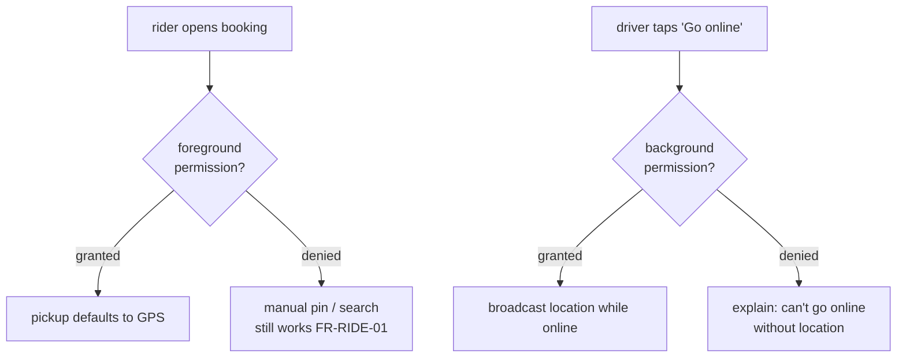

# Maps & Location

**Owner:** Engineering (Mobile) · **Last reviewed:** 2026-07-06
**Realizes:** FR-RIDE-01, FR-TRIP-03, R-AVAIL-2, A6.2

Location is the app's most sensitive and battery-hungry capability, and — given Kashmir's terrain
(A6.2) — its accuracy and degradation behavior matter more than in a flat city. This page covers
permissions, foreground vs background tracking, battery, and offline map behavior.

---

## Capabilities by role

| Capability                                   | Rider |           Driver            |
| -------------------------------------------- | :---: | :-------------------------: |
| Set pickup/drop on map                       |  ✅   |              —              |
| See own location                             |  ✅   |             ✅              |
| Foreground live tracking (view driver/rider) |  ✅   |             ✅              |
| **Background** location broadcasting         |   —   | ✅ (while online / on trip) |
| Turn-by-turn navigation                      |   —   |   handoff to native maps    |

The driver app is the heavy location user: it **broadcasts** position while online so matching and
live tracking work; the rider app mostly **consumes** the driver's position during a trip.

---

## Permissions — request at the right moment

- **Ask in context, not on launch.** Request foreground location when the user first opens booking
  (rider) or goes online (driver) — with a plain-language rationale. A cold permission prompt on
  first launch gets denied.
- **Background location (driver only)** is requested **separately and explicitly** when going online,
  because it's high-trust: "so riders can see you and get matched while the app is in the background."
- **Handle denial gracefully:** rider can still set pickup manually (map pin / search) if location is
  denied (FR-RIDE-01); driver cannot go online without location and is told why.

---

## Location strategy & battery

Battery is a real constraint for a driver online all day. We **adapt the sampling rate to context**:

| Context                          | Accuracy / frequency                                             |
| -------------------------------- | ---------------------------------------------------------------- |
| Driver online, idle (no trip)    | balanced accuracy, lower frequency                               |
| Driver on active trip            | high accuracy, higher frequency (rider is watching, ETA matters) |
| Rider viewing a trip             | consume driver pushes; sample own location sparingly             |
| App backgrounded (driver online) | OS-efficient background updates, batched                         |

- **Batch + debounce** pings; send over WS when connected, else **batch to
  `POST /drivers/location`** ([03](03_offline-resilience.md)). Locations land in Redis GEO
  (Volume 6 §04).
- **Maps data** (autocomplete, geocode, route preview) is fetched from the backend at
  `/api/v1/maps/*` so provider credentials stay server-side. Map rendering uses the secret-free
  `/api/v1/maps/config` response (client SDK keys only).
- **Freshness matters for matching (R-AVAIL-2):** stale fixes make a driver ineligible, so the app
  keeps the fix fresh while online — but no fresher than needed, to save battery.

### Terrain & poor-GPS handling (A6.2)

- **Poor GPS is expected** (narrow valleys, buildings). The app: shows accuracy state, lets the rider
  **manually adjust** the pickup pin, and doesn't hard-fail on a weak fix.
- **ETA/distance** come from the routing provider (road distance), not straight-line — terrain makes
  great-circle a poor proxy (matches server pricing/ranking, Volume 5).

---

## Maps rendering

- Map component wrapped in `packages/ui-kit` so rider, driver, and admin use one consistent map layer
  and it's swappable if we change providers (Volume 4 deferred provider decision).
- **Markers:** pickup, drop, driver (moving), rider. Driver marker animates from WS
  `trip.driver_location` pushes (Volume 7 §03), interpolated for smoothness between pings.
- **Offline maps:** cache recently-viewed map tiles where the provider allows, so a brief drop
  doesn't blank the map (A6.1). The trip can continue even if tiles are stale.

---

## Privacy & safety

- Location is only broadcast **when relevant** (driver online / on trip; rider during an active
  trip) — never silently in the background otherwise.
- The **share-trip** view exposes a **reduced** location payload to the shared link (Volume 7 §03,
  R-SAFE-01) — enough to watch the journey, not to profile the user.
- Location retention/handling follows the privacy policy (Volume 14); trip route history is retained
  for safety/disputes (R-SAFE-4) but governed by retention rules.

## Traceability

| Mechanism                   | Satisfies              |
| --------------------------- | ---------------------- |
| Manual pickup on poor GPS   | FR-RIDE-01, A6.2       |
| Driver background broadcast | R-AVAIL-2, FR-MATCH-01 |
| Live driver marker from WS  | FR-TRIP-03             |
| Adaptive sampling (battery) | NFR-USE-03             |
| Offline tile cache          | A6.1                   |
| Reduced share payload       | R-SAFE-01              |
