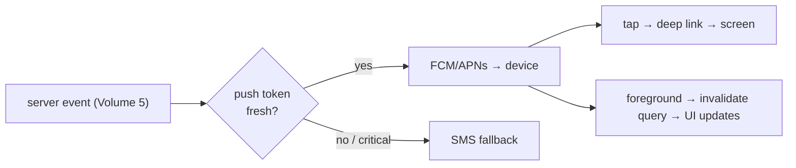

# Push, Deep Linking, OTA & App Config

**Owner:** Engineering (Mobile) · **Last reviewed:** 2026-07-06
**Realizes:** FR-NOTIF-01, A6.1, A6.4, NFR-MAINT-03

The remaining mobile infrastructure: how notifications reach the app, how links open the right
screen, how we ship fixes without an app-store cycle, and how the app is configured per environment.

---

## Push notifications

- **Registration:** on login/consent, the app registers its device token via
  `POST /notifications/device-tokens` (Volume 7). Tokens are refreshed and pruned when invalid
  (Volume 5 notifications handles stale-token fallback to SMS).
- **Delivery:** FCM (Android) / APNs (iOS). The server chooses push vs SMS by event priority (Volume 5,
  N-1): critical events (trip complete, SOS, OTP) fall back to **SMS** when push is unavailable — the
  app can't assume push arrived (A6.1).
- **Handling:** a push carries a `type` + `data` (e.g. `{ type: "trip.state_changed", tripId }`).
  Tapping it **deep-links** into the relevant screen; receiving it in-foreground invalidates the
  matching React Query key so the UI updates.
- **Never trust a push as truth:** like WS, a push is a _nudge_; the app fetches authoritative state
  (`GET /trips/active`) to act (Volume 7, Flow 5).



---

## Deep linking

Because navigation is **Expo Router (file-based)**, routes _are_ deep-link targets — little extra
wiring:

| Link                                 | Opens                                                     |
| ------------------------------------ | --------------------------------------------------------- |
| `zaroorat://trip/{id}`               | live trip screen                                          |
| `zaroorat://share/{token}`           | public shared-trip view (no auth)                         |
| `https://zaroorat.com/share/{token}` | universal link → same shared view (works without the app) |

- **Auth-gated links** route through the gate ([01](01_project-structure.md)): if not logged in, the
  target is remembered and reopened after auth.
- **Share links** are the key public deep link (R-SAFE-01) — they must open a live view for someone
  who may not have the app, hence the `https://` universal link to a lightweight web view.

---

## OTA (Over-The-Air) updates

- **Expo Updates** lets us ship JS/asset fixes **without an app-store review** — valuable at launch
  and for a market where users may update apps infrequently.
- **What OTA can change:** JS logic, styles, most bug fixes. **What it can't:** native modules /
  permissions / SDK upgrades — those need a store build.
- **Policy:** OTA for hotfixes and small features on a release channel per environment
  (staging/production); a native build for anything touching native code. Updates are **staged** and
  can be rolled back by pointing the channel at the previous bundle (Volume 13 release process).
- **Compatibility:** an OTA bundle targets a compatible native runtime + a compatible **API version**
  (Volume 7 versioning) — we never OTA a client that expects an API the server doesn't serve.

---

## App configuration & environments

Config is **env-driven**, mirroring the backend principle (Volume 1) — no hard-coded URLs/keys:

```ts
// app.config.ts (reads EXPO_PUBLIC_* — public, non-secret values only)
export default {
  extra: {
    apiUrl: process.env.EXPO_PUBLIC_API_URL, // per environment
    wsUrl: process.env.EXPO_PUBLIC_WS_URL,
    mapsKey: process.env.EXPO_PUBLIC_MAPS_KEY, // public client key, restricted by referrer
    env: process.env.EXPO_PUBLIC_ENV, // local | staging | production
  },
};
```

- **Only public values** use `EXPO_PUBLIC_*` — anything embedded in the client is world-readable, so
  true secrets never ship in the app (Volume 14). Client map keys are restricted/quota-limited.
- **Per-environment** builds/channels point at the right API + WS URLs.

---

## Internationalization (A6.4)

- **i18n from day one** (NFR-USE-01): all user-facing strings go through `src/i18n`; no hard-coded
  copy. Launch: English + one regional language, with Urdu/Kashmiri/Hindi on the roadmap.
- The device/user **locale** is sent as `Accept-Language` (Volume 7) so server messages (errors,
  notifications) are localized too — the whole stack respects locale, not just the UI shell.
- Layout tolerates longer translated strings and, where a roadmap language needs it, RTL.

---

## Traceability

| Mechanism                                | Satisfies                         |
| ---------------------------------------- | --------------------------------- |
| Device-token registration + SMS fallback | FR-NOTIF-01/02, A6.1              |
| Push/WS as nudge, REST as truth          | FR-TRIP-07, Flow 5                |
| Share universal link                     | R-SAFE-01                         |
| OTA hotfixes, API-version-aware          | NFR-MAINT-03, Volume 7 versioning |
| Env-driven config, no secrets in client  | Volume 1, Volume 14               |
| i18n + Accept-Language                   | NFR-USE-01, A6.4                  |
