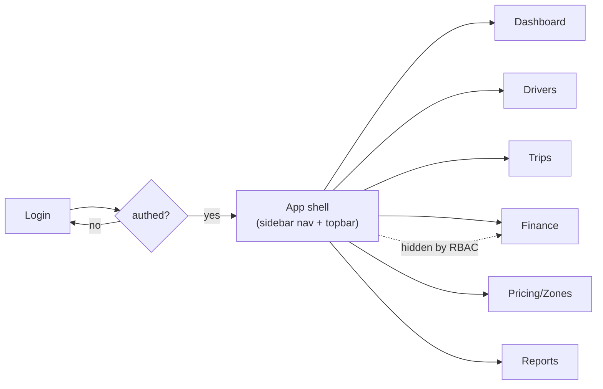

# Admin Project Structure

**Owner:** Engineering (Web) · **Last reviewed:** 2026-07-06

Feature-sliced, like the mobile app (Volume 8) and the backend modules (Volume 1) — code grouped by
what it does (drivers, trips, finance), not by technical type. Consistent structure across all three
apps means an engineer moving between them isn't relearning where things live.

---

## Folder layout

```
apps/admin/
├── index.html
├── vite.config.ts
└── src/
    ├── main.tsx               # bootstrap: QueryClient, Router, auth, theme
    ├── routes/                # route-based pages (thin — wire feature to URL)
    │   ├── login.tsx
    │   ├── dashboard.tsx      #   live ops (03)
    │   ├── drivers/           #   onboarding queue, driver detail
    │   ├── trips/             #   search + trip evidence (04)
    │   ├── finance/           #   ledgers, refunds, payouts
    │   ├── pricing/           #   pricing & zones config (05)
    │   └── reports/           #   metric reports (05)
    ├── features/              # the logic (components/, hooks/, api.ts per feature)
    │   ├── drivers/
    │   ├── trips/
    │   ├── finance/
    │   ├── pricing/
    │   ├── zones/
    │   ├── reports/
    │   └── live-ops/
    ├── api/                   # generated client wrappers + query keys
    ├── auth/                  # session, token refresh, RBAC helpers
    ├── components/            # app-level shared UI (data grid, filters, layout)
    ├── lib/                   # rbac, formatting (money/date), charts, map
    └── i18n/
```

Rule (same as mobile): **`routes/` is thin.** A route composes a page from `features/`; the feature
holds the data hooks and components.

---

## Layout & navigation



- A persistent **app shell** (sidebar + topbar) wraps authenticated pages.
- **Nav items are filtered by the signed-in role's scopes** — a support agent doesn't see Finance or
  Pricing. (Client-side filtering is UX; the server still enforces — [02](02_rbac-permissions.md).)

---

## Data layer

- **React Query** for all server reads/writes (same discipline as mobile, Volume 8). Structured query
  keys per feature; precise invalidation after mutations.
- **Live data** (dashboard counts, active-trips map) uses a **WS subscription** plus a polling
  backstop, so the ops view stays current ([03](03_dashboards-live-ops.md)).
- **Large lists** (trips, ledger entries) use **cursor pagination** (Volume 7 §04) in a virtualized
  grid — the admin never `SELECT *`s a huge table into the browser.

```ts
// features/trips/useTrips.ts
export function useTrips(filters: TripFilters) {
  return useInfiniteQuery({
    queryKey: qk.trips(filters),
    queryFn: ({ pageParam }) => api.admin.trips.search({ ...filters, cursor: pageParam }),
    getNextPageParam: (last) => last.page.nextCursor ?? undefined,
  });
}
```

---

## Cross-cutting UI conventions

- **Money** always via the shared `<Money>` from the `{amount, currency}` object (Volume 7) — never
  string math; consistent with mobile (NFR-USE-04).
- **Timestamps** shown in the market's local time with an explicit tz label; stored/queried in UTC.
- **Every mutating action** (approve, refund, suspend, price change) uses a **confirm step** and,
  where the API requires, an **`Idempotency-Key`** (Volume 7 `⏱`) so a double-click can't double-act.
- **Loading / empty / error** states are mandatory on every data view (same rule as mobile).
- **Audit surfacing:** views that changed state show _who_ changed it and _when_ (from `audit_log`,
  Volume 6) — accountability is visible, not buried.

---

## Auth & session

- **Same JWT auth** as the API (Volume 7): access token in memory, refresh on `401`. Admin tokens may
  carry a shorter TTL and stricter session policy (Volume 15) given their privilege.
- On load, the app fetches the current user + **their scopes**, which drive both the nav and the
  in-page gating ([02](02_rbac-permissions.md)).
- **CORS** is locked to the admin origin(s) (Volume 7 §05); the admin is the only browser client, so
  origin is tightly controlled.
