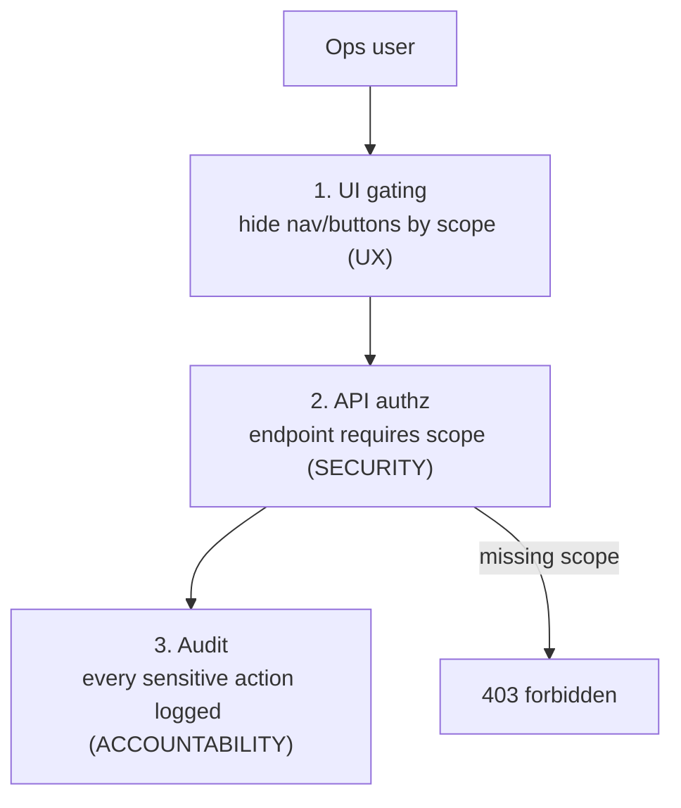

# RBAC & Permissions

**Owner:** Engineering (Web + API) · **Last reviewed:** 2026-07-06
**Realizes:** FR-ADMIN-03, NFR-SEC-04, R-DATA-2, R-PAY-5

Ops staff have real power — refund money, suspend accounts, change prices. That power must be
**scoped, enforced, and audited**. This page defines the role→scope model and, crucially, **where
enforcement actually happens** (spoiler: the server).

---

## The golden rule of RBAC

> **The client hides; the server enforces.**
> The admin UI hides buttons and nav a role can't use — that's _UX_. The **API independently checks
> the caller's scope on every request** — that's _security_ (NFR-SEC-04). A hidden button is not a
> permission; a server check is. If the two ever disagree, the server wins and the request is
> `403 forbidden` (Volume 7 §04).

Never protect an action by only hiding its button. Any determined user can call the API directly.

---

## Roles → scopes

Roles are bundles of **scopes** (fine-grained permissions). The token carries the user's scopes; the
API authorizes against the specific scope an endpoint requires.

| Scope             | Allows                         | Endpoints (Volume 7)                          |
| ----------------- | ------------------------------ | --------------------------------------------- |
| `trips:read`      | search trips, view evidence    | `GET /admin/trips*`                           |
| `drivers:read`    | view drivers, onboarding queue | `GET /admin/drivers*`                         |
| `drivers:approve` | approve/reject drivers         | `POST /admin/drivers/{id}/approve             | reject` |
| `users:suspend`   | suspend/reinstate accounts     | `POST /admin/users/{id}/suspend`              |
| `finance:read`    | view ledgers/earnings/payouts  | `GET /wallet*`, `GET /admin/reports/finance*` |
| `refund:issue`    | issue refunds                  | `POST /admin/refunds`                         |
| `pricing:write`   | edit pricing configs           | `PATCH /pricing/config`                       |
| `zones:write`     | manage zones/surge             | `POST /zones`                                 |
| `reports:read`    | run metric reports             | `GET /admin/reports/*`                        |
| `rbac:manage`     | manage roles/assignments       | `POST /admin/roles*`                          |

### Default role bundles

| Role               | Scopes                                                       |
| ------------------ | ------------------------------------------------------------ |
| **Support agent**  | `trips:read`, `drivers:read`, `reports:read`                 |
| **Ops manager**    | + `drivers:approve`, `users:suspend`                         |
| **Finance**        | `trips:read`, `finance:read`, `refund:issue`, `reports:read` |
| **Pricing/Growth** | `trips:read`, `pricing:write`, `zones:write`, `reports:read` |
| **Admin (super)**  | all scopes incl. `rbac:manage`                               |

Bundles are the _default_; a specific person's scopes can be adjusted. **Separation of duties** is
deliberate: e.g. approving drivers and issuing refunds are different roles, so no single agent both
onboards and pays out unchecked.

---

## Enforcement — three layers



1. **UI gating (UX):** a `<Can scope="refund:issue">` guard and nav filtering hide what the role
   can't do — clean, uncluttered screens.
2. **API authorization (security):** a FastAPI dependency checks the required scope on every `👮`
   endpoint; default-deny (Volume 7 §05). This is the real boundary.
3. **Audit (accountability):** sensitive actions write `audit_log` with actor + before/after
   (Volume 6, R-DATA-2) — even a legitimately-authorized action leaves a trail.

```tsx
// features/... client-side gate (UX only — not security)
<Can scope="refund:issue" fallback={null}>
  <Button onClick={openRefundDialog}>Issue refund</Button>
</Can>
```

```python
# server-side (the real gate) — Volume 7 dependency
@router.post("/admin/refunds", dependencies=[require_scope("refund:issue")])
async def issue_refund(...): ...
```

---

## Sensitive-data access control

Beyond _actions_, some **reads** are privileged: KYC documents, full PII, financial detail. These
require the appropriate scope **and** their access may be **audited** (NFR-SEC-03) — we log who
viewed a KYC document, not just who changed one. Masking is applied where full data isn't needed
(e.g. partial phone in a list; full only on an authorized detail view).

---

## Session & account security for admins

- Admin accounts warrant stronger controls (Volume 15): shorter session TTL, and — recommended —
  MFA for high-privilege scopes (`refund:issue`, `pricing:write`, `rbac:manage`).
- Admin account lifecycle (onboarding/offboarding ops staff) is itself an audited process; a departing
  agent's scopes are revoked immediately.

---

## Traceability

| Mechanism                             | Satisfies                      |
| ------------------------------------- | ------------------------------ |
| Scope-per-endpoint, default-deny      | FR-ADMIN-03, NFR-SEC-04        |
| Refund/pricing/suspend gated by scope | R-PAY-5, R-PRICE-6             |
| Audit on every sensitive action       | R-DATA-2, FR-ADMIN-04          |
| Sensitive-read access control + audit | NFR-SEC-03                     |
| Separation of duties in role bundles  | fraud control (Volume 2 risks) |
