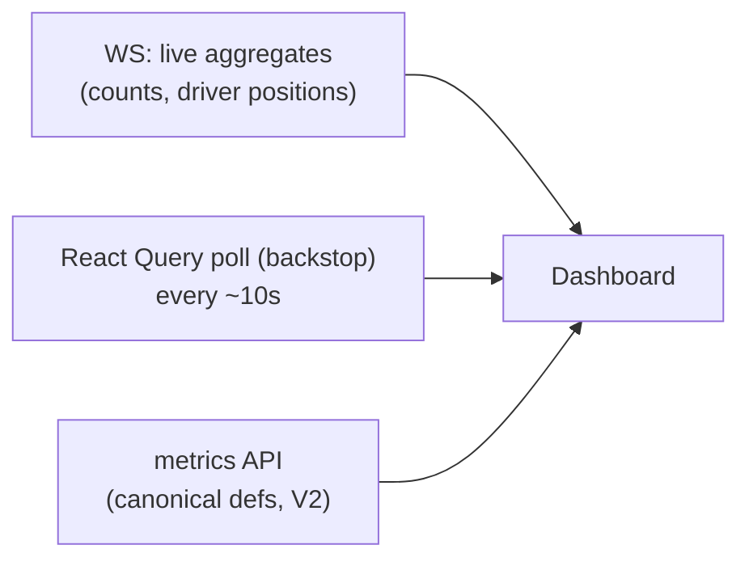

# Live Ops Dashboards

**Owner:** Engineering (Web) · **Last reviewed:** 2026-07-06
**Realizes:** FR-ADMIN-01, Volume 2 metrics

The live dashboard is where ops sees the marketplace breathing in real time and catches problems
before riders and drivers feel them. It answers one question continuously: **is the marketplace
healthy right now, and where isn't it?**

---

## The live dashboard

```
┌───────────────────────────────────────────────────────────────┐
│  Srinagar ▾   |  ● Live                              last 5 min │
├───────────────┬───────────────┬───────────────┬───────────────┤
│ Online drivers│ Active trips  │ Requests/min  │ Match rate     │
│      142      │      37        │      21        │    88% ▲       │
├───────────────┴───────────────┴───────────────┴───────────────┤
│ Avg pickup ETA 4.2m ▼   |  Cancel rate 6% ▲  |  Surge zones 2  │
├───────────────────────────────────────────────────────────────┤
│                     [ Active-trips map ]                        │
│      • drivers (idle/on-trip)   ▲ requests   ▨ surge zones      │
├───────────────────────────────────────────────────────────────┤
│  Alerts:  ⚠ Zone "Lal Chowk" match rate 61% (low supply)       │
└───────────────────────────────────────────────────────────────┘
```

### Tiles (the health-at-a-glance row)

The KPI tiles are the **Volume 2 marketplace metrics**, computed with the **canonical definitions**
([Volume 2](../01_Business/05_monetization-and-metrics.md)) so the live number matches the reports:

| Tile               | Metric                  | Healthy?                  |
| ------------------ | ----------------------- | ------------------------- |
| Online drivers     | live supply             | context                   |
| Active trips       | live demand in motion   | context                   |
| Requests/min       | demand rate             | context                   |
| **Match rate**     | request→match           | ≥ 85% (BR success metric) |
| **Avg pickup ETA** | match→arrival           | ≤ 5 min                   |
| Cancel rate        | cancels ÷ matches       | ≤ 10%                     |
| Surge zones        | zones currently surging | awareness                 |

Tiles show **trend arrows** (vs previous window) so a _degrading_ metric is visible before it's a
crisis — a green 85% trending down is more actionable than the number alone (dataviz guidance).

### Active-trips map

- Live map (per city) of **drivers** (idle vs on-trip), **open requests**, and **surge zone**
  overlays (PostGIS polygons, Volume 6 §03).
- Fed by a **WS subscription** to aggregate live data + a polling backstop; driver dots move from the
  same location stream that powers the app (Volume 4 realtime).
- Lets ops _see_ a supply gap ("requests piling up in a zone with no idle drivers") geographically,
  not just as a number.

---

## Data & refresh strategy



- **WS for immediacy**, **polling as a safety net** (same pattern as mobile, Volume 8) — a dropped
  socket degrades to slightly-staler numbers, never a frozen dashboard.
- Live counts come from an **aggregates endpoint** backed by Redis (hot counters) + read replicas
  (Volume 6 §05) so the dashboard never loads the primary DB with heavy scans.
- City selector scopes everything (launch: Srinagar, Jammu).

---

## Alerts on the dashboard

Ops shouldn't have to stare at tiles. The dashboard **surfaces threshold breaches** as inline alerts
and (via Volume 13 alerting) can page on severe ones:

| Condition                   | Alert                                                    |
| --------------------------- | -------------------------------------------------------- |
| Zone match rate < threshold | "Low supply in {zone}" → prompt driver incentive         |
| Pickup ETA > threshold      | "Slow pickups in {zone}"                                 |
| Cancel rate spike           | "Cancellations rising"                                   |
| Payment/settlement errors   | "Settlement errors — check finance" (links to Volume 13) |
| Matching backlog            | "Requests unmatched > N"                                 |

These tie to the **guardrail metrics** from Volume 2 — a spike in cancels while trips grow is exactly
the kind of thing the guardrails exist to catch.

---

## Why this belongs to ops, not just engineering

The dashboard is Sana's cockpit (persona). It turns the system's telemetry into **operational
levers**: see a supply gap → trigger an incentive; see surge → verify it's justified; see a
settlement error → escalate to finance. Engineering builds the same metrics into system monitoring
(Volume 13); this is the **business-facing** view of the same truth.

## Traceability

| Element                               | Satisfies                         |
| ------------------------------------- | --------------------------------- |
| Live supply/demand + active-trips map | FR-ADMIN-01                       |
| KPI tiles with canonical definitions  | Volume 2 metrics                  |
| WS + polling backstop                 | resilience pattern (V8)           |
| Threshold alerts on guardrails        | Volume 2 guardrails, V13 alerting |
