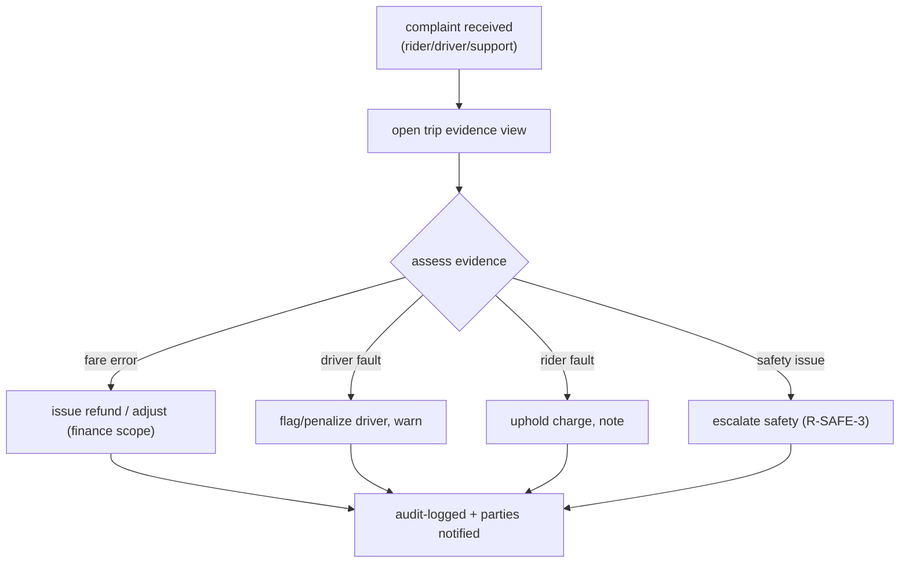

# Dispute Resolution Workflow

**Owner:** Engineering (Web) + Ops · **Last reviewed:** 2026-07-06
**Realizes:** FR-ADMIN-02, R-PAY-5, R-DATA-2, R-SAFE-3

When a rider or driver contests a trip — wrong fare, no-show, safety complaint — ops needs to resolve
it **quickly and fairly, from evidence**. This page defines the evidence view and the resolution
actions, all audited.

---

## The trip evidence view (one screen, all the facts)

The core of dispute handling is a single screen that assembles everything about a trip so an agent
doesn't hunt through raw tables:

```
┌──────────────── Trip t_4821  (completed)  ─────────────────┐
│ Rider: Ayesha (u_123)        Driver: Imran (d_77) ★4.8     │
│ Vehicle: auto JK01AB1234     City: Srinagar                │
├────────────────────────────────────────────────────────────┤
│ TIMELINE                                                    │
│ 10:12 requested → 10:12 matched → 10:15 arrived            │
│ 10:16 started (OTP ✓) → 10:31 completed                    │
├──────────────────────┬─────────────────────────────────────┤
│ FARE BREAKDOWN        │ ROUTE (map)                         │
│ base ₹30 dist ₹90     │  [pickup ──── path ──── drop]       │
│ time ₹30 surge 1.0    │  actual 5.9 km / 15 min             │
│ total ₹150            │                                     │
├──────────────────────┴─────────────────────────────────────┤
│ LEDGER: rider −₹150 | driver +₹127.50 | platform +₹21.42 … │
│ RATINGS: rider→driver ★5  driver→rider ★5                  │
│ SAFETY: no SOS   |   CHAT: [view transcript]               │
├────────────────────────────────────────────────────────────┤
│ Actions:  [Issue refund]  [Adjust fare]  [Flag driver]  …  │
└────────────────────────────────────────────────────────────┘
```

Everything shown comes from durable records (Volume 6): the **timeline** from `trip_events`, **fare**
from the trip's stamped pricing snapshot, **route** from `trip_locations` (PostGIS), **money** from
`ledger_entries`, plus `ratings`, SOS log, and chat. Nothing is reconstructed by guesswork — the
system was designed to make trips _auditable_ (that's why `trip_events`, the ledger, and route
history exist).

---

## Resolution workflow



### Actions and their guards

| Action                   | Requires scope           | Effect                                        | Audited           |
| ------------------------ | ------------------------ | --------------------------------------------- | ----------------- |
| **Issue refund**         | `refund:issue`           | reversing ledger transaction (Volume 5 §05)   | ✅ actor + reason |
| **Adjust fare**          | `refund:issue` / finance | correcting ledger entry (never edits history) | ✅                |
| **Flag/penalize driver** | `drivers:approve`        | rating/score note, possible review            | ✅                |
| **Suspend account**      | `users:suspend`          | blocks book/accept (R-ACCOUNT-4)              | ✅                |
| **Escalate safety**      | ops                      | routes per safety policy (R-SAFE-3)           | ✅                |

- **Refunds are reversing transactions, never edits** — the original settlement is immutable
  (Volume 5, W-2; Volume 6). A refund requires a **reason** and is RBAC-gated (R-PAY-5).
- **Every action writes `audit_log`** with actor, before/after, and reason (R-DATA-2), and the trip
  evidence view shows the resolution history — the next agent sees what was already done.
- **Parties are notified** of outcomes via the notifications module (Volume 5) — a refund the rider
  never hears about isn't resolved.

---

## Safety complaints (special handling) — R-SAFE-3

Safety issues are **not** routine disputes. An SOS or safety complaint:

- Is flagged distinctly and **prioritized** with an SLA (Volume 2, BR-9).
- Surfaces the trip's **location history** and SOS log for investigation (R-SAFE-4 retention is why
  that data still exists).
- Routes to a designated safety responder per policy (Volume 14), not general support.
- Is fully audited and may trigger driver suspension pending review.

---

## Fraud signals (assist, don't auto-punish)

The evidence view can highlight anomalies for the agent — improbable routes, repeated cancellations,
mismatched cash reconciliation (Volume 5 ledger). These are **decision support**: a human ops agent
decides, with the evidence, and the action is audited. Automated fraud _detection_ is Volume 14;
here it informs the human.

---

## Traceability

| Element                                | Satisfies              |
| -------------------------------------- | ---------------------- |
| One-screen trip evidence               | FR-ADMIN-02            |
| Refund as reversing txn, RBAC + reason | R-PAY-5, Volume 5 W-2  |
| Every action audited + shown           | R-DATA-2, FR-ADMIN-04  |
| Safety escalation path                 | R-SAFE-3, BR-9         |
| Party notification of outcome          | Volume 5 notifications |
