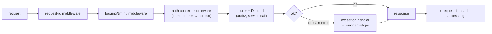

# Request Lifecycle: Middleware, Auth & Errors

**Owner:** Engineering (Backend) · **Last reviewed:** 2026-07-06
**Realizes:** NFR-SEC-04, NFR-OBS-01, Volume 7 error model

What happens to a request from the moment it hits the app to the moment a response leaves. The
cross-cutting concerns — request-id, logging, auth, error mapping — live **here, once**, not in every
handler. This is where the [Volume 7 error envelope](../07_API/04_errors-pagination-idempotency.md)
and [Volume 5 domain exceptions](../05_Design/README.md) meet.

---

## The request pipeline



### Middleware order (it matters)

Middleware wraps outermost-first. Order is deliberate:

```python
# api/middleware.py
def register_middleware(app):
    app.add_middleware(RequestIdMiddleware)      # 1. assign/propagate X-Request-ID (outermost)
    app.add_middleware(AccessLogMiddleware)      # 2. time + structured access log
    app.add_middleware(AuthContextMiddleware)    # 3. parse bearer → request.state.auth (no enforce)
    # CORS (admin origin only), security headers, body-size limit added here too (Volume 7/15)
```

1. **Request-id first** so _everything_ inside (logs, errors, traces) carries the same id
   (NFR-OBS-01). If the client sent `X-Request-ID`, we honor it; else we generate one.
2. **Access log** wraps the handler to record method, path, status, and latency — feeding the metrics
   and slow-query/endpoint tracking (Volume 13).
3. **Auth-context** _parses_ the token into `request.state.auth` but does **not** enforce — enforcement
   is per-endpoint via `Depends` (so public endpoints work and each endpoint declares its own
   requirement, default-deny).

---

## Authentication & authorization dependencies

Auth is **parsed in middleware, enforced in dependencies**. Every protected endpoint declares what it
needs; nothing is implicitly allowed (NFR-SEC-04).

```python
# core/security.py
async def get_auth(request: Request) -> AuthContext | None:
    return request.state.auth                     # set by AuthContextMiddleware

def require_authenticated(auth: AuthContext | None = Depends(get_auth)) -> AuthContext:
    if auth is None:
        raise UnauthenticatedError()              # → 401 (Volume 7)
    return auth

def require_rider(auth: AuthContext = Depends(require_authenticated)) -> AuthContext:
    if "rider" not in auth.roles:
        raise ForbiddenError()                    # → 403
    return auth

def require_scope(scope: str):                    # admin RBAC (Volume 9)
    def _dep(auth: AuthContext = Depends(require_authenticated)) -> AuthContext:
        if scope not in auth.scopes:
            raise ForbiddenError()
        return auth
    return _dep
```

- **Default-deny:** an endpoint with no auth dependency is public _by explicit choice_ (only
  `/auth/otp/*`, `/healthz`, share links). Everything else declares `require_authenticated` or
  stronger. Reviewers check this.
- **Ownership** is enforced in the service/repository (a rider can only read _their_ trip), returning
  `not_found` for resources they shouldn't know exist (Volume 7 §05).
- **Access tokens validate statelessly** (JWT signature + exp) — no DB hit on the hot path
  (Volume 5 auth, NFR-SCALE-02).

---

## Exception handling: domain errors → the one envelope

Services raise **typed domain exceptions** (Volume 5, `<module>/exceptions.py`), never
`HTTPException`. A single registered handler maps them to the Volume 7 error envelope. This keeps
HTTP concerns out of business logic (Volume 1) and guarantees a uniform error shape.

```python
# shared/exceptions.py
class DomainError(Exception):
    code: str                     # stable machine code (Volume 7)
    http_status: int
    def __init__(self, message: str, details: dict | None = None): ...

# examples (raised by services)
class InsufficientFundsError(DomainError): code="insufficient_funds"; http_status=422
class IllegalTransitionError(DomainError): code="illegal_transition"; http_status=409
class InvalidPickupOtpError(DomainError):  code="invalid_pickup_otp"; http_status=409
```

```python
# api/errors.py
def register_exception_handlers(app):
    @app.exception_handler(DomainError)
    async def _domain(request, exc: DomainError):
        return JSONResponse(
            status_code=exc.http_status,
            content={"error": {"code": exc.code, "message": str(exc),
                               "details": exc.details,
                               "requestId": request.state.request_id}},
        )

    @app.exception_handler(RequestValidationError)   # Pydantic → 400 validation_error
    async def _validation(request, exc): ...

    @app.exception_handler(Exception)                # last resort → 500 internal_error
    async def _unhandled(request, exc):
        log.exception("unhandled", request_id=request.state.request_id)   # detail to logs only
        return JSONResponse(500, {"error": {"code": "internal_error",
            "message": "Something went wrong.", "requestId": request.state.request_id}})
```

- **Every error path yields the same envelope with a `requestId`** — the client shows a code, the
  support agent greps the logs by `requestId` (NFR-OBS-01).
- **Internal errors never leak detail** (no stack traces to clients); the detail is logged
  server-side (Volume 15).
- The mapping table (code ↔ status) is the canonical list in [Volume 7 §04](../07_API/04_errors-pagination-idempotency.md).

---

## Structured logging

- **JSON logs** in staging/production (Volume 1); every line carries `request_id`, `env`, and
  relevant context (user id where safe, never secrets/PII beyond policy).
- The access-log middleware emits one structured line per request (method, path, status, ms).
- Logs feed the aggregation + alerting pipeline (Volume 11/13). No `print`; no unstructured logging.

---

## Putting it together (a request in ~7 steps)

1. Request arrives → **request-id** assigned.
2. **Access-log** timer starts.
3. **Auth-context** parses the bearer token into `request.state.auth`.
4. Router matches; **`Depends`** builds `service ← repository ← session` and runs **authz** deps.
5. Service executes the use-case inside a **UoW transaction** (Volume 10 §02), possibly enqueuing an
   outbox event.
6. Success → typed response model → JSON. Domain error → **exception handler** → error envelope.
7. **Access-log** line emitted with status + latency; `X-Request-ID` returned.

Every one of these steps is defined once and applies to every endpoint — which is exactly why
handlers stay thin.
