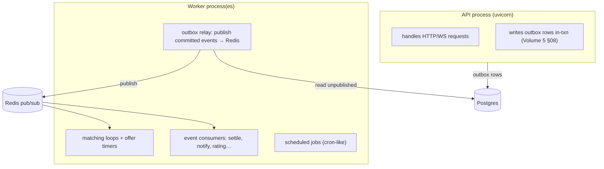

# Async Model, Workers & Background Jobs

**Owner:** Engineering (Backend) · **Last reviewed:** 2026-07-06
**Realizes:** Volume 4 (workers, events), Volume 5 §08 (outbox), NFR-RESIL-02

Not everything happens inside a request. Matching timers, event consumers, the outbox relay,
scheduled sweeps (KYC expiry, partition maintenance) run in **worker processes**. This page covers
the async model and the worker runtime — the same codebase, a different entrypoint.

---

## Async model (why and the rules)

The service is **I/O-bound** (DB, Redis, HTTP to providers, many concurrent connections). Async lets
one process handle thousands of concurrent operations without a thread each (Volume 4).

Rules that keep the event loop healthy:

- **Everything on the request/worker path is `async`** — DB (async SQLAlchemy), Redis, HTTP client.
- **Never block the loop.** No sync DB drivers, no `time.sleep`, no CPU-heavy loops inline. Blocking
  work → `run_in_threadpool` (rare) or a worker job.
- **No shared mutable global state** across requests (statelessness, Volume 4).
- **Bounded concurrency** for fan-out (e.g. sending N notifications) via a semaphore, so one burst
  can't exhaust connections.

---

## The two runtimes, one codebase



`worker.py` is the entrypoint (`python -m zaroorat.worker`), deployed as a separate pod set that
scales on queue depth (Volume 4/11). It shares modules, config, and DB/Redis with the API.

```python
# worker.py (sketch)
async def main():
    settings = get_settings(); configure_logging(settings)
    await redis_pool.connect(settings.redis_url)
    async with anyio.create_task_group() as tg:
        tg.start_soon(run_outbox_relay)       # publish committed events
        tg.start_soon(run_event_consumers)    # settle / notify / etc.
        tg.start_soon(run_matching_workers)   # offer loops + timers
        tg.start_soon(run_scheduler)          # cron-like jobs
```

---

## The outbox relay (exactly-once-ish events) — Volume 5 §08

The API writes events to the `outbox` table **inside the same transaction** as the state change
(Volume 5). The relay publishes committed rows to Redis and marks them sent:

```python
async def run_outbox_relay():
    while True:
        rows = await outbox_repo.fetch_unpublished(limit=100)   # ix_outbox_unpublished
        for row in rows:
            await bus.publish(row.type, row.payload, event_id=row.event_id)
            await outbox_repo.mark_published(row.id)
        await sleep_or_wait(rows)
```

- **State change ⇔ event publish is atomic** (outbox written in-txn) — no lost or phantom events.
- **At-least-once:** a crash between publish and `mark_published` re-publishes; consumers are
  idempotent (below), so that's safe (NFR-RESIL-02).

---

## Event consumers (idempotent by contract)

Consumers react to events (Volume 5 §08 catalog). **Every consumer dedupes** on the event id /
natural key before acting:

```python
async def on_trip_completed(evt: TripCompleted):
    if await dedupe.seen(evt.id):                 # idempotent (redelivery-safe)
        return
    async with uow.transaction():
        await settlement_service.settle(evt)      # one settlement per trip (Volume 5, W-4)
    await dedupe.mark(evt.id)
```

- **Retry with backoff** on transient failure (don't ack → redelivered).
- **Dead-letter + alert** on a poison message — never silently drop, especially money/safety events
  (Volume 5 §08 consumer contract, NFR-OBS-03).
- **DB unique constraints are the final guarantee** (e.g. `uq_ledger_txn_idem`) so even a dedupe miss
  can't double-settle (Volume 6, defense in depth).

---

## Matching workers & timers — Volume 5 §03

The matching offer loop runs in a worker: it consumes `ride.requested`, holds a per-request lock
(`ride:matchlock:{id}`), offers to candidates with `OFFER_TTL` timers, expands radius, and expires on
deadline. Timers are async sleeps within the loop; the Redis lock TTL lets another worker recover a
crashed loop (Volume 5, M-1).

---

## Scheduled jobs (cron-like)

Periodic maintenance runs on a scheduler within the worker (or a k8s CronJob, Volume 11):

| Job                        | Cadence  | Purpose                                                           |
| -------------------------- | -------- | ----------------------------------------------------------------- |
| KYC expiry sweep           | daily    | move drivers with expired docs → `docs_required` (R-KYC-3)        |
| Surge recompute            | ~1–2 min | recompute demand/supply surge per zone → Redis (Volume 5 §04)     |
| Partition maintenance      | daily    | pre-create next month's partitions (Volume 6 §05)                 |
| Location snapshot/archival | periodic | snapshot Redis locations, archive old `trip_locations`            |
| Stuck-trip watchdog        | periodic | flag non-terminal trips inactive too long (Volume 5 §02)          |
| Reconciliation             | daily    | assert ledger sums to zero; alert finance on drift (Volume 5 §05) |
| Token/OTP cleanup          | periodic | prune expired refresh tokens                                      |

Scheduled jobs are **idempotent and safe to run twice** (a missed/duplicated run must not corrupt
state) — the same discipline as event consumers.

---

## Worker reliability

- **Graceful shutdown:** on SIGTERM, stop taking new work, finish in-flight, release locks — so a
  deploy/rescale doesn't drop a matching loop or half-finish a settlement (Volume 4/11).
- **Isolation:** a failing consumer for one event type doesn't take down the others (separate tasks,
  supervised).
- **Observability:** workers emit the same structured logs + metrics (queue depth, processing time,
  DLQ size) that drive scaling and alerts (Volume 13).
