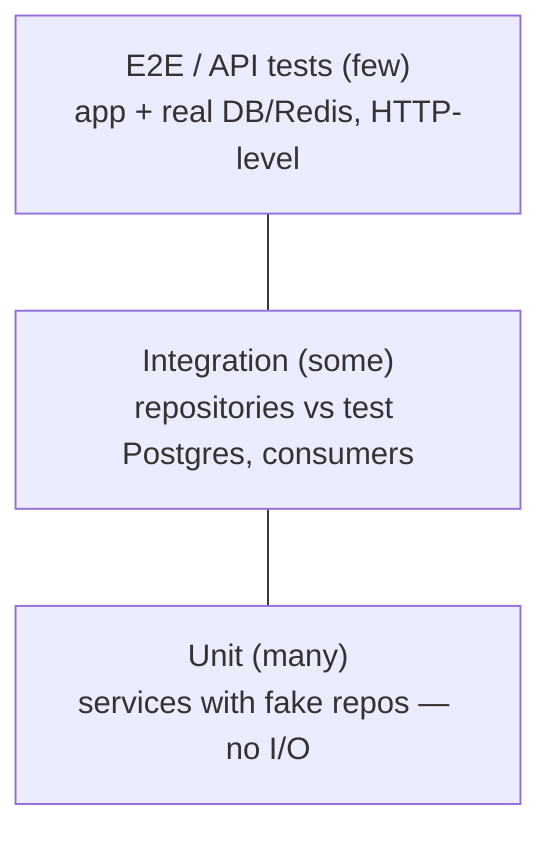

# Backend Conventions & Testing Seams

**Owner:** Engineering (Backend) · **Last reviewed:** 2026-07-06
**Realizes:** Volume 1 standards, ADR-0004 boundaries, Volume 12 testing

The backend-specific conventions that keep the codebase coherent as it grows, and the **seams** that
make it testable. Full coding standards are [Volume 1](../00_Project/02_coding-standards.md); the
full test strategy is [Volume 12](../13_Testing/README.md). This page is the backend's expression of
both.

---

## Module conventions (the repeated shape)

Every `modules/<domain>/` follows the same file set (Volume 5), and each file has a strict job:

| File            | Contains                                                   | Must NOT                          |
| --------------- | ---------------------------------------------------------- | --------------------------------- |
| `router.py`     | endpoints; parse input, call service, return               | contain business logic or SQL     |
| `service.py`    | use-cases; orchestrate, enforce rules, raise domain errors | build HTTP responses, run raw SQL |
| `repository.py` | data access (SQLAlchemy/Redis queries)                     | contain business rules, know HTTP |
| `models.py`     | SQLAlchemy ORM (Volume 6 schema)                           | import services/routers           |
| `schemas.py`    | Pydantic request/response (Volume 7 contract)              | leak ORM objects                  |
| `events.py`     | domain events this module publishes                        | —                                 |
| `exceptions.py` | typed `DomainError`s (Volume 10 §04)                       | subclass HTTPException            |

**Never leak ORM models across the boundary.** Routers return Pydantic `schemas`, not ORM objects —
the mapping happens in the service/router edge. This keeps the API contract (Volume 7) decoupled from
the DB schema (Volume 6), so they can evolve independently (expand→contract, Volume 6 §06).

---

## Boundary enforcement (mechanical) — ADR-0004

Module boundaries decay if only enforced by good intentions. We enforce them in CI:

- **Import-linter** (or equivalent) forbids illegal imports:
  - a module's `repository` importing another module's anything,
  - `core/` importing `modules/`,
  - a router importing a repository directly.
- A violation **fails the build** — the boundary is a compile-time-ish guarantee, not a review hope.
- **CODEOWNERS** per module directory (Volume 1) routes review to owners.

```
# conceptual import-linter contract
core          →  (nothing in modules)
modules.X.repository  →  core, modules.X.models, shared
modules.X.router      →  modules.X.service, modules.X.schemas, core.security
modules.X.service     →  modules.X.repository, modules.X.events, other modules' SERVICE only
```

This is what makes the "extract a module into a service later" promise real (ADR-0004): the seams
already exist and are enforced.

---

## The testing pyramid (seams fall out of DI)

The dependency injection design (Volume 10 §02) gives us clean test seams at each layer:



| Level           | What                                                      | How                                                           | Speed                  |
| --------------- | --------------------------------------------------------- | ------------------------------------------------------------- | ---------------------- |
| **Unit**        | services, pure logic (FSM rules, fare calc, ledger split) | inject **fake** repositories/UoW; no DB                       | ⚡ fast, most numerous |
| **Integration** | repositories, event consumers, migrations                 | **real test Postgres + Redis** (containers)                   | slower                 |
| **API/E2E**     | full request → response, key flows                        | build app via `create_app()`, `dependency_overrides`, real DB | slowest, fewest        |

- **Services test without I/O** because deps are injected — the FSM double-accept guard, the ledger
  balance assertion (W-1), the fare clamp (P-1/P-2) are unit-tested fast and deterministically.
- **Repositories test against real Postgres** — they're the only layer that knows SQL, so that's
  where a DB test belongs (catches the actual `FOR UPDATE`, partial-unique, PostGIS behavior).
- **API tests** exercise auth, middleware, error envelope, and idempotency end-to-end for the core
  flows.

Every **MUST** functional requirement and every **invariant** (Volume 5 I-/M-/P-/W-/A-/D-/N-) has a
test that names it (Volume 12, traceability). The invariants were written _to be tested_.

---

## Concurrency & correctness tests (the ones that matter here)

Ride-hailing has money and races, so these get explicit tests (Volume 12):

- **Double-accept** — two concurrent accepts, assert exactly one wins (Volume 5, I-2).
- **Idempotent booking/settlement** — replay same idempotency key, assert single side-effect
  (Volume 7, W-4).
- **No-overdraw** — concurrent wallet debits, assert balance never negative (R-PAY-6).
- **Outbox atomicity** — rollback leaves no published event; commit publishes exactly once.
- **Ledger balances** — every posted transaction sums to zero (W-1); reconciliation sums global to
  zero (W-5).

These are correctness tests, not coverage theater — they assert the invariants the whole design
rests on.

---

## Performance & quality gates (CI)

| Gate              | Rule                                                                  |
| ----------------- | --------------------------------------------------------------------- |
| Lint + format     | Ruff (Volume 1) — fails on violation                                  |
| Types             | mypy strict — fails on error                                          |
| Import boundaries | import-linter — fails on illegal import                               |
| Tests             | unit + integration + API green                                        |
| Migrations        | apply cleanly on a fresh + prod-like DB; `downgrade` works (Volume 6) |
| Coverage          | meaningful coverage of services + invariants (not a raw % fetish)     |

Everything here runs in the [CI pipeline (Volume 11)](../11_Infrastructure/README.md) on every PR —
"green CI" (Volume 1) means all of the above passed.

---

## Summary

The backend is a **modular monolith** whose coherence comes from three things working together:
the **repeated module shape** (predictability), **mechanically-enforced boundaries** (they can't
rot), and **DI-driven test seams** (correctness is provable). None of these is optional — together
they're what let a small team run a money-handling marketplace backend with confidence.
