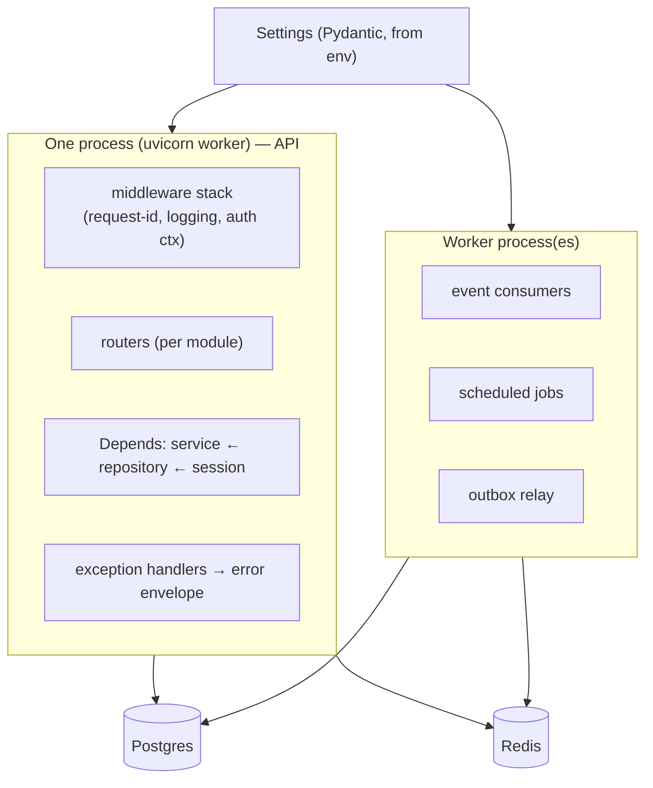

# Volume 10 — Backend Architecture

> How the FastAPI service is actually assembled and runs. Volume 1 gave the repo/module layout,
> Volume 4 the component boundaries, Volume 5 the module internals — **this volume is the connective
> tissue**: how the app boots, wires dependencies, reads config, processes a request end-to-end, and
> runs background work. If you're implementing the backend, this is your assembly manual.

**Owner:** Engineering (Backend) · **Last reviewed:** 2026-07-06

---

## Contents

| Doc                                                            | Topic                                                                 |
| -------------------------------------------------------------- | --------------------------------------------------------------------- |
| [01_application-structure.md](01_application-structure.md)     | App factory, lifespan, module wiring, the `src/` layout               |
| [02_dependency-injection.md](02_dependency-injection.md)       | FastAPI `Depends`, service/repository wiring, per-request session/UoW |
| [03_config-and-settings.md](03_config-and-settings.md)         | Pydantic Settings, env, secrets, feature flags                        |
| [04_request-lifecycle.md](04_request-lifecycle.md)             | Middleware stack, auth, exception handling, request-id, logging       |
| [05_async-and-workers.md](05_async-and-workers.md)             | Async model, workers, queues, scheduled jobs, the outbox relay        |
| [06_conventions-and-testing.md](06_conventions-and-testing.md) | Backend conventions, testing seams, boundary enforcement              |

> Related: [Repo structure (V1)](../00_Project/01_repository-structure.md) ·
> [Component architecture (V4)](../04_Architecture/02_component-architecture.md) ·
> [Module internals (V5)](../05_Design/README.md). This volume assumes those and doesn't re-explain them.

---

## Principles (FastAPI-specific expression of the handbook rules)

1. **Thin routers, fat services, isolated repositories.** The layering from Volume 1/4 is enforced by
   _how we wire dependencies_ — routers receive a service via `Depends`, services receive a
   repository, repositories receive a DB session. The wiring makes the boundary physical.
2. **Everything async.** Endpoints, DB (async SQLAlchemy), Redis, and outbound calls are `async`. We
   never block the event loop; sync work goes to a threadpool or a worker.
3. **Config is typed and validated at startup.** One `Settings` object (Pydantic). A bad/missing env
   var **fails the boot**, loudly — never a silent misconfiguration (Volume 1).
4. **The app is stateless.** No request state in module globals; all state in Postgres/Redis so any
   instance serves any request (Volume 4, NFR-SCALE-02).
5. **One place per cross-cutting concern.** Auth, error mapping, logging, request-id, and the DB
   transaction boundary are middleware/dependencies — not repeated in every handler.
6. **Domain exceptions, not HTTPExceptions, in services.** Services raise typed domain errors; a
   single handler maps them to the [Volume 7 error envelope](../07_API/04_errors-pagination-idempotency.md).

## The shape at a glance

The **API process** and **worker process(es)** run the _same codebase_ with different entrypoints
(`main:app` vs `worker`), share the same modules and config, but scale independently (Volume 4).
