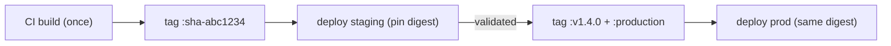

# Containers & Images

**Owner:** Engineering (SRE) · **Last reviewed:** 2026-07-06
**Realizes:** Volume 1 Docker principles, NFR-SEC, Volume 4 deployment

The production image story. The local/dev Docker setup is [Volume 1](../00_Project/06_docker-setup.md);
this page is about the **production** artifacts — how they're built, hardened, tagged, and stored.

---

## The production image (recap + hardening)

The backend uses a multi-stage build (Volume 1) whose `production` target is minimal and locked down:

```dockerfile
# production stage (from Volume 1, with prod hardening called out)
FROM python:3.12-slim AS production
ENV PYTHONUNBUFFERED=1 PYTHONDONTWRITEBYTECODE=1
WORKDIR /app
COPY --from=deps /app/.venv /app/.venv           # prod deps only (no pytest/ruff/mypy)
ENV PATH="/app/.venv/bin:$PATH"
COPY src ./src
RUN adduser --disabled-password --gecos "" appuser && chown -R appuser /app
USER appuser                                     # ← never root (NFR-SEC)
EXPOSE 8000
HEALTHCHECK CMD python -m zaroorat.healthcheck || exit 1
CMD ["uvicorn", "zaroorat.main:app", "--host", "0.0.0.0", "--port", "8000"]
```

Hardening checklist (enforced in review + CI scan):

| Rule                                                           | Why                                        |
| -------------------------------------------------------------- | ------------------------------------------ |
| **Non-root user** (`appuser`)                                  | container breakout blast-radius            |
| **Slim base, pinned tag** (`python:3.12-slim`, never `latest`) | reproducible, small attack surface         |
| **Prod deps only** (no test/lint tooling)                      | smaller image, fewer CVEs                  |
| **No secrets baked in**                                        | secrets are runtime env (Volume 3/14)      |
| **`.dockerignore`** excludes `.env`, `.git`, tests             | no leakage into layers                     |
| **Read-only root filesystem** at runtime (k8s)                 | tamper resistance ([03](03_kubernetes.md)) |
| **Dependencies installed before source copy**                  | layer caching (fast builds)                |

The **API and worker share the same image** — different entrypoints (`main:app` vs
`-m zaroorat.worker`, Volume 10 §05). One artifact, two roles.

The **mobile** app isn't containerized (it's built by EAS/Expo and shipped to stores/OTA, Volume 8);
the **admin** SPA builds to static assets served via CDN/Nginx.

---

## Image registry, tagging & provenance

- Images are pushed to a **private container registry** by CI ([02](02_ci-cd.md)).
- **Tagging:** every build is tagged with the **immutable git SHA** (`zaroorat/backend:sha-<7>`), and
  releases additionally with a **semver tag** (`:v1.4.0`) and a moving `:staging` / `:production`
  pointer. Deployments reference the **SHA/semver**, never `:latest` — so a rollout is to a precisely
  known artifact (Volume 4 "same image everywhere").
- **Promotion, not rebuild:** the exact image validated on staging is the one promoted to production
  by re-tagging/pinning — we never rebuild between environments (eliminates "it built differently").
- **Provenance:** CI records the image digest + source SHA; deploys pin by digest so the running
  artifact is verifiable.



---

## Vulnerability scanning

- **Image scanning** runs in CI on every build (e.g. Trivy/Grype): fails the pipeline on
  fixable HIGH/CRITICAL CVEs in OS packages or dependencies.
- **Dependency scanning** (Python + JS) via the ecosystem tooling + Dependabot-style updates;
  security patches are prioritized (Volume 14).
- **Base image freshness:** the pinned base is bumped on a cadence and on advisories — pinned isn't
  "never updated", it's "updated deliberately".

---

## Size & startup budget

- **Keep images small** — slim base + prod-only deps → faster pulls, faster autoscaling (a pod that
  pulls faster scales into a surge faster, Volume 4 A6.3).
- **Fast, honest startup** — the app fails fast on bad config (Volume 10 §03) and exposes
  `/readyz` only when DB/Redis are reachable, so k8s doesn't route to a not-ready pod (Volume 10 §01).

---

## Local ↔ prod parity

The dev and prod images share a base stage (Volume 1), so behavior is consistent, but the prod image
strips dev tooling and bind-mounts. This parity is why `make up` locally and the k8s deployment
behave the same — a deliberate design choice, not luck.
