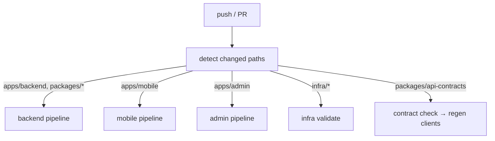

# CI/CD — GitHub Actions

**Owner:** Engineering (SRE) · **Last reviewed:** 2026-07-06
**Realizes:** Volume 1 "green CI", ADR-0001 monorepo, Volume 4 environments

The automated path from a push to a running deployment. CI is the gatekeeper that makes "green =
correct style + passing tests" true (Volume 1). Because we're a **monorepo** (ADR-0001), pipelines
are **path-scoped** — only what changed is built and tested.

---

## Path-scoped pipelines (monorepo essential)

A change to `apps/mobile` shouldn't run the backend test suite. CI detects changed paths and runs
only the relevant jobs — otherwise a monorepo's CI gets slow enough that people route around it.



---

## The backend pipeline (per PR)

```yaml
# .github/workflows/backend.yml (sketch)
on:
  pull_request: { paths: ['apps/backend/**', 'packages/**'] }
jobs:
  quality:
    steps:
      - uses: actions/checkout@v4
      - run: make setup
      - run: make lint # Ruff (format + lint) — Volume 1
      - run: make typecheck # mypy strict
      - run: make lint-imports # import-linter — module boundaries (ADR-0004, V10 §06)
  test:
    services: { postgres: postgis/postgis:16-3.4, redis: redis:7 }
    steps:
      - run: make migrate # migrations apply on a fresh DB (V6)
      - run: make test # unit + integration + API (V10 §06, V12)
  contract:
    steps:
      - run: make openapi # regenerate spec
      - run: make check-contract # fail if breaking change without version bump (V7)
  build:
    steps:
      - run: docker build --target production -t zaroorat/backend:sha-${{ github.sha }} .
      - run: trivy image zaroorat/backend:sha-${{ github.sha }} # scan (V11 §01)
```

**Required to merge** (branch protection, Volume 1): quality + test + contract green, image builds
and scans clean, ≥1 review (2 for migrations/auth/payments/infra). This is the mechanical enforcement
of every rule the handbook states.

---

## Client & contract jobs

- **Contract check:** regenerate the OpenAPI spec and the TS clients; if the generated clients no
  longer compile or the spec has a **breaking diff** without a version bump, CI fails (Volume 7 §05).
  Because it's a monorepo, the backend change and client update land in **one atomic PR** (ADR-0001).
- **Mobile/admin pipelines:** lint (ESLint), typecheck (`tsc`), unit/component tests, build. Mobile
  additionally validates the Expo build; admin builds static assets.

---

## Deploy pipeline (staging → production)

```mermaid
flowchart LR
    MRG["merge to main"] --> BSTG["build image :sha + :staging"]
    BSTG --> DSTG["deploy staging (auto, rolling)"]
    DSTG --> SMOKE["staging smoke + integration"]
    SMOKE --> TAG["tag release :vX.Y.Z (manual gate)"]
    TAG --> DPROD["deploy production (rolling, health-gated)"]
    DPROD --> VERIFY["post-deploy checks + watch dashboards"]
    VERIFY -.fail.-> RB["rollback to previous digest"]
```



| Stage                    | Trigger                             | Notes                                                                                                         |
| ------------------------ | ----------------------------------- | ------------------------------------------------------------------------------------------------------------- |
| **Staging deploy**       | auto on merge to `main`             | same artifact that will go to prod; runs migrations (expand phase)                                            |
| **Staging verification** | after deploy                        | smoke tests + key integration flows; connectivity-drop tests (A6.1)                                           |
| **Production deploy**    | **manual gate** on a tagged release | rolling, readiness-gated (Volume 4/10); off-peak by default                                                   |
| **Post-deploy**          | after prod                          | automated health checks + human watch of Volume 2/13 dashboards                                               |
| **Rollback**             | on failure                          | redeploy previous **digest** (fast, known-good); DB uses expand→contract so old code is compatible (Volume 6) |

**Migrations in the pipeline** follow expand→contract (Volume 6 §06): the _expand_ migration ships
with or before the code that needs it; the _contract_ (destructive) migration ships a release later,
after all pods use the new schema — so a rollback is always safe.

---

## Secrets in CI/CD

- CI uses **scoped, least-privilege credentials** (registry push, cluster deploy) stored as
  encrypted GitHub Actions secrets / OIDC to the cloud — no long-lived cloud keys in the repo.
- App secrets are **never** in CI logs or images; they're injected into the runtime from the platform
  secret store ([03](03_kubernetes.md), Volume 14).
- Pipelines that touch production require the appropriate protected-environment approval.

---

## What "green CI" guarantees

When CI is green on a PR, the following are **true by construction** (not by hope):
formatting/lint, strict types, module boundaries, migrations apply + reverse, unit+integration+API
tests pass, the API contract is non-breaking (or versioned), and the image builds and scans clean.
That's why the team can move fast on trunk-based development — the pipeline is the safety net.
