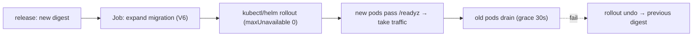

# Kubernetes

**Owner:** Engineering (SRE) · **Last reviewed:** 2026-07-06
**Realizes:** Volume 4 topology, NFR-SCALE, NFR-AVAIL, NFR-SEC

The orchestration layer. Kubernetes runs the stateless tiers (API, realtime, workers), autoscales
them, and gives us health-gated rolling deploys. The data tier is **managed services** outside the
cluster (Volume 4). Manifests live in `infra/k8s/` (or a Helm chart); this page is the shape and the
key settings.

---

## Workloads

| Workload         | Kind                       | Notes                                                             |
| ---------------- | -------------------------- | ----------------------------------------------------------------- |
| `api`            | Deployment + HPA + Service | stateless FastAPI, behind ingress                                 |
| `ws-gateway`     | Deployment + HPA + Service | WebSocket; scales on connections                                  |
| `worker`         | Deployment + HPA           | event consumers, matching, relay (Volume 10 §05)                  |
| `scheduler jobs` | CronJob                    | KYC expiry, partition maintenance, reconciliation (Volume 10 §05) |
| `migrate`        | Job (pre-deploy)           | runs Alembic expand migration before rollout (Volume 6)           |

Data tier (Postgres+PostGIS, Redis, object storage) = **managed**, referenced by connection strings
from secrets — not pods (Volume 4, ADR-0003).

---

## A Deployment (annotated)

```yaml
apiVersion: apps/v1
kind: Deployment
metadata: { name: api }
spec:
  replicas: 3
  strategy:
    type: RollingUpdate
    rollingUpdate: { maxUnavailable: 0, maxSurge: 1 } # zero-downtime (NFR-AVAIL-03)
  template:
    spec:
      securityContext:
        runAsNonRoot: true # NFR-SEC
        readOnlyRootFilesystem: true
      containers:
        - name: api
          image: registry/zaroorat/backend@sha256:... # pinned by DIGEST (V11 §01)
          envFrom:
            - secretRef: { name: api-secrets } # injected at runtime (V14)
            - configMapRef: { name: api-config }
          ports: [{ containerPort: 8000 }]
          readinessProbe: # gates traffic (V10 §01)
            httpGet: { path: /readyz, port: 8000 }
            initialDelaySeconds: 5
          livenessProbe:
            httpGet: { path: /healthz, port: 8000 }
          resources:
            requests: { cpu: '250m', memory: '256Mi' }
            limits: { cpu: '1', memory: '512Mi' }
      terminationGracePeriodSeconds: 30 # graceful drain (V10 §05)
```

Key settings and why:

- **`maxUnavailable: 0`** — never drop below capacity during a deploy → zero-downtime.
- **Readiness `/readyz`** — a pod receives traffic only when DB+Redis are reachable (Volume 10 §01),
  so rollouts don't route to a not-ready pod.
- **`readOnlyRootFilesystem` + non-root** — hardening (Volume 11 §01, Volume 15).
- **Digest-pinned image** — the exact validated artifact (Volume 11 §01).
- **Graceful termination** — workers/gateways finish in-flight work and release locks on SIGTERM
  (Volume 10 §05), so a rescale doesn't drop a matching loop or half a settlement.

---

## Autoscaling (HPA)

```yaml
apiVersion: autoscaling/v2
kind: HorizontalPodAutoscaler
metadata: { name: api }
spec:
  scaleTargetRef: { kind: Deployment, name: api }
  minReplicas: 3
  maxReplicas: 20
  metrics:
    - type: Resource
      resource: { name: cpu, target: { type: Utilization, averageUtilization: 65 } }
```

| Tier         | Scales on                                  |
| ------------ | ------------------------------------------ |
| `api`        | CPU / request rate                         |
| `ws-gateway` | active connections (custom metric)         |
| `worker`     | **queue depth** (custom metric from Redis) |

Seasonal tourist peaks (A6.3) are absorbed by autoscaling headroom (`maxReplicas`) — capacity is a
number to tune, not a redesign (NFR-SCALE-03). The stateless design (Volume 4/10) is what makes this
work: any pod serves any request.

---

## Config & secrets

- **ConfigMaps** hold non-secret config (log level, feature-flag defaults, provider URLs).
- **Secrets** (DB URL, JWT secret, provider keys) are injected via `envFrom: secretRef`, sourced from
  a real secret manager (cloud KMS / external-secrets), **never** committed (Volume 14). Rotating a
  secret is updating the secret + a rolling restart (Volume 10 §03).
- The app reads all of it through `Settings` (Volume 10 §03) and **fails to boot** if required config
  is missing — so a misconfigured deploy never silently serves.

---

## Networking & security posture

- **Ingress** ([04](04_nginx-networking.md)) is the only public entrypoint; it routes REST → `api`
  and WSS → `ws-gateway`.
- **NetworkPolicies** restrict pod-to-pod traffic: only `api`/`worker` may reach the data tier;
  nothing public reaches it (Volume 4 zones, NFR-SEC).
- **Namespaces** separate staging and production; RBAC on the cluster limits who/what can deploy.
- **Pod security**: non-root, read-only FS, dropped capabilities, resource limits (prevents a noisy
  neighbor / limits blast radius).

---

## Deploy & rollback flow (k8s view)



Because old and new code are schema-compatible during rollout (expand→contract, Volume 6) and pods
are stateless (Volume 4), **rollback is `rollout undo` to the previous digest** — fast and safe.
Detailed runbooks are [Volume 13](../14_Operations/README.md).
