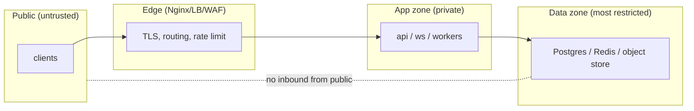

# Nginx & Networking

**Owner:** Engineering (SRE) · **Last reviewed:** 2026-07-06
**Realizes:** Volume 4 edge/zones, NFR-SEC-01, Volume 7 REST+WSS

Nginx (as the ingress controller / reverse proxy) is the **edge** — the single public entrypoint and
the primary trust boundary (Volume 4). It terminates TLS, routes REST vs WebSocket traffic, and
applies edge protections before anything reaches the app tier.

---

## Responsibilities

```mermaid
flowchart LR
    C["clients (rider/driver/admin)"] -->|HTTPS/WSS| NG["Nginx edge<br/>TLS · routing · rate limit · headers"]
    NG -->|/api/v1/* REST| API["api service"]
    NG -->|/api/v1/ws WSS| WS["ws-gateway service"]
    NG -->|/ (admin static)| CDN["admin SPA (CDN/static)"]
    NG -. blocks .- DATA["(data tier: no public path)"]
```

| Responsibility                  | Detail                                                                        |
| ------------------------------- | ----------------------------------------------------------------------------- |
| **TLS termination**             | HTTPS/WSS terminate here; internal hops are within the private cluster        |
| **Routing**                     | REST → `api`; WebSocket upgrade → `ws-gateway`; static admin → CDN/origin     |
| **Edge rate limiting**          | coarse per-IP limits (fine-grained, per-user limits are in the app, Volume 7) |
| **Security headers**            | HSTS, X-Content-Type-Options, frame-deny, etc. (Volume 15)                    |
| **Body size limits / timeouts** | reject oversized bodies; sane timeouts (long for WS, short for REST)          |
| **Request-id passthrough**      | forward/inject `X-Request-ID` for tracing (Volume 10 §04)                     |

---

## Routing REST vs WebSocket (the key config)

WebSockets need the HTTP upgrade headers and long timeouts; REST needs neither. They route to
**different upstreams** (Volume 4: separate scaling/failure domains).

```nginx
# TLS + security headers (abridged)
server {
    listen 443 ssl http2;
    server_name api.zaroorat.com;
    # ssl_certificate … (managed cert)

    add_header Strict-Transport-Security "max-age=63072000; includeSubDomains" always;
    add_header X-Content-Type-Options "nosniff" always;
    add_header X-Frame-Options "DENY" always;
    client_max_body_size 10m;

    # ---- REST ----
    location /api/v1/ {
        limit_req zone=api burst=20 nodelay;         # edge rate limit
        proxy_pass http://api_upstream;
        proxy_set_header X-Request-ID $request_id;
        proxy_read_timeout 30s;
    }

    # ---- WebSocket ----
    location /api/v1/ws {
        proxy_pass http://ws_upstream;
        proxy_http_version 1.1;
        proxy_set_header Upgrade $http_upgrade;       # WS upgrade
        proxy_set_header Connection "upgrade";
        proxy_read_timeout 3600s;                     # long-lived connection
        proxy_send_timeout 3600s;
    }
}
# rate-limit zone
limit_req_zone $binary_remote_addr zone=api:10m rate=20r/s;
```

Notes:

- **WS `proxy_read_timeout` is long** (1h) with app-level heartbeats (Volume 7 §03) — a short timeout
  would kill live trips. REST timeouts stay short.
- **Edge rate limiting is coarse** (per-IP DoS protection); **business rate limits** (per-phone OTP,
  per-user) live in the app with Redis counters (Volume 6/7) because the edge doesn't know identity.
- **`X-Request-ID`** is forwarded so one id spans edge → app → logs → traces (NFR-OBS-01).

---

## Network zones (topology recap — Volume 4)



- Only the **edge** has a public address. App and data tiers have **no public IPs**.
- The **data zone** accepts connections only from the app zone (enforced by NetworkPolicies /
  security groups) — never from the internet.
- A **WAF** in front of the edge filters common web attacks (Volume 15).
- This zoning is **defense in depth**; the real authz is still enforced per-request in the app
  (NFR-SEC-04) — the network is a second wall, not the only one.

---

## Static admin & CDN

- The admin SPA (Volume 9) is built to static assets and served via **CDN** (cached, close to users),
  with the edge routing `/` to it and `/api` to the backend.
- **CORS** allows only the admin origin(s) (Volume 7 §05); the mobile app is native (no CORS). No
  wildcard origins.

---

## TLS & certificates

- Certificates are **managed/auto-renewed** (e.g. cert-manager / cloud-managed) — no manual cert
  juggling, no expiry outages.
- **TLS everywhere at the edge** (NFR-SEC-01); modern ciphers only; HSTS on.
- Internal cluster traffic is within the private network; service-to-service mTLS is a Volume 15
  consideration as the system matures.
