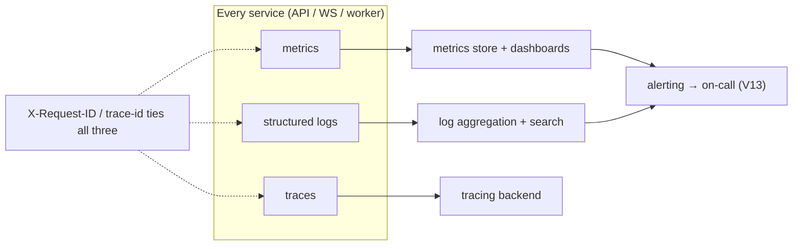

# Observability

**Owner:** Engineering (SRE) · **Last reviewed:** 2026-07-06
**Realizes:** NFR-OBS-01..04, Volume 2 metrics, Volume 4 tracing

You can't operate what you can't see. Observability rests on **three pillars — metrics, logs,
traces — plus alerting** on top. Every service emits all three with a shared correlation id, so a
problem can be seen (metrics), read (logs), and followed (traces) end-to-end.

---

## The three pillars

### 1. Metrics

Two kinds, both essential:

| Class             | Examples                                                                            | Source                        |
| ----------------- | ----------------------------------------------------------------------------------- | ----------------------------- |
| **System health** | request rate, latency (P50/95/99), error rate, CPU/mem, queue depth, DB connections | app + infra                   |
| **Business KPIs** | weekly completed trips, match rate, pickup ETA, cancel rate, settlement errors      | app (Volume 2 canonical defs) |

- **RED method** for services (Rate, Errors, Duration) + **USE** for resources (Utilization,
  Saturation, Errors).
- **Business metrics use the Volume 2 canonical definitions** so the SRE dashboard, the ops dashboard
  (Volume 9), and the board report all show the _same_ number.
- Metrics drive **HPA autoscaling** (queue depth, connections — Volume 11 §03) and alerts.

### 2. Logs

- **Structured JSON** (Volume 1/10), one line per request + explicit domain events, each carrying
  `request_id`, `env`, and safe context. **No secrets/PII** beyond policy (Volume 14/15).
- Aggregated centrally, searchable by `request_id` — a support ticket's `requestId` (Volume 7
  envelope) jumps straight to the exact logs.
- Log **levels** are meaningful: `error` pages/alerts eventually; `warn` is watched; `info` is the
  audit of normal operation; `debug` is off in prod.

### 3. Traces

- **Distributed tracing** across the **request → match → trip → settle** path (NFR-OBS-04), so a slow
  or failing trip can be followed across API → worker → DB → Redis with timings at each hop.
- Trace id == the correlation id shared with logs and the client `X-Request-ID` — one thread ties
  everything.

---

## Dashboards

| Dashboard             | Audience      | Shows                                                           |
| --------------------- | ------------- | --------------------------------------------------------------- |
| **Service health**    | SRE/on-call   | RED per service, resource USE, error budgets                    |
| **Marketplace**       | eng + ops     | match rate, ETA, active trips, settlement success (V2)          |
| **Data tier**         | SRE           | Postgres/Redis load, replication lag, slow queries, connections |
| **Pipelines/workers** | SRE           | queue depth, consumer lag, DLQ size, job success (V10 §05)      |
| **Money**             | eng + finance | settlement errors, reconciliation drift, refund volume (V5 §05) |

Dashboards follow the **[dataviz]** guidance (consistent, accessible, light/dark). The **money** and
**reconciliation** dashboards matter specially — a settlement error or a ledger that doesn't sum to
zero is a page-worthy event, not a nightly surprise.

---

## SLOs & error budgets

We define **Service Level Objectives** and alert on **burn rate**, not every blip:

| SLO                                | Target (launch)                     |
| ---------------------------------- | ----------------------------------- |
| API availability                   | ≥ 99.5% (NFR-AVAIL-01)              |
| API latency (read P95 / write P95) | ≤ 300 ms / ≤ 500 ms (NFR-PERF)      |
| Match assignment P95               | ≤ 3 s (NFR-PERF-04)                 |
| Settlement success                 | ~100% (money — near-zero tolerance) |

An SLO with an **error budget** means we alert when the budget burns too fast, and it informs
release risk (Volume 13) — a burning budget slows risky deploys.

---

## Alerting → on-call

- **Alerts fire on symptoms users feel** (error rate, latency, match failures, settlement errors,
  availability) — not on every CPU spike. Noisy alerts get ignored; we tune for signal (NFR-OBS-03).
- **Severity tiers:** page (wake someone) vs. ticket (business hours). Money/safety/availability =
  page.
- Routing, escalation, and the **runbooks** each alert links to are [Volume 13
  (Operations)](../14_Operations/README.md) — every page-level alert must have a runbook.

### Alerts that matter most here

| Alert                                            | Why it's critical                                                           |
| ------------------------------------------------ | --------------------------------------------------------------------------- |
| Settlement/ledger errors, reconciliation drift   | money correctness (Volume 5)                                                |
| Match rate / assignment latency degraded         | marketplace liquidity (Volume 2)                                            |
| SMS/OTP delivery failing                         | logins + critical notifications broken in a poor-connectivity market (A6.1) |
| API availability / error-rate SLO burn           | users can't ride                                                            |
| Postgres replication lag / connection saturation | data-tier health                                                            |
| Worker queue backlog / DLQ growing               | events not being processed (settlement, notifications)                      |

---

## Why observability is designed in, not added later

The system was **built to be observable**: structured logs with `request_id` (Volume 10 §04), the
outbox/event catalog gives natural business events (Volume 5 §08), canonical metric definitions
(Volume 2), and a health/readiness contract (Volume 10 §01). Observability here is the _harvest_ of
decisions made throughout the handbook — which is exactly why it works.
