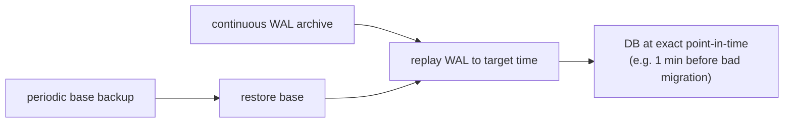

# Backups & Disaster Recovery

**Owner:** Engineering (SRE) · **Last reviewed:** 2026-07-06
**Realizes:** NFR-AVAIL-04, R-DATA-1, Volume 6 §06

The insurance policy. When something goes badly wrong — data corruption, a bad migration, a region
outage — this is how we get back to a known-good state within our recovery targets. The governing
rule: **a backup you have never restored is not a backup.**

---

## Recovery objectives

| Objective                          | Target (launch) | Meaning                                |
| ---------------------------------- | --------------- | -------------------------------------- |
| **RPO** (Recovery Point Objective) | ≤ 5 min         | max acceptable data loss               |
| **RTO** (Recovery Time Objective)  | ≤ 1 h           | max acceptable time to restore service |

These come from NFR-AVAIL-04. Money and safety data (ledger, trips, KYC) are the highest priority —
losing a settlement or a safety record is unacceptable, which is also why they're **append-only /
soft-deleted** (Volume 6 §06, R-DATA-1): most "data loss" from bugs is prevented by design, and
backups cover the rest.

---

## What we back up, and how

| Data                                 | Mechanism                                                   | Frequency / retention                                   |
| ------------------------------------ | ----------------------------------------------------------- | ------------------------------------------------------- |
| **PostgreSQL** (system of record)    | continuous **WAL archiving + PITR** + periodic base backups | PITR to any point in the retention window (RPO ≤ 5 min) |
| **Object storage** (KYC docs, media) | versioned, encrypted bucket + cross-location replication    | versioned; lifecycle per retention policy               |
| **Redis**                            | **not** primary-backed up (ephemeral, Volume 6 §04)         | reconstructable from Postgres + live pings              |
| **Config / manifests / IaC**         | git (`infra/`)                                              | full history                                            |
| **Secrets**                          | secret manager's own backup                                 | per platform                                            |

Redis is deliberately **not** part of DR-critical backups — everything in it is derivable
(Volume 6). This is a payoff of the two-store split (ADR-0003): the thing that's hard to back up
(high-churn cache) is the thing we don't _need_ to back up.

---

## Point-in-Time Recovery (the main tool)

PITR lets us restore Postgres to a **specific moment** — e.g. just before a bad migration or a
data-corrupting bug. Combined with expand→contract migrations (Volume 6 §06), most schema mistakes
are recoverable without data loss.

---

## Disaster scenarios & response

| Scenario                            | Response                                                                                                                          |
| ----------------------------------- | --------------------------------------------------------------------------------------------------------------------------------- |
| **Bad deploy**                      | `rollout undo` to previous digest (Volume 11 §03); schema is backward-compatible (expand→contract)                                |
| **Bad migration / data corruption** | halt writes, **PITR** to just before it, replay/repair, resume (runbook, V13)                                                     |
| **Primary DB failure**              | promote a **read replica** to primary (Volume 4/6); reconnect app; verify                                                         |
| **Redis loss**                      | app degrades gracefully; locations/idempotency repopulate; DB unique constraints prevent dupes (Volume 6 §04) — no restore needed |
| **Region/zone outage**              | multi-AZ managed data services; failover per provider; app pods reschedule                                                        |
| **Object storage loss**             | restore from versioned/replicated bucket                                                                                          |
| **Accidental data deletion**        | soft-delete means it's recoverable (Volume 6); ledger/audit are append-only (never deleted)                                       |

Each row maps to a **runbook** in [Volume 13 (Operations)](../14_Operations/README.md) — the _how_,
step by step, so recovery isn't improvised at 3am.

---

## DR drills (the part everyone skips — we don't)

- **Restore drills:** periodically restore a backup into an isolated environment and **verify the
  data** — proving RPO/RTO are actually met, not assumed. A backup that has never been restored is
  treated as broken.
- **Failover drills:** exercise replica promotion in staging so the runbook is real and timed.
- **Game days:** occasionally inject a failure (kill a pod, drop Redis, simulate a connectivity
  outage — A6.1) and confirm the system and the team respond as designed.
- Drill outcomes update the runbooks (Volume 13) and this page's targets.

---

## Data lifecycle interplay

Backups don't override the **retention/immutability** rules (Volume 6 §06):

- Financial & safety records are **append-only / soft-deleted** — DR restores them intact; we never
  shred what compliance or a dispute may need (R-DATA-1, R-SAFE-4).
- Retention/archival jobs move cold data to cheaper storage but keep it recoverable within policy
  (Volume 14).

---

## Summary

DR here is credible because it's **layered and rehearsed**: design prevents most loss (append-only,
soft-delete, two-store split), PITR + replicas + versioned object storage cover the rest, and
**drills prove it works**. The targets (RPO ≤ 5 min, RTO ≤ 1 h) are commitments backed by tested
procedure, not aspirations.
