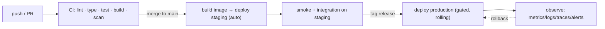

# Volume 11 — Infrastructure & DevOps

> How the software is built, shipped, run, observed, and recovered. Volume 4 gave the deployment
> _topology_; this volume gives the _concrete infrastructure_ — Dockerfiles, CI/CD pipelines,
> Kubernetes manifests, Nginx config, monitoring, and backups/DR. If Volume 4 is the blueprint,
> this is the running building.

**Owner:** Engineering (SRE / Platform) · **Last reviewed:** 2026-07-06

---

## Contents

| Doc                                                        | Topic                                                        |
| ---------------------------------------------------------- | ------------------------------------------------------------ |
| [01_containers-and-images.md](01_containers-and-images.md) | Production images, registry, tagging, hardening              |
| [02_ci-cd.md](02_ci-cd.md)                                 | GitHub Actions: path-scoped build/test/scan/deploy           |
| [03_kubernetes.md](03_kubernetes.md)                       | Manifests, deployments, HPA, probes, config/secrets, ingress |
| [04_nginx-networking.md](04_nginx-networking.md)           | Reverse proxy, TLS, REST vs WSS routing, edge rate limits    |
| [05_observability.md](05_observability.md)                 | Metrics, logs, traces, dashboards, alerts, SLOs              |
| [06_backups-and-dr.md](06_backups-and-dr.md)               | Backups, PITR, disaster recovery, drills                     |

> Related: [Deployment topology (V4)](../04_Architecture/05_deployment-architecture.md) ·
> [Docker (V1)](../00_Project/06_docker-setup.md) · [Workers/health (V10)](../10_Backend/05_async-and-workers.md) ·
> Runbooks & incident response are [Volume 13 (Operations)](../14_Operations/README.md).

---

## Principles

1. **The environment is code.** Images, manifests, pipelines, and (cloud) infra are versioned in git
   (`infra/`). No hand-clicked servers, no snowflake config. Reproducible by definition.
2. **Same image everywhere; config differs.** One build promotes from staging → production; only
   env/secrets change (Volume 1). "Works in staging" means "works in prod" because it's the same
   artifact.
3. **Fail-fast, health-gated rollouts.** Readiness probes gate traffic; rolling updates + backward-
   compatible migrations give zero-downtime (Volume 4/6/10).
4. **Least privilege, private data tier.** Only the edge is public; app and data tiers are private;
   containers run non-root; secrets injected at runtime (Volume 4/15).
5. **Observability is not optional.** Every service emits structured logs, metrics, and traces; every
   critical failure has an alert (Volume 2 KPIs + system health).
6. **A backup you haven't restored isn't a backup.** DR is drilled, not assumed (Volume 6/13).

## Pipeline at a glance

## What runs in production (recap from V4)

| Component             | Deployment unit             | Scales on              |
| --------------------- | --------------------------- | ---------------------- |
| API (FastAPI)         | Deployment + HPA            | CPU/req rate           |
| Realtime gateway (WS) | Deployment + HPA            | connections            |
| Workers               | Deployment + HPA / CronJobs | queue depth / schedule |
| Nginx ingress         | Ingress controller          | edge                   |
| Postgres + PostGIS    | managed service             | vertical + replicas    |
| Redis                 | managed HA                  | throughput/memory      |
| Object storage        | managed                     | —                      |
